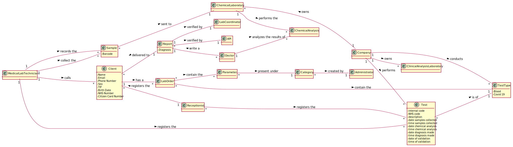

# OO Analysis #

The construction process of the domain model is based on the client specifications, especially the nouns (for _concepts_) and verbs (for _relations_) used. 

## Rationale to identify domain conceptual classes ##
To identify domain conceptual classes, start by making a list of candidate conceptual classes inspired by the list of categories suggested in the book "Applying UML and Patterns: An Introduction to Object-Oriented Analysis and Design and Iterative Development". 

### _Conceptual Class Category List_ ###

**Business Transactions**

* Test
*

---

**Transaction Line Itemss**

* Sample
* Chemical Test
*

---

**Product/Service related to a Transaction or Transaction Line Item**

* Lab Order
* Parameter
*

---

**Transaction Records**

* Lab Order
* Report
* Covid 19 data
*

---  

**Roles of People or Organizations**

* Receptionist
* Medical Lab Technician
* Client
* Clinical Chemistry Technologist
* Doctor 
* Laboratory Coordinator
* Courier
* Administrator
* Specialist Doctor
*

---

**Places**

* Headquarter
* Chemical Laboratory
* Clinical Analysis laboratory 
*

---

** Noteworthy Events**

* Chemical Analysis
*

---

**Physical Objects**

* Lab Order
*

---

**Descriptions of Things**

* Lab Order
* Category
* Type of test
* Report
*

---

**Catalogs**

*  

---

**Containers**

*  

---

**Elements of Containers**

*  

---

**Organizations**

* Company
* 

---

**Other External/Collaborating Systems**

* External API
* External module

---

**Records of finance, work, contracts, legal matters**

* 

---

**Financial Instruments**

*  

---

**Documents mentioned/used to perform some work/**

* 
---

###**Rationale to identify associations between conceptual classes**

An association is a relationship between instances of objects that indicates a relevant connection and that is worth of remembering, or it is derivable from the List of Common Associations: 

+ **_A_** is physically or logically part of **_B_**
+ **_A_** is physically or logically contained in/on **_B_**
+ **_A_** is a description for **_B_**
+ **_A_** known/logged/recorded/reported/captured in **_B_**
+ **_A_** uses or manages or owns **_B_**
+ **_A_** is related with a transaction (item) of **_B_**
+ etc.

| Concept (A) 		|  Association   	| Concept (B) |
|----------	   		|:-------------:		|---------:       |
| Parameter  	| presented under   		 	| Category |
| Category  	| created by    		 	| Administrator  |
| Company  	| performs    		 	| Test |
| Company  	| conducts    		 	| TestType |
| Test  	| requested by   		 	| Client |
| Test  	| is of	 	| TestType |
| Receptionist 	| registers the   		 	| client  |
| Receptionist 	| registers the   		 	| Test  |
| MedicalLabTechnician 	| calls  		 	| client |
| MedicalLabTechnician 	| registers the  		 	|test|
| MedicalLabTechnician 	| collect the 		 	| Sample |
| MedicalLabTechnician 	| record the 		 	| Sample |
| Sample 	| sent to   		 	| ChemicalLaboratory  |
| ChemicalLaboratory 	| perform the  	| ChemicalAnalysis |
| LabOrder	| contains the   		 	| TestType |
| LabOrder	| contains the   		 	| Parameter |

## Domain Model

**Do NOT forget to identify concepts atributes too.**

**Insert below the Domain Model Diagram in a SVG format**

