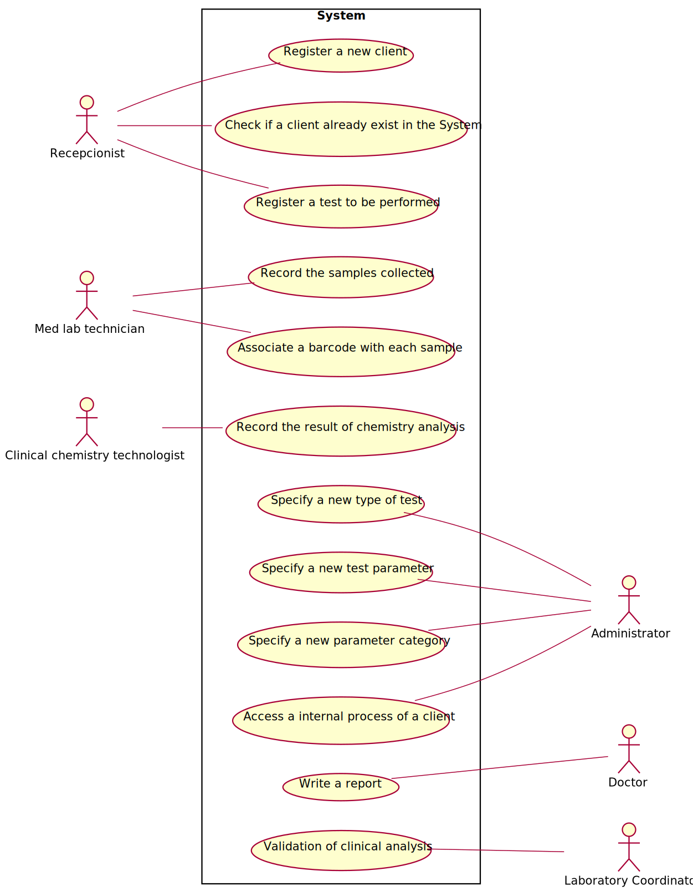

# Use Case Diagram (UCD)

**In the scope of this project, there is a direct relationship of _1 to 1_ between Use Cases (UC) and User Stories (US).**

However, be aware, this is a pedagogical simplification. On further projects and curricular units might also exist _1 to N **and/or** N to 1 relationships between US and UC.

**Insert below the Use Case Diagram in a SVG format**

**For each UC/US, it must be provided evidences of applying main activities of the software development process (requirements, analysis, design, tests and code). Gather those evidences on a separate file for each UC/US and set up a link as suggested below.**

# Use Cases / User Stories
| UC/US  | Description                                                               |                   
|:----|:------------------------------------------------------------------------|
| US01 | [Register a new client](US01.md)|
| US02 | |
| US03 | |
| US04 | [Register a test](US04.md)   |
| US05 | [Record samples collected](US05.md)  |
| US06 | [Record the result of chemistry analysis](US.06)|
| US07 | |
| US08 | |
| US09 | [Specify a new type of test](US09.md)|
| US10 | [Specify a new test parameter](US10.md)|
| US11 | [Specify a new parameter category](US11.md)|
| US12 | [Write a report](US12.md)|
| US13 | [Validation of clinical analysis](US13.md)|
| US14 | [Report Covid-19 data](US14.md)|
| US15 | [Sort the clients](US15.md)|
| US16 | [Assess the internal process](US16.md)|
| US17 ||
| US18 ||
| US19 ||
| US20 ||

