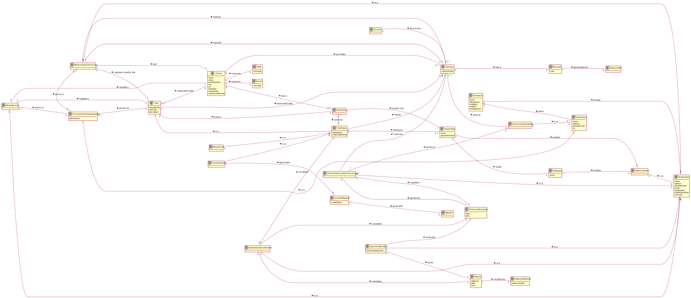

# OO Analysis #

The construction process of the domain model is based on the client specifications, especially the nouns (for _concepts_) and verbs (for _relations_) used. 

## Rationale to identify domain conceptual classes ##
To identify domain conceptual classes, start by making a list of candidate conceptual classes inspired by the list of categories suggested in the book "Applying UML and Patterns: An Introduction to Object-Oriented Analysis and Design and Iterative Development". 

### _Conceptual Class Category List_ ###

**Business Transactions**

* Test

---

**Transaction Line Itemss**

* Sample

---

**Product/Service related to a Transaction or Transaction Line Item**

* Lab Order
* Parameter
* Category
* Barcode
* Reference Value

---

**Transaction Records**

* Lab Order
* Report

---  

**Roles of People or Organizations**

* Receptionist
* Medical Lab Technician
* Client
* Clinical Chemistry Technologist
* Doctor 
* Laboratory Coordinator
* Courier
* Administrator
* Specialist Doctor

---

**Places**

* Headquarter
* Chemical Laboratory
* Clinical Analysis laboratory 

---

**Noteworthy Events**

* Chemical Analysis

---

**Physical Objects**

* Lab Order

---

**Descriptions of Things**

* Lab Order
* Category
* Test Type 
* Report
* Barcode
* Reference Value

---

**Catalogs**

*  

---

**Containers**

*  

---

**Elements of Containers**

*  

---

**Organizations**

* Company

---

**Other External/Collaborating Systems**

* External API
* External module
* External API 2

---

**Records of finance, work, contracts, legal matters**

* NHS
* Courier Company

---

**Financial Instruments**

*  

---

**Documents mentioned/used to perform some work/**

* 
---

###**Rationale to identify associations between conceptual classes**

An association is a relationship between instances of objects that indicates a relevant connection and that is worth of remembering, or it is derivable from the List of Common Associations: 

+ **_A_** is physically or logically part of **_B_**
+ **_A_** is physically or logically contained in/on **_B_**
+ **_A_** is a description for **_B_**
+ **_A_** known/logged/recorded/reported/captured in **_B_**
+ **_A_** uses or manages or owns **_B_**
+ **_A_** is related with a transaction (item) of **_B_**
+ etc.

| Concept (A) 	                  |  Association   	    | Concept (B)         |
|:----------:	                  |:-------------:	    |:---------:          |
| Parameter  	                  | under           	| Category            |
|                   	          | created by     	    | Administrator       |
| Category  	                  | created by      	| Administrator       |
| Company  	                      | performs    		| Test                |
|                                 | conducts    		| Test Type           |
|                                 | knows     		    | Employee            |
|                                 | owns      		    | Laboratory          |
| Test  	                      | requested by        | Client              |
|                                 | is of	 	        | TestType            |
|                                 | needs	 	        | Sample              |
| Receptionist 	                  | registers a     	| Client              |
|                                 | register        	| Test                |
|                                 | is a            	| Employee            |
| Medical Lab Technician          | calls  		    	| Client              |
|                                 | is a            	| Employee            |
|                                 | registers the   	| Test                |
|                                 | collect the 		| Sample              |
|                                 | record the 		    | Sample              |
| Sample 	                      | sent to   	    	| ChemicalLaboratory  |
|                                 | has a            	| Barcode             |
| Courier 	                      | delievers at		| ChemicalLaboratory  |
| Chemical Laboratory 	          | perform the     	| ChemicalAnalysis    |
| Lab Order          	          | contains the  	    | Test Type           |
|                   	          | order a     	    | Test                |
|                                 | contains the    	| Parameter           |
| Clinical Analysis Laboratory    | is a  	            | Laboratory          |
| Chemical Laboratory             | is a            	| Laboratory          |
| Administrator                   | is a             	| Employee            |
| Clinical Chemistry Technologist | is a  	            | Employee            |
|                   	          | receives     	    | Sample              |
|                   	          | work in     	    | Chemical Laboratory |
|                   	          | perform      	    | Chemical Analyses   |
| Client                          | has a  	            | Lab Order           |
| Test Type 	                  | contain             | Parameters          |
| Barcode    	                  | generated by        | External API        |
| Doctor                          | is a  	            | Employee            |
|                   	          | analyzes    	    | Chemical Analyses   |
|                   	          | write        	    | Report              |
| Laboratory Coordinator          | is a            	| Employee            |
|                   	          | validates    	    | Chemical Analyses   |
|                   	          | validates        	| Report              |
| Chemical Analyses               | compared with     	| Reference Values    |
| Report             	          | verified by  	    | External API 2      |

## Domain Model

**Do NOT forget to identify concepts atributes too.**

**Insert below the Domain Model Diagram in a SVG format**

