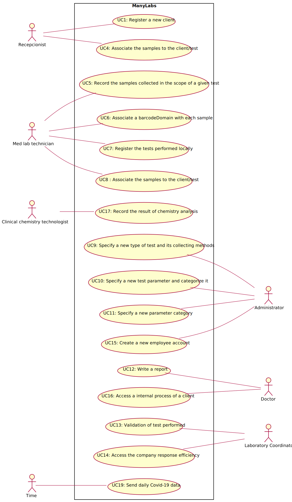

# Use Case Diagram (UCD)

**In the scope of this project, there is a direct relationship of _1 to 1_ between Use Cases (UC) and User Stories (US).**

However, be aware, this is a pedagogical simplification. On further projects and curricular units might also exist _1 to N **and/or** N to 1 relationships between US and UC.

**Insert below the Use Case Diagram in a SVG format**

**For each UC/US, it must be provided evidences of applying main activities of the software development process (requirements, analysis, design, tests and code). Gather those evidences on a separate file for each UC/US and set up a link as suggested below.**

# Use Cases / User Stories
| UC/US  | Description                                                                                                  |                   
|:------:|:-------------------------------------------------------------------------------------------------------------|
| US01   | [As a Receptionist, I want register a new client.](US01.md)                                                  |
| US02   | |
| US03   | |
| US04   | [As a receptionist of the laboratory, I intend to register a test to be performed to a registered client.](US04.md)             |
| US05   | [As a medical lab technician, I want to record the samples collected in the scope of a given test.](US05.md)                      |
| US06   | [As a medical lab technician, I want to associate a barcode to each sample collected.](US06.md)              |
| US07   | [As a medical lab technician, I want to register the tests perfomed locally.](US07.md)                       |
| US08   | [As a medical lab technician , I want to associate the samples to the client/test.](US08.md)        |
| US09   | [As an administrator, I want to specify a new type of test and its collecting methods.](US09.md)                                        |
| US11   | [As an administrator , I want to specify a new parameter category.](US11.md)                                 |
| US12   | [As a Doctor, I intend write a report.](US12.md)                                                             |
| US13   | [As the Laboratory Coordinator, I want to validate the clinical analysis.](US13.md)                          |
| US14   | [As the Laboratory Coordinator, I want to know the company response efficiency.](US14.md)|
| US15   | [As a Administrator, I want to create a new employee account.](US15.md)                                                                                                             |
| US16   | [As a Doctor, I want to access the internal process of a client.](US16.md)                            |
| US17   | [As a clinical chemistry technologist, I intend to record the result of chemistry analysis.](US08.md)                                                                                                            |
| US18   |                                                                                                              |
| US19   | [As a Time, I want to send daily Covid-19 data](US19.md)                                                     |
| US20   |                                                                                                              |

