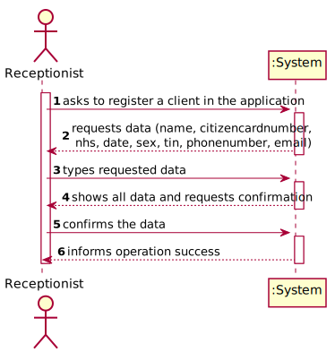

# US 03 - To register a client

## 1. Requirements Engineering

### 1.1. User Story Description

*As a receptionist of the laboratory, I want to register a client.*

### 1.2. Customer Specifications and Clarifications 

**From the specifications document:**

>	In case of a new client, the receptionist registers the client in the application.

>	To register a client, the receptionist needs the client’s citizen card number, National Healthcare Service (NHS) number, birth date, sex, Tax Identification number (TIF), phone number, e-mail and name.

**From the client clarifications:**

> **Question:** After being registered by the receptionist, should the client receive some kind of confirmation e-mail in order to finish his registration?
>  
> [**Answer:**](https://moodle.isep.ipp.pt/mod/forum/discuss.php?d=7736#p10133) The client only receives an e-mail informing that the registration was successful and that he can start to use the system. The e-mail includes the client password.

> **Question:** To register a Client which is the format of each attribute?
>  
> [**Answer:**](https://moodle.isep.ipp.pt/mod/forum/discuss.php?d=7563#p10179) 
> * Citizen Card: 16 digit.
> * number NHS: 10 digit number.
> * TIN: 10 digit number.
> * Birth day - in which format: DD/MM/YYYY.
> * Sex - should only be Male/Female or include more options.
> * Phone number: 11 digit number.
> * The sex is opcional. All other fields are required.

> **Question:** What parameter (asked by the receptionist) should the system use to create the password of the new client?
> 
> [**Answer:**](https://moodle.isep.ipp.pt/mod/forum/discuss.php?d=7462#p9872) The password should be randomly generated. It should have ten alphanumeric characters.

> **Question:** Recently you said that the maximum acceptable age is 150 years old, so the client can be born in 1870 and the data format is DD/MM/YY, this format can be tricky because, for example, if the data is DD/MM/70 the data can indicate that he born on 1870 or 1970. How can we solve this? Or I am understanding wrong?
> 
> [**Answer:**](https://moodle.isep.ipp.pt/mod/forum/discuss.php?d=7962#p10532) Thank you for identifying this issue. Please consider DD / MM / YYYY format for all dates.

> **Question:** What should be the maximum length of the String with the name of the Client?
>
> [**Answer:**](https://moodle.isep.ipp.pt/mod/forum/discuss.php?d=7945#p10383) A string with no more than 35 characters.

> **Question:** Is there any restrictions to the client age?
>
> [**Answer:**](https://moodle.isep.ipp.pt/mod/forum/discuss.php?d=7918#p10388) A client should not have more than 150 years of age. Although there are important developments in the pursuit of eternal youth, for now this value is ok.

> **Question:** How should the system send a email to the client with the password?
> 
> [**Answer:**](https://moodle.isep.ipp.pt/mod/forum/discuss.php?d=7808#p10545) Considering a set of technical restrictions, during the development of the Integrative Project we will not use any e-mail or SMS API services to send messages. All the e-mail and SMS messages should be written to a file with the name emailAndSMSMessages.txt. This file simulates the use of e-mail and SMS API services.

### 1.3. Acceptance Criteria

*Insert here the client acceptance criteria.*

* **AC1:** The client must become a system user. The "auth" component available on the repository must be reused (without modifications).
* **AC2:** All fields are required (excluding sex).
* **AC3:** The Client's password must be generated randomly and sent in the e-mail informing that the registration was successful.
* **AC4:** The password must have ten alphanumeric characters.
* **AC5:** The Citizen Card number must have 16 digits.
* **AC6:** The National Healthcare Service number must have 10 digits.
* **AC7:** The Birth date should be in this format: DD/MM/YYYY.
* **AC8:** A client should not have more than 150 years of age.
* **AC9:** The gender should only be Male/Female or include more options.
* **AC10:** The phone number must be a 11 digit number.
* **AC11:** The tax identification number must have 10 digits.

### 1.4. Found out Dependencies

* No dependencies found

### 1.5 Input and Output Data

**Input Data:**
      
* Typed data:
	* citizen card number, 
	* NHS number,
	* birth date,
	* sex,
	* TIF,
	* phone number,
	* e-mail,
	* name
	
* Selected data:
	* None
	
**Output Data:**

* (In)Success of the operation

### 1.6. System Sequence Diagram (SSD)

### 1.7 Other Relevant Remarks

* All clients need to become a user of the system.
## 2. OO Analysis

### 2.1. Relevant Domain Model Excerpt

### 2.2. Other Remarks

## 3. Design - User Story Realization 

### 3.1. Rationale

**The rationale grounds on the SSD interactions and the identified input/output data.**

| Interaction ID | Question: Which class is responsible for...                     | Answer                   | Justification (with patterns)                                                                                             |
|:-------------  |:--------------------------------------------------------------- |:------------------------:|:------------------------------------------------------------------------------------------------------------------------- |
| Step 1  		 | ... interacting with the actor?                                 | CreateClientUI           | Pure Fabrication: there is no justification for assigning this responsibility to any existing class in the Domain Model.  |
|                | ... coordinating the US?                                        | CreateClientController   | Controller                                                                                                                |
|                | ... creates Client instance?                                    | ClientStore              | ClientStore is the class that registers the Client, so is the one assign to this task                                     |
|                | ... knowing the user using the system?                          | UserSession              | IE: A&A component documentation                                                                                           |
| Step 2  		 |                                                                 |                          |                                                                                                                           |
| Step 3  		 | ... saving the inputted data?                                   | Client                   | IE: object created in step 1 has its own data.                                                                            |
|                |                                                                 | ClientDto                | IE: dto from the object created in step 1 and has its data                                                                |
| Step 4  		 |                                                                 |                          |                                                                                                                           |
| Step 5  		 | ... who shows the output ?                                      | CreateClientUI           | IE: responsible for user interactions with the system                                                                     |
| Step 6 		 | ... validating all data (local validation)?                     | Client                   | IE: owns its data.                                                                                                        |
|                | ... validating all data (global validation)?                    | ClientStore              | IE: knows all Clients.                                                                                                    |
|                | ... saving the created Client?                                  | ClientStore              | IE: owns all Clients.                                                                                                     |
| Step 7  		 | ... informing operation success?                                | CreateClientUI           | IE: is responsible for user interactions.                                                                                 |

### Systematization ##

According to the taken rationale, the conceptual classes promoted to software classes are: 

 * Company
 * Client

Other software classes (i.e. Pure Fabrication) identified: 

 * CreateClientUI
 * CreateClientController
 * ClientStore
 * ClientDto
 * ClientMapper

## 3.2. Sequence Diagram (SD)

## 3.3. Class Diagram (CD)

# 4. Tests 

**Test 1:** Check that it is not possible to create an instance of the Client class with null values.

    @Test(expected = NullPointerException.class)
    public void ensureNullIsNotAllowed(){
    new Client(null,null,null,null,null,null,null,null); }

**Test 2:** Check that it is not possible to create an instance of Citizen Card Number without 16 digits - AC5.

	@Test(expected = IllegalArgumentException.class)
    public void citizenCardNumberNumericValidation(){
        new Client("José Pessoa","123456789123aaaa","1234567891","12/12/1995","Male","1234567891","12345678910","pessoa@gmail.com");
    }

**Test 3:** Check that it is not possible to create an instance of National Healthcare Service number without 10 digits - AC6.
	
	@Test(expected = IllegalArgumentException.class)
	public void nhsLengthValidation(){
	new Client("José Pessoa","1234567891231111","123456789111","12/12/1995","Male","1234567891","12345678910","pessoa@gmail.com");
	}

**Test 4:** Check that it is not possible to create an instance of birth date without the format: DD/MM/YYYY - AC7.

	@Test(expected = IllegalArgumentException.class)
    public void dateformatValidation(){
        new Client("José Pessoa","1234567891231111","123456789111","12/12/1869","Male","1234567891","12345678910","pessoa@gmail.com");
    }

**Test 5:** Check that it is not possible to create an instance of sex without being Male/Female or leaving the option blank - AC9.

	@Test(expected = IllegalArgumentException.class)
    public void sexValidation(){
        new Client("José Pessoa","1234567891234567","1234567891","12/12/1995","Transgender","1234567891","12345678910","pessoa@gmail.com");
    }

**Test 6:** Check that it is not possible to create an instance of phone number without 11 digits - AC10.

	@Test(expected = IllegalArgumentException.class)
    public void phonenumberLengthValidation(){
        new Client("José Pessoa","1234567891234567","1234567891","12/12/1995","Male","1234567891","1234567891011","pessoa@gmail.com");
    }

**Test 7:** Check that it is not possible to create an instance of tax identification number without 10 digits - AC11.

	@Test(expected = IllegalArgumentException.class)
    public void tinLengthValidation(){
        new Client("José Pessoa","1234567891234567","1234567891","12/12/1995","Male","123456789111","12345678910","pessoa@gmail.com");
    }

# 5. Construction (Implementation)

## Class CreateClientController 

	/**
     * Create a client by receiving a client DTO as a parameter
     * @param cldto The client DTO
     * @return the client
     */
    public boolean CreateClient(ClientDto cldto) {
        this.cl = store.createClient(cldto,clMapper);
        return store.validateClient(cl);
    }

	/**
     * Saves the client
     * @return True if the client is saved in the client store, false otherwise
     */
    public boolean saveClient() throws IOException {
        return store.saveClient(cl,clAuthFacade);
    }

## Class ClientStore

	/**
     * Global validation of a Client
     * @param cl Client that we intend to validate
     * @return false if the client already exists or is null. Otherwise, it returns true.
     */
    public boolean validateClient(Client cl) {
        if (cl == null)
            return false;
        return !this.clientList.contains(cl);
    }

	/**
     * Saves the client sent as parameter
     * @param cl a client
     * @param clAuthFacade a instance of Auth Facade
     * @return True if the employee has been transformed into a user of the system, false otherwise
     */
    public boolean saveClient(Client cl,AuthFacade clAuthFacade) throws IOException {
        if (!validateClient(cl)) {
            return false;
        } else {
            this.clientList.add(cl);
            return clAuthFacade.addUser(cl.getName(),cl.getEmail(), generatelogin(cl));
        }
    }

## Class ClientDto

	/**
     * Creates a new instance of ClientDto with the following attributes: name, citizencardnumber, nhs, date, sex, tin, phonenumber, email
     * @param name
     * @param citizencardnumber
     * @param nhs
     * @param date
     * @param sex
     * @param tin
     * @param phonenumber
     * @param email
     */
    public ClientDto(String name, String citizencardnumber, String nhs, String date, String sex, String tin, String phonenumber, String email) {
        this.name = name;
        this.citizencardnumber = citizencardnumber;
        this.nhs = nhs;
        this.date = date;
        this.sex = sex;
        this.tin = tin;
        this.phonenumber = phonenumber;
        this.email = email;
    }

## Class Client

	/**
     * Constructs an instance of {@code Client} receiving the name, Citizen card number, National Healthcare Service number, birth date, gender, tax identification number, phone number and e-mail
     * @param name
     * @param citizencardnumber
     * @param nhs
     * @param date
     * @param sex
     * @param tin
     * @param phonenumber
     * @param email
     */
    public Client(String name, String citizencardnumber, String nhs, String date, String sex, String tin, String phonenumber, String email) {
        nameValidation(name);
        citizencardnumberValidation(citizencardnumber);
        nhsValidation(nhs);
        dateValidation(date);
        sexValidation(sex);
        tinValidation(tin);
        phonenumberValidation(phonenumber);
        emailValidation(email);
        this.name = name;
        this.citizencardnumber = citizencardnumber;
        this.nhs = nhs;
        this.date = date;
        this.sex = sex;
        this.tin = tin;
        this.phonenumber = phonenumber;
        this.email = email;
    }

# 6. Integration and Demo 

* At the moment, instead of sending an e-mail informing the client that the registration was successful and giving him the password, the details are sent to a text file.

# 7. Observations

* In the future, the user story will be developed with a graphical interface, and the Client menu will be added.