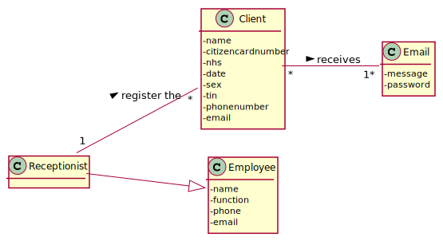

# US 03 - To register a client

## 1. Requirements Engineering

*In this section, it is suggested to capture the requirement description and specifications as provided by the client as well as any further clarification on it. It is also suggested to capture the requirements acceptance criteria and existing dependencies to other requirements. At last, identfy the involved input and output data and depicted an Actor-System interaction in order to fulfill the requirement.*

### 1.1. User Story Description

*As a receptionist of the laboratory, I want to register a client.*

### 1.2. Customer Specifications and Clarifications 

**From the specifications document:**

>	In case of a new client, the receptionist registers the client in the application.

>	To register a client, the receptionist needs the client’s citizen card number, National Healthcare Service (NHS) number, birth date, sex, Tax Identification number (TIF), phone number, e-mail and name.

**From the client clarifications:**

> **Question:** After being registered by the receptionist, should the client receive some kind of confirmation e-mail in order to finish his registration?
>  
> [**Answer:**](https://moodle.isep.ipp.pt/mod/forum/discuss.php?d=7736#p10133) The client only receives an e-mail informing that the registration was successful and that he can start to use the system. The e-mail includes the client password.

> **Question:** To register a Client which is the format of each attribute?
>  
> [**Answer:**](https://moodle.isep.ipp.pt/mod/forum/discuss.php?d=7563#p10179) 
> * Citizen Card: 16 digit.
> * number NHS: 10 digit number.
> * TIN: 10 digit number.
> * Birth day - in which format: DD/MM/YYYY.
> * Sex - should only be Male/Female or include more options.
> * Phone number: 11 digit number.
> * The sex is opcional. All other fields are required.

> **Question:** What parameter (asked by the receptionist) should the system use to create the password of the new client?
> 
> [**Answer:**](https://moodle.isep.ipp.pt/mod/forum/discuss.php?d=7462#p9872) The password should be randomly generated. It should have ten alphanumeric characters.

> **Question:** Recently you said that the maximum acceptable age is 150 years old, so the client can be born in 1870 and the data format is DD/MM/YY, this format can be tricky because, for example, if the data is DD/MM/70 the data can indicate that he born on 1870 or 1970. How can we solve this? Or I am understanding wrong?
> 
> [**Answer:**](https://moodle.isep.ipp.pt/mod/forum/discuss.php?d=7962#p10532) Thank you for identifying this issue. Please consider DD / MM / YYYY format for all dates.

> **Question:** What should be the maximum length of the String with the name of the Client?
>
> [**Answer:**](https://moodle.isep.ipp.pt/mod/forum/discuss.php?d=7945#p10383) A string with no more than 35 characters.

> **Question:** Is there any restrictions to the client age?
>
> [**Answer:**](https://moodle.isep.ipp.pt/mod/forum/discuss.php?d=7918#p10388) A client should not have more than 150 years of age. Although there are important developments in the pursuit of eternal youth, for now this value is ok.

> **Question:** How should the system send a email to the client with the password?
> 
> [**Answer:**](https://moodle.isep.ipp.pt/mod/forum/discuss.php?d=7808#p10545) Considering a set of technical restrictions, during the development of the Integrative Project we will not use any e-mail or SMS API services to send messages. All the e-mail and SMS messages should be written to a file with the name emailAndSMSMessages.txt. This file simulates the use of e-mail and SMS API services.

### 1.3. Acceptance Criteria

*Insert here the client acceptance criteria.*

* **AC1:** The client must become a system user. The "auth" component available on the repository must be reused (without modifications).
* **AC2:** All fields are required (excluding sex).
* **AC3:** The Client's password must be generated randomly and sent in the e-mail informing that the registration was successful.
* **AC4:** The password must have ten alphanumeric characters.
* **AC5:** The Citizen Card number must have 16 digits.
* **AC6:** The National Healthcare Service number must have 10 digits.
* **AC7:** The Birth date should be in this format: DD/MM/YYYY.
* **AC8:** A client should not have more than 150 years of age.
* **AC9:** The gender should only be Male/Female or include more options.
* **AC10:** The phone number must be a 11 digit number.

### 1.4. Found out Dependencies

*Identify here any found out dependency to other US and/or requirements.*

* No dependencies found

### 1.5 Input and Output Data

*Identity here the data to be inputted by the system actor as well as the output data that the system have/needs to present in order to properly support the actor actions. Regarding the inputted data, it is suggested to distinguish between typed data and selected data (e.g. from a list)*

**Input Data:**
      
* Typed data:
	* citizen card number, 
	* NHS number,
	* birth date,
	* sex,
	* TIF,
	* phone number,
	* e-mail,
	* name
	
* Selected data:
	* None
	
**Output Data:**

* (In)Success of the operation

### 1.6. System Sequence Diagram (SSD)

*Insert here a SSD depicting the envisioned Actor-System interactions and throughout which data is inputted and outputted to fulfill the requirement. All interactions must be numbered.*

### 1.7 Other Relevant Remarks

*Use this section to capture other relevant information that is related with this US such as (i) special requirements ; (ii) data and/or technology variations; (iii) how often this US is held.*

## 2. OO Analysis

### 2.1. Relevant Domain Model Excerpt

*In this section, it is suggested to present an excerpt of the domain model that is seen as relevant to fulfill this requirement.*

### 2.2. Other Remarks

*Use this section to capture some aditional notes/remarks that must be taken into consideration into the design activity. In some case, it might be usefull to add other analysis artifacts (e.g. activity or state diagrams).*

## 3. Design - User Story Realization 

### 3.1. Rationale

**The rationale grounds on the SSD interactions and the identified input/output data.**

| Interaction ID | Question: Which class is responsible for...                     | Answer                   | Justification (with patterns)                                                                                             |
|:-------------  |:--------------------------------------------------------------- |:------------------------:|:------------------------------------------------------------------------------------------------------------------------- |
| Step 1  		 | ... interacting with the actor?                                 | CreateClientUI           | Pure Fabrication: there is no justification for assigning this responsibility to any existing class in the Domain Model.  |
|                | ... coordinating the US?                                        | CreateClientController   | Controller                                                                                                                |
|                | ... creates Client instance?                                    | ClientStore              | ClientStore is the class that registers the Client, so is the one assign to this task                                     |
|                | ... knowing the user using the system?                          | UserSession              | IE: A&A component documentation                                                                                           |
| Step 2  		 |                                                                 |                          |                                                                                                                           |
| Step 3  		 | ... saving the inputted data?                                   | Client                   | IE: object created in step 1 has its own data.                                                                            |
|                |                                                                 | ClientDto                | IE: dto from the object created in step 1 and has its data                                                                |
| Step 4  		 |                                                                 |                          |                                                                                                                           |
| Step 5  		 | ... who shows the output ?                                      | CreateClientUI           | IE: responsible for user interactions with the system                                                                     |
| Step 6 		 | ... validating all data (local validation)?                     | Client                   | IE: owns its data.                                                                                                        |
|                | ... validating all data (global validation)?                    | ClientStore              | IE: knows all Clients.                                                                                                    |
|                | ... saving the created Client?                                  | ClientStore              | IE: owns all Clients.                                                                                                     |
| Step 7  		 | ... informing operation success?                                | CreateClientUI           | IE: is responsible for user interactions.                                                                                 |

### Systematization ##

According to the taken rationale, the conceptual classes promoted to software classes are: 

 * Company
 * Client

Other software classes (i.e. Pure Fabrication) identified: 

 * CreateClientUI
 * CreateClientController
 * ClientStore
 * ClientDto
 * ClientMapper

## 3.2. Sequence Diagram (SD)

## 3.3. Class Diagram (CD)

# 4. Tests 

**Test 1:** Check that it is not possible to create an instance of the Task class with null values. 

	@Test(expected = IllegalArgumentException.class)
		public void ensureNullIsNotAllowed() {
		Task instance = new Task(null, null, null, null, null, null, null);
	}
	

**Test 2:** Check that it is not possible to create an instance of the Task class with a reference containing less than five chars - AC2. 

	@Test(expected = IllegalArgumentException.class)
		public void ensureReferenceMeetsAC2() {
		Category cat = new Category(10, "Category 10");
		
		Task instance = new Task("Ab1", "Task Description", "Informal Data", "Technical Data", 3, 3780, cat);
	}

*It is also recommended to organize this content by subsections.* 

# 5. Construction (Implementation)

## Class CreateTaskController 

		public boolean createTask(String ref, String designation, String informalDesc, 
			String technicalDesc, Integer duration, Double cost, Integer catId)() {
		
			Category cat = this.platform.getCategoryById(catId);
			
			Organization org;
			// ... (omitted)
			
			this.task = org.createTask(ref, designation, informalDesc, technicalDesc, duration, cost, cat);
			
			return (this.task != null);
		}

## Class Organization

		public Task createTask(String ref, String designation, String informalDesc, 
			String technicalDesc, Integer duration, Double cost, Category cat)() {
		
	
			Task task = new Task(ref, designation, informalDesc, technicalDesc, duration, cost, cat);
			if (this.validateTask(task))
				return task;
			return null;
		}

# 6. Integration and Demo 

* A new option on the Employee menu options was added.

* Some demo purposes some tasks are bootstrapped while system starts.

# 7. Observations

Platform and Organization classes are getting too many responsibilities due to IE pattern and, therefore, they are becoming huge and harder to maintain. 

Is there any way to avoid this to happen?

