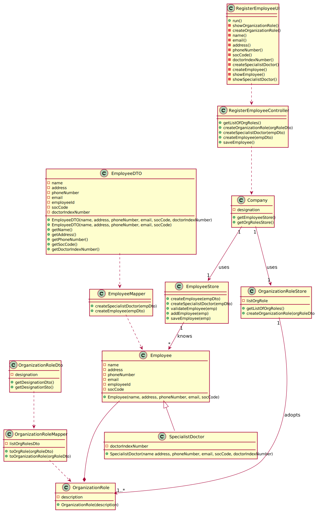

# US 07 - Register a new Employee

## 1. Requirements Engineering

### 1.1. User Story Description
*As an Administrator, I want register a new employee.*
### 1.2. Customer Specifications and Clarifications
>_**Question:**_ What data characterizes a Manylabs employee?
> 
> [_**Answer:**_](https://moodle.isep.ipp.pt/mod/forum/discuss.php?d=7126#p9455) All the roles that exist in the Many Labs company are characterized by the following attributes:
> * Employee ID;
> * Organization Role;
> * Name;
> * Address;
> * Phone Number;
> * E-Mail;
> * Standard Occupational Classification (SOC) code.
> 
> The Specialist Doctor has an additional attribute:
> * Doctor Index Number.

> _**Question:**_ What format should the phone number be?
>
> [_**Answer:**_](https://moodle.isep.ipp.pt/mod/forum/discuss.php?d=7153#p9462) Phone number : 11 digits number

>_**Question:**_ When creating a new employee, the attributes "Employee ID" and "Doctor Index Number", are implemented by the administrator or incremented by the system?
> 
> [_**Answer:**_](https://moodle.isep.ipp.pt/mod/forum/discuss.php?d=7547#p10159) Only the employee ID should be generated from the initials of the employee name and should include a number. The number has 5 digits and is increases automatically when a new employee is registered in the system.
> The Doctor Index Number should be introduced by the administrator.

>[The Doctor index number has 6 digits and it´s introduced by the Administrator.](https://moodle.isep.ipp.pt/mod/forum/discuss.php?d=7854#p10407)

> [Soc Number has 4 digits and it´s introduced by the administrator.](https://moodle.isep.ipp.pt/mod/forum/discuss.php?d=7854#p10407)

> _**Question:**_ How should the password be generated?
> 
>  [_**Answer:**_](https://moodle.isep.ipp.pt/mod/forum/discuss.php?d=7872#p10396) The password should be randomly generated. It should have ten alphanumeric characters.

>_**Question:**_  Which is the organization role's format?
> 
> [_**Answer:**_](https://moodle.isep.ipp.pt/mod/forum/discuss.php?d=7928#p10387) Organization Role: a string with no more than 15 characters.

> _**Question:**_ When the application is delivered, should it have default employees, ex: administrator, etc.., or should be completely empty (without any user or employee).
> 
> [_**Answer:**_](https://moodle.isep.ipp.pt/mod/forum/discuss.php?d=7668#p10201) One Administrator must be registered before starting the application for the first time.

> _**Question:**_ The application can add new employees but can it remove them, for example when one of them is fired?
>
> [_**Answer:**_](https://moodle.isep.ipp.pt/mod/forum/discuss.php?d=7668#p10201) For now, I do not want such a feature.

>_**Question:**_  Is there any size limit to the employee's name?
> 
> [_**Answer**_](https://moodle.isep.ipp.pt/mod/forum/discuss.php?d=7973#p10536) Employee Name: "a string with no more than 35 characters".

> _**Question:**_ When registering a new employee should the administrator write or select his role?
> 
> [_**Answer**_](https://moodle.isep.ipp.pt/mod/forum/discuss.php?d=7863#p10541) The administrator should write the role when he is registering a new employee.

### 1.3. Acceptance Criteria
- *_AC1:_* Each user must have a single role defined in the System. 
- *_AC2:_* The "auth" component available on the repository must be reused (without modifications).
- *_AC3:_* Every employee must be a user of the system.
- *_AC4:_* The employeeId must be generated automatically.
- *_AC5:_* The phone number must have 11 digits.
- *_AC6:_* Doctor index number has 6 digits.
- *_AC7:_* Soc number must have 4 digits.
- *_AC7:_* The Organization role must have maximum 15 characters.
- *_AC8:_* When the application is used for the first time, it must contain at least one administrator registered in the system.
- *_AC9:_* The Employee name has maximum 35 characters.
- *_AC10:_* Password must have ten alphanumerics characters.

### 1.4. Found out Dependencies
- The "Auth" component
### 1.5 Input and Output Data

**Input Data:**

* Typed data:
    * a name,
    * an address,
    * a phone number,
    * an email,
    * a SOC code,
    * the doctor index number,
    * the organization role
   
  
* Automatically generated data:
  * employee id 
  * password
  

**Output Data:**

* (In)Success of the operation

### 1.6. System Sequence Diagram (SSD)

### 1.7 Other Relevant Remarks

* All employees need to become a user of the system.
* This US will be used more frequently in the first use of the system, then it will only be necessary in the case of a new contract.

## 2. OO Analysis

### 2.1. Relevant Domain Model Excerpt

### 2.2. Other Remarks

*Use this section to capture some additional notes/remarks that must be taken into consideration into the design activity. In some case, it might be usefull to add other analysis artifacts (e.g. activity or state diagrams).* 

## 3. Design - User Story Realization 

### 3.1. Rationale

**The rationale grounds on the SSD interactions and the identified input/output data.**

| Interaction ID | Question: Which class is responsible for... | Answer  | Justification (with patterns)  |
|:-------------  |:--------------------- |:------------|:---------------------------- |
| Step 1  	   |	... interacting with the actor ? | CreateEmployeeUI | There is no logical reason to assign this task to any of the existing class in the Domain Model |
|              | ... coordinating the US ? | CreateEmployeeController | This task is assign to a Controller to make the connection from the UI and all the classes |      
|              | ... instantiating a new Employee ? | Company | In the DM company is the class that employs the Employee, so is the one assign to this task |
|              | ... knowing the user using the system ? | UserSession | IE: A&A component documentation |
| Step 2       |  ... knowing the organizationRoles to show ? | ListRoles | has registered all the roles |
|              |                                   | ListRolesDto | dto from OrganizationRole that has all the registered roles |
| Step 3       | ... saving the selected role ?    | OrgRole      | IE: object created to have all the information about a role |
|              |                                   | OrgRoleDto   | dto from the object created to have all the information about a role |
| Step 4       | n/a                               |  n/a         | n/a |
| Step 5       | ... saving the inputted data ?    | Employee | IE: the object created in step 1 has its own data |
|              |                                   | EmployeeDto | IE: dto from the object created in step 1 and has its data |
| Step 6       | ... who shows the output ?        | CreateEmployeeUI | IE: responsible for user interactions with the system |
| Step 7       | ... validating all data (local validation) ? | OrgRole | IE: holds the role data and creates the employee |
|              | ... validating all data (global validation) ? | Company | IE: knows all its tasks |
|              | ... saving the created task ? | Company | IE: knows all its tasks |
| Step 8       | ... informing operation success ?  | CreateEmployeeUI | IE: responsible for user interactions with the system |
### Systematization ##

According to the taken rationale, the conceptual classes promoted to software classes are: 

 * Company
 * Employee

Other software classes (i.e. Pure Fabrication) identified: 
 * CreateEmployeeUI  
 * CreateEmployeeController
 * EmployeeStore
 * EmployeeDto
 * EmployeeMapper
 * OrganizationRoleDto
 * OrganizationRoleMapper
   

## 3.2. Sequence Diagram (SD)

## 3.3. Class Diagram (CD)

# 4. Tests 
*In this section, it is suggested to systematize how the tests were designed to allow a correct measurement of requirements fulfilling.* 

**_DO NOT COPY ALL DEVELOPED TESTS HERE_**

**Test 1:** Check that it is not possible to create an instance of the Example class with null values. 

	@Test(expected = IllegalArgumentException.class)
		public void ensureNullIsNotAllowed() {
		Exemplo instance = new Exemplo(null, null);
	}

*It is also recommended to organize this content by subsections.* 

# 5. Construction (Implementation)

*In this section, it is suggested to provide, if necessary, some evidence that the construction/implementation is in accordance with the previously carried out design. Furthermore, it is recommeded to mention/describe the existence of other relevant (e.g. configuration) files and highlight relevant commits.*

*It is also recommended to organize this content by subsections.* 

# 6. Integration and Demo 

*In this section, it is suggested to describe the efforts made to integrate this functionality with the other features of the system.*

# 7. Observations

*In this section, it is suggested to present a critical perspective on the developed work, pointing, for example, to other alternatives and or future related work.*

