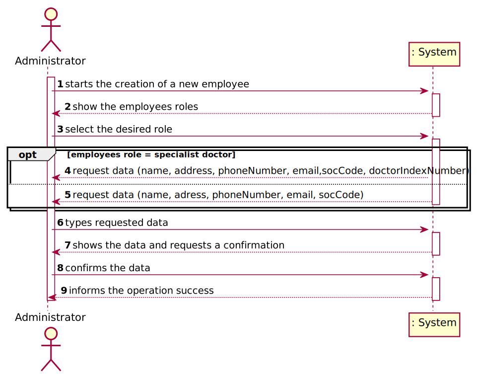
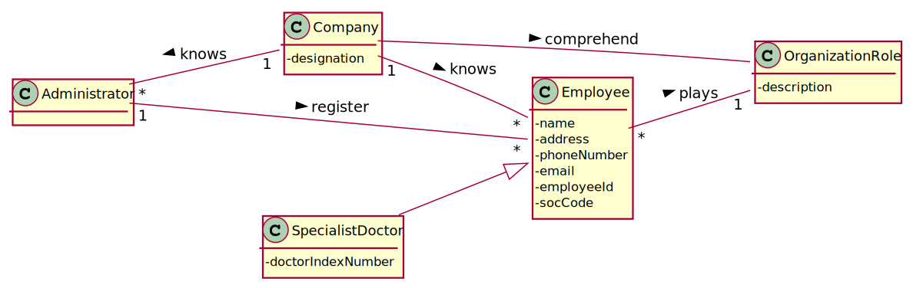
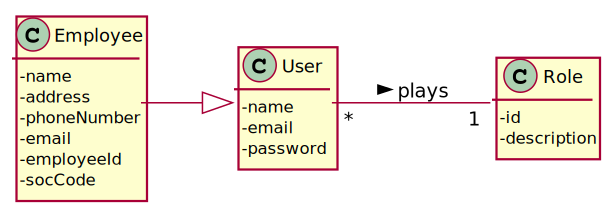

# US 07 - Register a new Employee

## 1. Requirements Engineering

### 1.1. User Story Description
*As an Administrator, I want register a new employee.*
### 1.2. Customer Specifications and Clarifications
>_**Question:**_ What data characterizes a Manylabs employee?
> 
> [_**Answer:**_](https://moodle.isep.ipp.pt/mod/forum/discuss.php?d=7126#p9455) All the roles that exist in the Many Labs company are characterized by the following attributes:
> * Employee ID;
> * Organization Role;
> * Name;
> * Address;
> * Phone Number;
> * E-Mail;
> * Standard Occupational Classification (SOC) code.
> 
> The Specialist Doctor has an additional attribute:
> * Doctor Index Number.

> _**Question:**_ What format should the phone number be?
>
> [_**Answer:**_](https://moodle.isep.ipp.pt/mod/forum/discuss.php?d=7153#p9462) Phone number : 11 digits number

>_**Question:**_ When creating a new employee, the attributes "Employee ID" and "Doctor Index Number", are implemented by the administrator or incremented by the system?
> 
> [_**Answer:**_](https://moodle.isep.ipp.pt/mod/forum/discuss.php?d=7547#p10159) Only the employee ID should be generated from the initials of the employee name and should include a number. The number has 5 digits and is increases automatically when a new employee is registered in the system.
> The Doctor Index Number should be introduced by the administrator.

>[The Doctor index number has 6 digits and it´s introduced by the Administrator.](https://moodle.isep.ipp.pt/mod/forum/discuss.php?d=7854#p10407)

> [Soc Number has 4 digits and it´s introduced by the administrator.](https://moodle.isep.ipp.pt/mod/forum/discuss.php?d=7854#p10407)

> _**Question:**_ How should the password be generated?
> 
>  [_**Answer:**_](https://moodle.isep.ipp.pt/mod/forum/discuss.php?d=7872#p10396) The password should be randomly generated. It should have ten alphanumeric characters.

>_**Question:**_  Which is the organization role's format?
> 
> [_**Answer:**_](https://moodle.isep.ipp.pt/mod/forum/discuss.php?d=7928#p10387) Organization Role: a string with no more than 15 characters.

> _**Question:**_ When the application is delivered, should it have default employees, ex: administrator, etc.., or should be completely empty (without any user or employee).
> 
> [_**Answer:**_](https://moodle.isep.ipp.pt/mod/forum/discuss.php?d=7668#p10201) One Administrator must be registered before starting the application for the first time.

> _**Question:**_ The application can add new employees but can it remove them, for example when one of them is fired?
>
> [_**Answer:**_](https://moodle.isep.ipp.pt/mod/forum/discuss.php?d=7668#p10201) For now, I do not want such a feature.

>_**Question:**_  Is there any size limit to the employee's name?
> 
> [_**Answer**_](https://moodle.isep.ipp.pt/mod/forum/discuss.php?d=7973#p10536) Employee Name: "a string with no more than 35 characters".

> _**Question:**_ When registering a new employee should the administrator write or select his role?
> 
> [_**Answer**_](https://moodle.isep.ipp.pt/mod/forum/discuss.php?d=7863#p10541) The administrator should write the role when he is registering a new employee.

### 1.3. Acceptance Criteria
- *_AC1:_* Each user must have a single role defined in the System. 
- *_AC2:_* The "auth" component available on the repository must be reused (without modifications).
- *_AC3:_* Every employee must be a user of the system.
- *_AC4:_* The employeeId must be generated automatically with this following format: "XXXX00000".
- *_AC5:_* The phone number must have 11 digits.
- *_AC6:_* Doctor index number has 6 digits.
- *_AC7:_* Soc number must have 4 digits.
- *_AC8:_* The Organization role must have maximum 15 characters.
- *_AC9:_* When the application is used for the first time, it must contain at least one administrator registered in the system.
- *_AC10:_* The Employee name has maximum 35 characters.
- *_AC11:_* Password must have ten alphanumerics characters.

### 1.4. Found out Dependencies
- The "Auth" component
### 1.5 Input and Output Data

**Input Data:**

* Typed data:
    * a name,
    * an address,
    * a phone number,
    * an email,
    * a SOC code,
    * the doctor index number,
    * the organization role
   
  
* Automatically generated data:
  * employee id 
  * password
  

**Output Data:**

* (In)Success of the operation

### 1.6. System Sequence Diagram (SSD)

### 1.7 Other Relevant Remarks

* All employees need to become a user of the system.
* This US will be used more frequently in the first use of the system, then it will only be necessary in the case of a new contract.

## 2. OO Analysis

### 2.1. Relevant Domain Model Excerpt

### 2.2. Other Remarks
* Exert of the domain model of the Auth component relevant to the development of the acceptance criteria 3.

## 3. Design - User Story Realization 

### 3.1. Rationale

**The rationale grounds on the SSD interactions and the identified input/output data.**

| Interaction ID | Question: Which class is responsible for... | Answer  | Justification (with patterns)  |
|:-------------  |:--------------------- |:------------|:---------------------------- |
| Step 1  	   |	... interacting with the actor ? | CreateEmployeeUI | Pure Fabrication: there is no justification for assigning this responsibility to any existing class in the Domain Model. |
|              | ... knowing the user using the system ? | UserSession | IE: A&A component documentation |
|              | ... coordinating the US ? | CreateEmployeeController | This task is assign to a Controller to make the connection from the UI and all the classes |
|              | ... knowing who is responsible for creating Employee instances?| Company | Creator (R1)|
|              | ... creates Employee instance?                                 | EmployeeStore       | HC+LC on the Company. By HC / LC the Company delegates these responsibilities in EmployeeStore.|
| Step 2       |  ... knowing who is responsible for know all Organization role?| Company |  Creator (R1)|
|              | ...know all the organizational roles for show? | OrganizationRoleStore |HC+LC on the Company. By HC / LC the Company delegates these responsibilities in OrganizationRoleStore. |
| Step 3       | ... saving the selected role ?    | OrganizationRole | IE: object created to have all the information about a role |
| Step 4       |                               |         |  |
| Step 5       | | | 
| Step 6       | ... saving the inputted data ?    | Employee | IE: the object created in step 1 has its own data |
| Step 7      | ... who shows the output ?        | CreateEmployeeUI | IE: responsible for user interactions with the system |
| Step 8       | ... validating all data (local validation) ? | Employee | IE: holds the role data and creates the employee |
|              | ... validating all data (global validation) ? | EmployeeStore | IE: knows all its Employees |
|              | ... saving the created task ? | EmployeeStore | IE: knows all its Employees|
| Step 8       | ... informing operation success ?  | CreateEmployeeUI | IE: responsible for user interactions with the system |
### Systematization ##

According to the taken rationale, the conceptual classes promoted to software classes are: 

 * Company
 * Employee

Other software classes (i.e. Pure Fabrication) identified: 
 * CreateEmployeeUI  
 * CreateEmployeeController
 * EmployeeStore
 * EmployeeDto
 * EmployeeMapper
 * OrganizationRoleDto
 * OrganizationRoleMapper
   

## 3.2. Sequence Diagram (SD)

## 3.3. Class Diagram (CD)

# 4. Tests 

**Test 1:** Check that it is not possible to create an instance of the Employee class with null values. 

	@Test(expected = NullPointerException.class)
    public void ensureNullIsNotAllowed(){new Employee(null, null, null, null, null, null);}
**Test 2:** Check that it is not possible to create an instance of Name with less than 35 characters - AC9.

	@Test(expected = IllegalArgumentException.class)
    public void ensureNameMeetsAC9(){new Name("Maria Lucia Lima de Ferreira Carvalho");}

**Test 3:** Check that it is not possible to create an instance of Doctor index number with less than 6 digits - AC6.

    @Test(expected = IllegalArgumentException.class)
    public void ensureDoctorIndexNumberMeetsAC6_1(){new DoctorIndexNumber("1234567");}

    @Test(expected = IllegalArgumentException.class)
    public void ensureDoctorIndexNumberMeetsAC6_2(){new DoctorIndexNumber("123");}

    @Test(expected = IllegalArgumentException.class)
    public void ensureDoctorIndexNumberMeetsAC6_3(){new DoctorIndexNumber("1adt57");}
  
    @Test(expected = IllegalArgumentException.class)
    public void ensureNameMeetsAC9(){new Name("Maria Lucia Lima de Ferreira Carvalho");}

**Test 4:** Check that it is not possible to create an instance of SOC code with less than 4 digits - AC7.
    
    @Test(expected = IllegalArgumentException.class)
    public void ensureSocCodeMeetsAC7_1(){new SocCode("1111111");}

    @Test(expected = IllegalArgumentException.class)
    public void ensureSocCodeMeetsAC7_2(){new SocCode("1");}

    @Test(expected = IllegalArgumentException.class)
    public void ensureSocCodeMeetsAC7_3(){new SocCode("1ah7");}

**Test 5:** Check that it is not possible to create an instance of Phone number with less than 11 digits - AC5.
    
    @Test(expected = IllegalArgumentException.class)
    public void ensurePhoneNumberMeetsAC5_1(){new PhoneNumber("11111");}

    @Test(expected = IllegalArgumentException.class)
    public void ensurePhoneNumberMeetsAC5_2(){new PhoneNumber("11111111111111111");}

    @Test(expected = IllegalArgumentException.class)
    public void ensurePhoneNumberMeetsAC5_3(){new PhoneNumber("11111abgss");}

# 5. Construction (Implementation)

##Class RegisterEmployeeController
  
    /**
     * Returns a DTO-type list of organizational roles present in the company
     * @return A DTO-type list of Organization roles
     */
    public List<OrganizationRoleDTO> getLisOfOrgRoles(){
       return this.mapperOrgRole.listOrgRolesDto(this.organizationRoleStore.getListOrgRoles());
    }

##Class EmployeeStore

    /**
     * Global validation of a Employee
     * @param employee Employee that we intend to validate
     * @return false if the employee already exists or is null. Otherwise, it returns true.
     */
    public boolean validateEmployee(Employee employee){
        if (employee == null) return false;
        return !this.employees.contains(employee);
    }

    /**
     * Save the employee case it is in a valid state.
     * @param employee The employee we intend to save
     * @return true if the employee was saved. Otherwise, false.
     */
    public boolean saveEmployee(Employee employee){
        if (!validateEmployee(employee)) return false;
        return this.addEmployee(employee);
    }
##Class EmployeeDTO

    /**
     * Creates a new instance of EmployeeDto with the following attributes: name, email, address, phone number, soc code, organizational role and doctor index number
     * @param name employer's name
     * @param email employer's email
     * @param address employer's address
     * @param phoneNumber employer's phone number
     * @param socCode employer's socCode
     * @param organizationRole employer's organization role
     * @param doctorIndexNumber employer's doctor index number
     */
    public EmployeeDTO(Name name, Email email, Address address, PhoneNumber phoneNumber, SocCode socCode, OrganizationRole organizationRole, DoctorIndexNumber doctorIndexNumber) {
        this.name = new Name(name);
        this.email = new Email(email);
        this.address = new Address(address);
        this.phoneNumber = new PhoneNumber(phoneNumber);
        this.socCode = new SocCode(socCode);
        this.organizationRole = new OrganizationRole(organizationRole);
        this.doctorIndexNumber = new DoctorIndexNumber(doctorIndexNumber);
    }

    /**
     * Creates a new instance of EmployeeDto with the following attributes: name, email, address, phone number, soc code and organizational role
     * @param name employer's name
     * @param email employer's email
     * @param address employer's address
     * @param phoneNumber employer's phone number
     * @param socCode employer's SOC code
     * @param organizationRole employer's organization role
     */
    public EmployeeDTO(Name name, Email email, Address address, PhoneNumber phoneNumber,SocCode socCode, OrganizationRole organizationRole) {
        this.name = new Name(name);
        this.email = new Email(email);
        this.address = new Address(address);
        this.phoneNumber = new PhoneNumber(phoneNumber);
        this.socCode = new SocCode(socCode);
        this.organizationRole = new OrganizationRole(organizationRole);
    }

# 6. Integration and Demo 

* For some demo purposes, some user roles are bootstrapped while the system starts.
  

* Integration with the AuthFacade class was required for the registered employee to become a user of the system.

# 7. Observations

`* In the future, the user story will be developed with a graphical interface, and the option to select the organizational role will be added.`
  

* The responsibility of generating a random password maturely may in the future be delegated to a new class for greater maintenance of the code.

