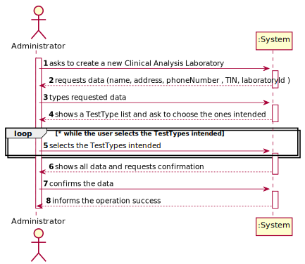
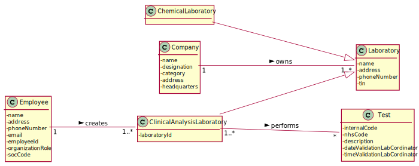
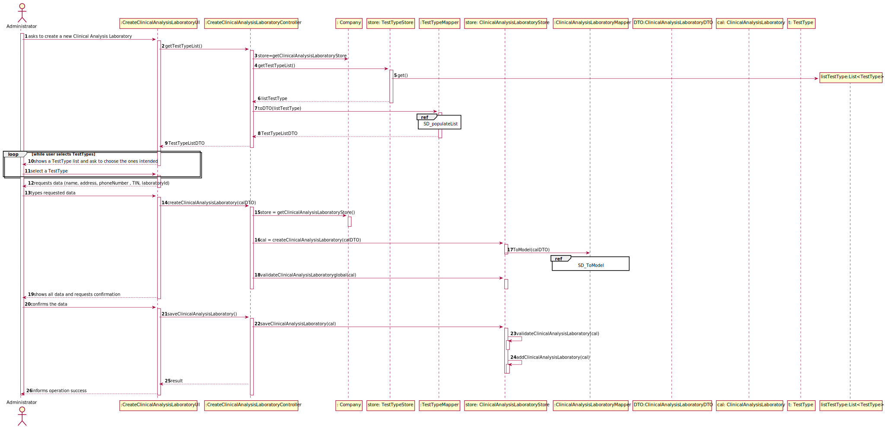

# US 08 - Register a new clinical analysis laboratory 

## 1. Requirements Engineering

### 1.1. User Story Description

As an administrator, I want to register a new clinical analysis laboratory stating which
kind of test(s) it operates.

### 1.2. Customer Specifications and Clarifications 

**From the specifications document:**

>	All Many Labs clinical analysis laboratories perform clinical blood tests, and a subset of
these laboratories also performs Covid-19 tests.

> The set of Many Labs clinical analysis laboratories form a network that covers all England, and it is
responsible for collecting samples and interacting with clients.

>The samples collected by the
network of laboratories are then sent to the chemical laboratory located in the company's
headquarters and the chemical analysis are performed there.
 

**From the client clarifications:**

> **Question:** What kind of information does the company store about about their clinical analysis laboratory
>  
> [**Answer:**](https://moodle.isep.ipp.pt/mod/forum/discuss.php?d=7126) 
> The clinical analysis laboratory is caracterized by its name, address , phone number and its TIN number

> **Question:** "Which type/format has LaboratoryID, address, name, phone number, and TIN number on Clinical Analysis Laboratory?"
>  
> [**Answer:**](https://moodle.isep.ipp.pt/mod/forum/discuss.php?d=7636)
>Each Clinical Analysis Laboratory is characterized by the following attributes:
> * Laboratory ID: five alphanumeric characters;
> * Name: A string with no more than 20 characters;
> * Address: A string with no more than 30 characters;
> * Phone Number: 11 digit number;
> * TIN number: 10 digit number;
> * Type of tests performed by the lab.

All information is required.

### 1.3. Acceptance Criteria

* **AC1:** Every Clinical Analysis Laboratory must perform blood tests
* **AC2:** The laboratoryId has 5 alphanumeric characters
* **AC3:** The name must have no more than 20 characters
* **AC4:** The address must have no more than 30 characters
* **AC5:** The phone number is an 11-digit number
* **AC6:** TIN is a 10-digit number
* **AC7:** Every field is required

### 1.4. Found out Dependencies

* There is a dependency to "US09 Specify a new type of test" since at least the types of test must exist to associate them to the Clinical Analysis Laboratory.

### 1.5 Input and Output Data

**Input Data:**

* Typed data:
	*  name 
	*  address
	*  phoneNumber
	*  TIN
	*  laboratoryId
	
* Selected data:
	* Test Types

**Output Data:**

* (In)Success of the operation

### 1.6. System Sequence Diagram (SSD)

**Alternative 1**

**Alternative 2**

**Other alternatives might exist.**

### 1.7 Other Relevant Remarks

* This Us is going to be used frequently in the beggining to register the Clinical Analysis Laboratories 
  that they have but later its use will become rarer.

## 2. OO Analysis

### 2.1. Relevant Domain Model Excerpt 

### 2.2. Other Remarks

n/a

## 3. Design - User Story Realization 

### 3.1. Rationale

**SSD - Alternative 1 is adopted.**

| Interaction ID | Question: Which class is responsible for... | Answer  | Justification (with patterns)  |
|:-------------  |:--------------------- |:------------|:---------------------------- |
| Step 1  		 |	... interacting with the actor? | CreateClinicalAnalysisLaboratoryUI   |  Pure Fabrication: there is no reason to assign this responsibility to any existing class in the Domain Model.           |
| 			     |	... coordinating the US? | CreateClinicalAnalysisLaboratoryController | Controller                             |
| 			     |	... knowing who is responsible for creating Clinical Analysis Laboratory instances? | Company   | Creator (R1)   |
| 			  	 | ... knowing the user using the system?  | UserSession  |   |
| 			  	 |	... creates Clinical Analysis Laboratory instance? | Laboratory  | HC+LC on the Company. By HC / LC the Company delegates these responsibilities in TestTypeStore. |
| Step 2  		 |							 |             |                              |
| Step 3  		 |	...saving the inputted data? | ClinicalAnalysisLaboratory  | IE: object created in step 1 has its own data.  |
| Step 4  		 |	...knowing the TestType to show? | TestTypeStore  | IE: knows all the TestTypes. |
| Step 5  		 |	... saving the selected TestTypes? | ClinicalAnalysisLaboratory  | IE: the object created contains one or more TestTypes.  |
| Step 6  		 |							 |             |                              |              
| Step 7  		 |	... validating all data (local validation)? | ClinicalAnalysisLaboratory | IE: owns its data.| 
| 			  		 |	... validating all data (global validation)? | Laboratory | IE: knows all its Clinical Analysis Laboratories.| 
| 			  		 |	... saving the created task? | Laboratory | IE: owns all its Clinical Analysis Laboratories.| 
| Step 8  		 |	... informing operation success?| CreateClinicalAnalysisLaboratoryUI  | IE: is responsible for user interactions.  | 

### Systematization ##

According to the taken rationale, the conceptual classes promoted to software classes are: 

 * Company
 * ClinicalAnalysisLaboratory
 * TestTypeStore

Other software classes (i.e. Pure Fabrication) identified: 

 * CreateClinicalAnalysisLaboratoryUI  
 * CreateClinicalAnalysisLaboratoryController

## 3.2. Sequence Diagram (SD)

**Alternative 1**

**Alternative 2**

## 3.3. Class Diagram (CD)

**From alternative 1**

# 4. Tests 

**Test 1:** Check that it is not possible to create an instance of the Task class with null values. 

	@Test(expected = IllegalArgumentException.class)
		public void ensureNullIsNotAllowed() {
		Task instance = new Task(null, null, null, null, null, null, null);
	}
	

**Test 2:** Check that it is not possible to create an instance of the Task class with a reference containing less than five chars - AC2. 

	@Test(expected = IllegalArgumentException.class)
		public void ensureReferenceMeetsAC2() {
		Category cat = new Category(10, "Category 10");
		
		Task instance = new Task("Ab1", "Task Description", "Informal Data", "Technical Data", 3, 3780, cat);
	}

*It is also recommended to organize this content by subsections.* 

# 5. Construction (Implementation)

## Class CreateClinicalAnalysisLaboratoryController 

## Class Company

# 6. Integration and Demo

# 7. Observations

