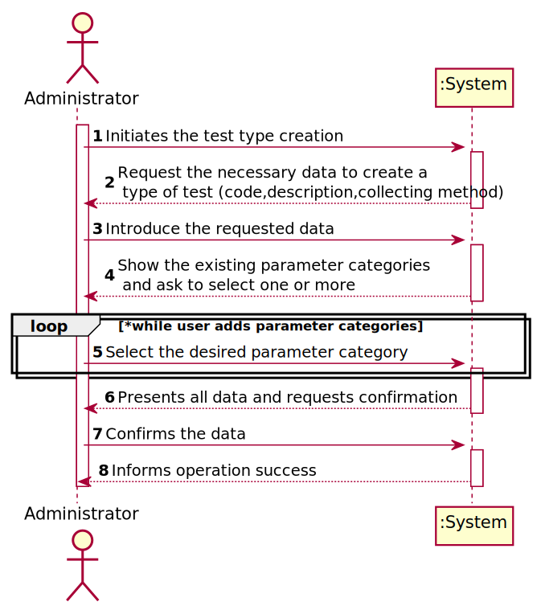
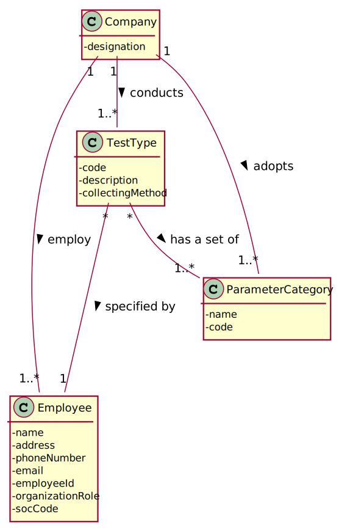

# US 09 - To specify a Type of Test

## 1. Requirements Engineering

### 1.1. User Story Description

As an administrator, I want to specify a new type of test and its collecting methods.

### 1.2. Customer Specifications and Clarifications 

**From the specifications document:**

> Many Labs performs two types of tests. Each test is characterized by an internal code, an NHS
code, a description that identifies the sample collection method, the date and time when the samples
were collected, the date and time of the chemical analysis, the date and time of the diagnosis made
by the specialist doctor, the date and time when the laboratory coordinator validated the test, and the
test type (whether it is blood test or Covid test).

> Blood tests are frequently characterized by measuring several parameters which for
presentation/reporting purposes are organized by categories. For example, parameters such
as the number of Red Blood Cells (RBC), White Blood Cells (WBC) and Platelets (PLT) are
usually presented under the blood count (Hemogram) category.

> Covid tests are characterized by measuring a single parameter stating whether it is a positive
or a negative result.

> Despite being out of scope, the system should be developed having in mind the need to
easily support other kinds of tests (e.g., urine).

**From the client clarifications:**

> **Question:** Is there a feature where you add collection methods or is there an already existent list where you choose from not having the option to add another?
>  
> **Answer:** .

> **Question:** What other type of input does a test type need besides its designation and sample collection method?
>  
> **Answer:** .

> **Question:** Does the admin select the sample collection method from a pre-existent list or does he write it?
>
> **Answer:** .

> **Question:** Is there any kind of rules that the admin should be restricted to, when he is creating a new test type? 
>
> **Answer:** .

> **Question:** What attributes should a Test Type have, when the administrator is creating a new one?
>
> **Answer:** .

> **Question:** Are there any different collecting methods other than the ones currently known? Which ones?
>
> **Answer:** .

> **Question:** Does a type of test holds any atributte besides it's name and collecting methods?
>
> **Answer:** .

> **Question:** Are the collecting methods stored simpled as a word or a sentence, or does it also must contain it's description, and/or another attributes?
>
> **Answer:** .

> **Question:**
>
> **Answer:** .

### 1.3. Acceptance Criteria

* **AC1:** Despite being out of scope, the system should be developed having in mind the need to
  easily support other kinds of tests (e.g., urine).
* **AC2:** 

### 1.4. Found out Dependencies

* 

### 1.5 Input and Output Data

**Input Data:**

* Typed data:
	* designation
	* internalCode
	* nhsCode
	* description
	
	
* Selected data:
	* 

**Output Data:**

*

### 1.6. System Sequence Diagram (SSD)

**Alternative 1**

**Alternative 2**

**Other alternatives might exist.**

### 1.7 Other Relevant Remarks

* The created task stays in a "not published" state in order to distinguish from "published" tasks.

## 2. OO Analysis

### 2.1. Relevant Domain Model Excerpt 

### 2.2. Other Remarks

n/a

## 3. Design - User Story Realization 

### 3.1. Rationale

**SSD - Alternative 1 is adopted.**

| Interaction ID | Question: Which class is responsible for... | Answer  | Justification (with patterns)  |
|:-------------  |:--------------------- |:------------|:---------------------------- |
| Step 1  		 |	... interacting with the actor? | CreateTaskUI   |  Pure Fabrication: there is no reason to assign this responsibility to any existing class in the Domain Model.           |
| 			  	 |	... coordinating the US? | CreateTaskController | Controller                             |
| 			  	 |	... instantiating a new Task? | Organization   | Creator (Rule 1): in the DM Organization has a Task.   |
| 			  	 | ... knowing the user using the system?  | UserSession  | IE: cf. A&A component documentation.  |
| 			  	 |	... knowing to which organization the user belongs to? | Platform  | IE: has registed all Organizations |
| 			  	 |							 | Organization   | IE: knows/has its own Employees|
| 			  	 |							 | Employee  | IE: knows its own data (e.g. email) |
| Step 2  		 |							 |             |                              |
| Step 3  		 |	...saving the inputted data? | Task  | IE: object created in step 1 has its own data.  |
| Step 4  		 |	...knowing the task categories to show? | Platform  | IE: Task Categories are defined by the Platform. |
| Step 5  		 |	... saving the selected category? | Task  | IE: object created in step 1 is classified in one Category.  |
| Step 6  		 |							 |             |                              |              
| Step 7  		 |	... validating all data (local validation)? | Task | IE: owns its data.| 
| 			  	 |	... validating all data (global validation)? | Organization | IE: knows all its tasks.| 
| 			  	 |	... saving the created task? | Organization | IE: owns all its tasks.| 
| Step 8  		 |	... informing operation success?| CreateTaskUI  | IE: is responsible for user interactions.  | 

### Systematization ##

According to the taken rationale, the conceptual classes promoted to software classes are: 

 * Organization
 * Platform
 * Task

Other software classes (i.e. Pure Fabrication) identified: 

 * CreateTaskUI  
 * CreateTaskController

## 3.2. Sequence Diagram (SD)

**Alternative 1**

**Alternative 2**

## 3.3. Class Diagram (CD)

**From alternative 1**

# 4. Tests 

**Test 1:** Check that it is not possible to create an instance of the Task class with null values. 

	@Test(expected = IllegalArgumentException.class)
		public void ensureNullIsNotAllowed() {
		Task instance = new Task(null, null, null, null, null, null, null);
	}
	

**Test 2:** Check that it is not possible to create an instance of the Task class with a reference containing less than five chars - AC2. 

	@Test(expected = IllegalArgumentException.class)
		public void ensureReferenceMeetsAC2() {
		Category cat = new Category(10, "Category 10");
		
		Task instance = new Task("Ab1", "Task Description", "Informal Data", "Technical Data", 3, 3780, cat);
	}

*It is also recommended to organize this content by subsections.* 

# 5. Construction (Implementation)

## Class CreateTaskController 

		public boolean createTask(String ref, String designation, String informalDesc, 
			String technicalDesc, Integer duration, Double cost, Integer catId)() {
		
			Category cat = this.platform.getCategoryById(catId);
			
			Organization org;
			// ... (omitted)
			
			this.task = org.createTask(ref, designation, informalDesc, technicalDesc, duration, cost, cat);
			
			return (this.task != null);
		}

## Class Organization

		public Task createTask(String ref, String designation, String informalDesc, 
			String technicalDesc, Integer duration, Double cost, Category cat)() {
		
	
			Task task = new Task(ref, designation, informalDesc, technicalDesc, duration, cost, cat);
			if (this.validateTask(task))
				return task;
			return null;
		}

# 6. Integration and Demo 

* A new option on the Employee menu options was added.

* Some demo purposes some tasks are bootstrapped while system starts.

# 7. Observations

Platform and Organization classes are getting too many responsibilities due to IE pattern and, therefore, they are becoming huge and harder to maintain. 

Is there any way to avoid this to happen?

