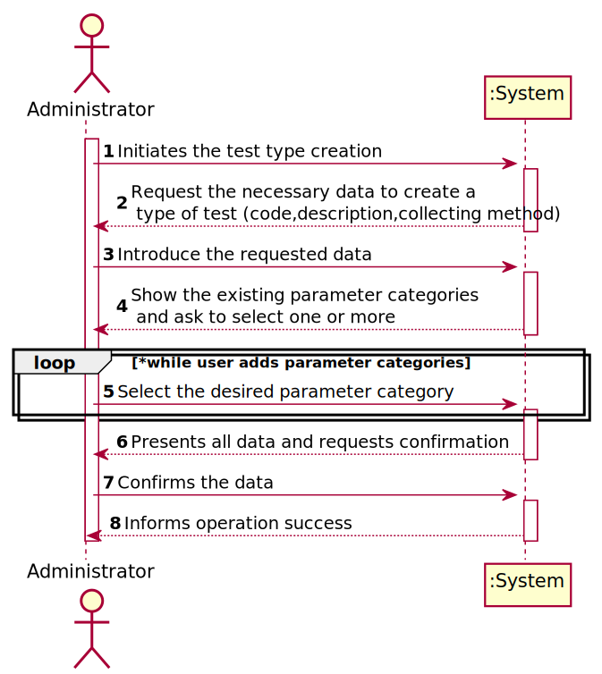
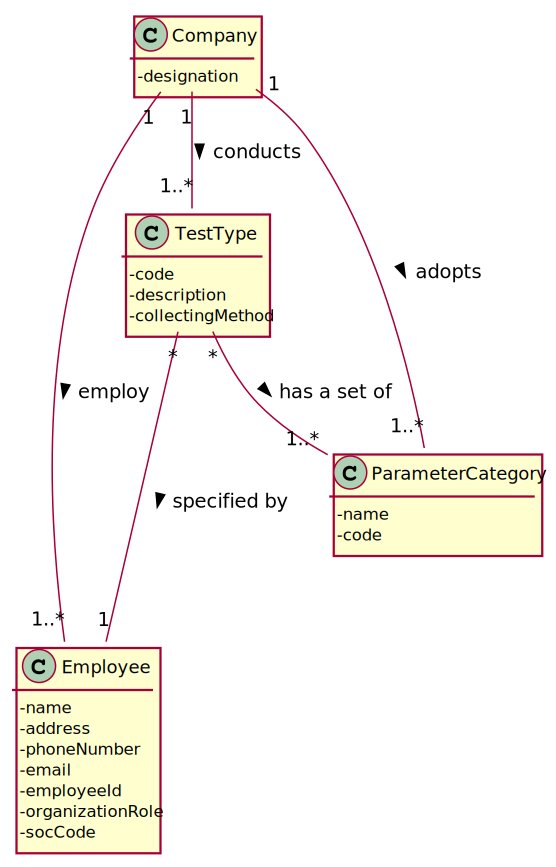
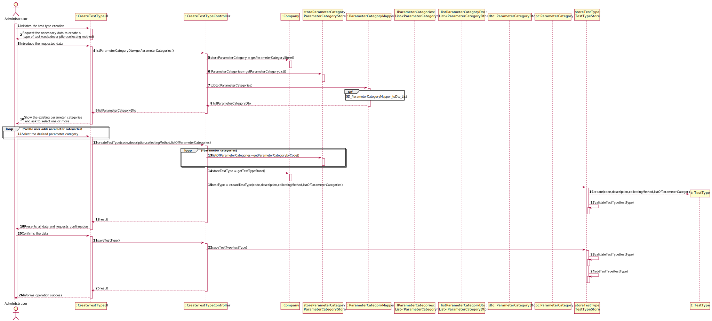
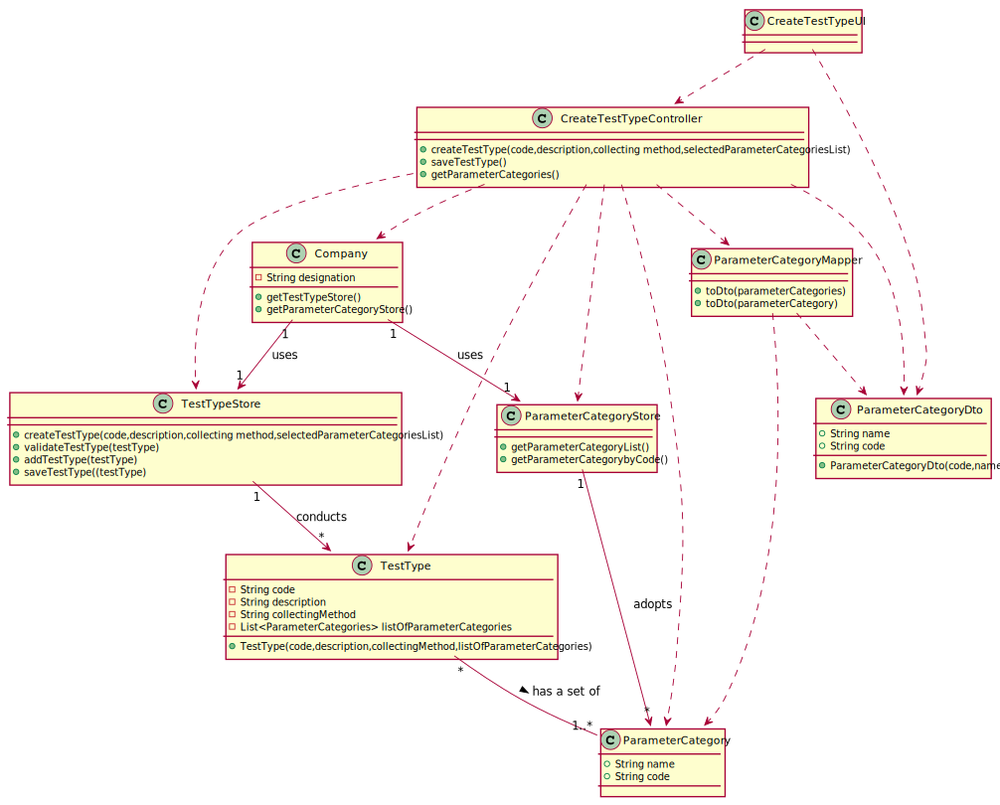

# US 09 - Specify a Type of Test

## 1. Requirements Engineering

### 1.1. User Story Description

As an administrator, I want to specify a new type of test and its collecting methods.

### 1.2. Customer Specifications and Clarifications 

**From the specifications document:**

>Many Labs performs two types of tests.

**From the client clarifications:**

> **Question:**  Does a type of test holds any attribute besides it's name and collecting methods?
>
> [_**Answer:**_](https://moodle.isep.ipp.pt/mod/forum/discuss.php?d=7512#p10171)  The attributes for a new test type are:
> * Code; 
> * Description;
> * Collecting Method;
> * Set of categories;

> **Question:**  Are the collecting methods stored simpled as a word or a sentence, or does it also must contain it's description, and/or another attributes?
>
> [_**Answer:**_](https://moodle.isep.ipp.pt/mod/forum/discuss.php?d=7512#p10171)  The administrator introduces a brief description for specifying the collecting method and there exists only one collection method per test type.

> **Question:**   What do you mean by the collecting methods and  what collecting methods  are available?
>
> [_**Answer:**_](https://moodle.isep.ipp.pt/mod/forum/discuss.php?d=7752#p10120)   To make a Covid test you need a swab to collect a sample. To make a blood test you need sample tubes and a syringe. 

> **Question:**   Are there any different collecting methods other than the ones currently known? Which ones?
>
> [_**Answer:**_](https://moodle.isep.ipp.pt/mod/forum/discuss.php?d=7514#p10172)   Each collecting method is associated with a test type. Whenever a test type is created a collecting method should be defined.

### 1.3. Acceptance Criteria

* **AC1:** The code is not automatically generated and has five alphanumeric characters.
* **AC2:** The description is a string with a maximum of 15 characters.
* **AC3:** The collecting Method is a string with no more than 20 characters.
* **AC4:** Each category should be chosen from a list of categories.

### 1.4. Found out Dependencies

* *Identify here any found out dependency to other US and/or requirements.*

* **Depends on US11** - The categories that the test will have have to be created previously

### 1.5 Input and Output Data

**Input Data:**

* Typed data:
	* code
    * description
	* collecting method
	
* Selected data:
	* parameter category
	
**Output Data:**

* (In)Success of the operation

### 1.6. System Sequence Diagram (SSD)

**Alternative 1**

**Other alternatives might exist.**

### 1.7 Other Relevant Remarks

## 2. OO Analysis

### 2.1. Relevant Domain Model Excerpt 

### 2.2. Other Remarks

n/a

## 3. Design - User Story Realization 

### 3.1. Rationale

**SSD - Alternative 1 is adopted.**

| Interaction ID | Question: Which class is responsible for...                     | Answer                   | Justification (with patterns)                                                                                             |
|:-------------  |:--------------------------------------------------------------- |:------------------------:|:------------------------------------------------------------------------------------------------------------------------- |
| Step 1  		 | ... interacting with the actor?                                 | CreateTestTypeUI         | Pure Fabrication: there is no justification for assigning this responsibility to any existing class in the Domain Model.  |
|                | ... coordinating the US?                                        | CreateTestTypeController | Controller                                                                                                                |
|                | ...knowing who is responsible for creating test type instances? | Company                  | Creator (R1)                                                                                                              |
|                | ... creates Test Type instance?                                 | TestTypeStore            | HC+LC on the Company. By HC / LC the Company delegates these responsibilities in TestTypeStore.                           |
|                | ... knowing the user using the system?                          | UserSession              |                                                                                                                           |
| Step 2  		 |                                                                 |                          |                                                                                                                           |
| Step 3  		 | ... saving the inputted data?                                   | TestType                 | IE: object created in step 1 has its own data.                                                                            |
| Step 4  		 | ... knowing the parameter categories to show?                   | ParameterCategoryStore   | IE: knows all the categories of parameters.                                                                               |
| Step 5  		 | ... saving the selected categories?                             | TestType                 | IE: the object created in step 1 contains one or more categories of parameters                                            |
| Step 6  		 |                                                                 |                          |                                                                                                                           |
| Step 7  		 | ... validating all data (local validation)?                     | TestType                 | IE: owns its data.                                                                                                        |
|                | ... validating all data (global validation)?                    | TestTypeStore            | IE: knows all types of tests.                                                                                             |
|                | ... saving the created task?                                    | TestTypeStore            | IE: owns all types of tests.                                                                                              |
| Step 8  		 | ... informing operation success?                                | CreateTestTypeUI         | IE: is responsible for user interactions.                                                                                 |

### Systematization ##

According to the taken rationale, the conceptual classes promoted to software classes are: 

 * Company
 * TestType
 * ParameterCategory
 

Other software classes (i.e. Pure Fabrication) identified: 

 * CreateTestTypeUI  
 * CreateTestTypeController
 * TestTypeStore

## 3.2. Sequence Diagram (SD)

**Alternative 1**

## 3.3. Class Diagram (CD)

**From alternative 1**

# 4. Tests 

**Test 1:** 

*It is also recommended to organize this content by subsections.* 

# 5. Construction (Implementation)

## Class CreateTestTypeController 

## Class Company

# 6. Integration and Demo 

# 7. Observations

