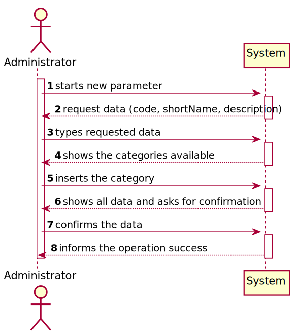
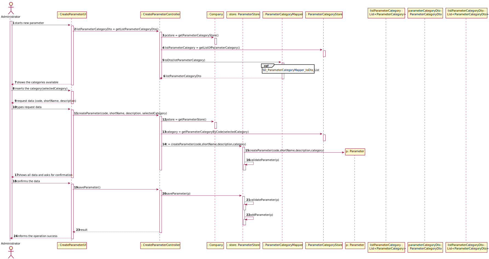

# US 10 - I want to specify a new test parameter and categorize it.

## 1. Requirements Engineering

*In this section, it is suggested to capture the requirement description and specifications as provided by the client as well as any further clarification on it. It is also suggested to capture the requirements acceptance criteria and existing dependencies to other requirements. At last, identfy the involved input and output data and depicted an Actor-System interaction in order to fulfill the requirement.*

### 1.1. User Story Description

*As an administrator, I want to specify a new parameter and categorize it.*

### 1.2. Customer Specifications and Clarifications 

*Insert here any related specification and/or clarification provided by the client together with **your interpretation**. When possible, provide a link to such specifications/clarifications.*

**From the specifications document:**

> Blood tests are frequently characterized by measuring several parameters which for presentation/reporting purposes are organized by categories. For example, parameters such as the number of Red Blood Cells (RBC), White Blood Cells (RBC) and Platelets (PLT) are usually presented under the blood count (Hemogram) category.
> 
> Regardless, such tests rely on measuring one or more parameters that can be grouped/organized by categories.

**From the client clarifications:**

> **Question:** What is the data that characterize a parameter? Should we follow the same data as the parameter category, for example, would each parameter have its own code, description and NHS identifier?
Each parameter is associated with one category. Each parameter has a Code, a Short Name and a Description.
> 
> [**Awnser:**](https://moodle.isep.ipp.pt/mod/forum/discuss.php?d=7507&parent=9763#p10106) The Code are five alphanumeric characters. The Short Name is a String with no more than 8 characters. The Description is a String with no more than 20 characters.

> **Question:** Can a parameter be classified in more than one parameter category?
> 
> [**Awnser:**](https://moodle.isep.ipp.pt/mod/forum/discuss.php?d=7749) No. Each parameter has only one category. There are no subcategories.
>
> **Question:** When a new parameter is specified, should there always be a category it falls under prior to its specification and subsequent categorization?
>
> [**Awnser:**](https://moodle.isep.ipp.pt/mod/forum/discuss.php?d=7616) Each parameter is associated with one category.
> 
>
>**Question:** Can a parameter have more than one category? or is it limited to one?
>
> [**Awnser:**](https://moodle.isep.ipp.pt/mod/forum/discuss.php?d=7649&parent=10196#p10297)
 
>**Question:** Is the categorization of a parameter mandatory or optional?
>
> [**Awnser:**](https://moodle.isep.ipp.pt/mod/forum/discuss.php?d=7649) Yes.

> **Question:** How does the assignment of a parameter category works? Does he have to select the category or he have the option to create in the moment?
> 
> [**Awnser:**](https://moodle.isep.ipp.pt/mod/forum/discuss.php?d=7649) There exists a user story to specify a new parameter category. Therefore, the administrator should select one category when creating a parameter.

> **Question:** Does the administrator need to log in order to create a parameter and categorize it?
> 
> [**Awnser:**](https://moodle.isep.ipp.pt/mod/forum/discuss.php?d=7639) Yes.

> **Question:**  Which information will the client provide for the addition of a new parameter and its categorization?
> 
> [**Awnser:**](https://moodle.isep.ipp.pt/mod/forum/discuss.php?d=7616) A: I already answered this question.

> **Question:** Does the client want to specify more than one new parameter at a time?
> 
> [**Awnser:**](https://moodle.isep.ipp.pt/mod/forum/discuss.php?d=7616) Yes.

> **Question:** Regarding the recommended fields, which one are unique and mandatory?
Unique = for example, two parameters cannot have the same code.
> 
> [**Awnser:**](https://moodle.isep.ipp.pt/mod/forum/discuss.php?d=7507) 

> **Question:**  In case the category doesn't exist in the system, would be possible for the admin to create directly when creating the parameters or does he/she needs to create first the category and only after the parameters?
for the second option this would mean that the Admin will have duplicate work: (A)  starts to create a parameter and he notices that the category does not exist - needs to exit and create category
(B) start creating the parameter again, now that the category exists.
> 
> [**Awnser:**](https://moodle.isep.ipp.pt/mod/forum/discuss.php?d=7649&parent=10196#p10297)

> **Question:** When specifying more than one parameter at the same time, all that parameters will be categorized to one single category or should I ask the category to each parameter?
>
> [**Awnser:**](https://moodle.isep.ipp.pt/mod/forum/discuss.php?d=7888) You should always ask the category of each parameter.

> **Question:**
>
> [**Awnser:**]()

### 1.3. Acceptance Criteria

*Insert here the client acceptance criteria.*

* **AC1:** The Code are five alphanumeric characters. 
* **AC2:** The Short Name is a String with no more than 8 characters.
* **AC3:** The Description is a String with no more than 20 characters.
* **AC4:** Each parameter has only one category.
* **AC5:** The administrator has to be logged in, in order to create a new parameter and categorize it.

### 1.4. Found out Dependencies

*Identify here any found out dependency to other US and/or requirements.*

* *There is a dependency to "US11 - Specify a new parameter category" since at least a parameter category must exist to classify the parameter being created.*

### 1.5 Input and Output Data

*Identity here the data to be inputted by the system actor as well as the output data that the system have/needs to present in order to properly support the actor actions. Regarding the inputted data, it is suggested to distinguish between typed data and selected data (e.g. from a list)*

**Input Data:**

* Typed data:
    *  code
    *  designation
    *  description
  
* Selected data:
    *  category

**Output Data:**
* List of existing Parameter Categories
* (In)Success of the operation

### 1.6. System Sequence Diagram (SSD)

*Insert here a SSD depicting the envisioned Actor-System interactions and throughout which data is inputted and outputted to fulfill the requirement. All interactions must be numbered.*

### 1.7 Other Relevant Remarks

*Use this section to capture other relevant information that is related with this US such as (i) special requirements ; (ii) data and/or technology variations; (iii) how often this US is held.* 

## 2. OO Analysis

### 2.1. Relevant Domain Model Excerpt 
*In this section, it is suggested to present an excerpt of the domain model that is seen as relevant to fulfill this requirement.* 

### 2.2. Other Remarks

*Use this section to capture some aditional notes/remarks that must be taken into consideration into the design activity. In some case, it might be usefull to add other analysis artifacts (e.g. activity or state diagrams).* 

## 3. Design - User Story Realization 

### 3.1. Rationale

**The rationale grounds on the SSD interactions and the identified input/output data.**

| Interaction ID | Question: Which class is responsible for... | Answer  | Justification (with patterns)  |
|:-------------  |:--------------------- |:------------|:---------------------------- |
| Step 1  		 |	... interacting with the user? | CreateParameterUI   |  Pure Fabrication: there is no reason to assign this responsibility to any existing class in the Domain Model.           |
| 			     |	... coordinating the US? | CreateParameterController | Controller                             |
|                |  ... knowing who is responsible for creating the Parameter? | Company | Creator (R1) |
| 			  	 |	... instantiating a new Parameter? | Organization   | Creator (Rule 1): in the DM Organization has a Task.   |
| 			  	 |	... showing the existing parameter categories? | ParameterCategoryStore | IE: has registed all Organizations |
|                | ... knowing the user using the system? | UserSession |            |
| Step 2  		 |							 |             |                              |
| Step 3  		 |	...saving the inputted data? | Parameter  | IE: object created in step 1 has its own data.  |
| Step 4  		 | ... knowing the parameter categories to show?                   | ParameterCategoryStore   | IE: knows all the categories of parameters.                                                                               |
| Step 5  		 | ... saving the selected categories?                             | Parameter                 | IE: the object created in step 1 contains one or more categories of parameters                                            |
| Step 6  		 |                                                                 |                          |                                                                                                                           |
| Step 7  		 | ... validating all data (local validation)?                     | Parameter                 | IE: owns its data.                                                                                                        |
|                | ... validating all data (global validation)?                    | ParameterStore            | IE: knows all types of tests.                                                                                             |
|                | ... saving the created task?                                    | ParameterStore            | IE: owns all types of tests.                                                                                              |
| Step 8  		 | ... informing operation success?                                | CreateParameterUI         | IE: is responsible for user interactions.                                                                                 |             

### Systematization ##

According to the taken rationale, the conceptual classes promoted to software classes are: 

 * Company
 * Parameter
 * ParameterCategory

Other software classes (i.e. Pure Fabrication) identified: 
 * CreateParameterUI  
 * CreateParameterController
 * ParameterStore

## 3.2. Sequence Diagram (SD)

*In this section, it is suggested to present an UML dynamic view stating the sequence of domain related software objects' interactions that allows to fulfill the requirement.* 

## 3.3. Class Diagram (CD)

*In this section, it is suggested to present an UML static view representing the main domain related software classes that are involved in fulfilling the requirement as well as and their relations, attributes and methods.*

# 4. Tests 
*In this section, it is suggested to systematize how the tests were designed to allow a correct measurement of requirements fulfilling.* 

**_DO NOT COPY ALL DEVELOPED TESTS HERE_**

**Test 1:** Check that it is not possible to create an instance of the Example class with null values. 

	@Test(expected = IllegalArgumentException.class)
		public void ensureNullIsNotAllowed() {
		Exemplo instance = new Exemplo(null, null);
	}

*It is also recommended to organize this content by subsections.* 

# 5. Construction (Implementation)

*In this section, it is suggested to provide, if necessary, some evidence that the construction/implementation is in accordance with the previously carried out design. Furthermore, it is recommeded to mention/describe the existence of other relevant (e.g. configuration) files and highlight relevant commits.*

*It is also recommended to organize this content by subsections.* 

# 6. Integration and Demo 

*In this section, it is suggested to describe the efforts made to integrate this functionality with the other features of the system.*

# 7. Observations

*In this section, it is suggested to present a critical perspective on the developed work, pointing, for example, to other alternatives and or future related work.*

