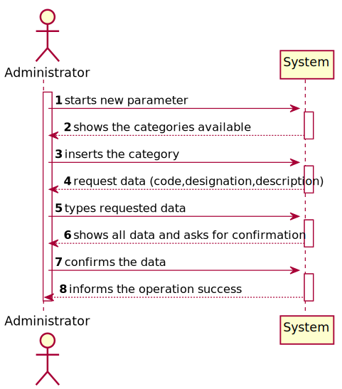
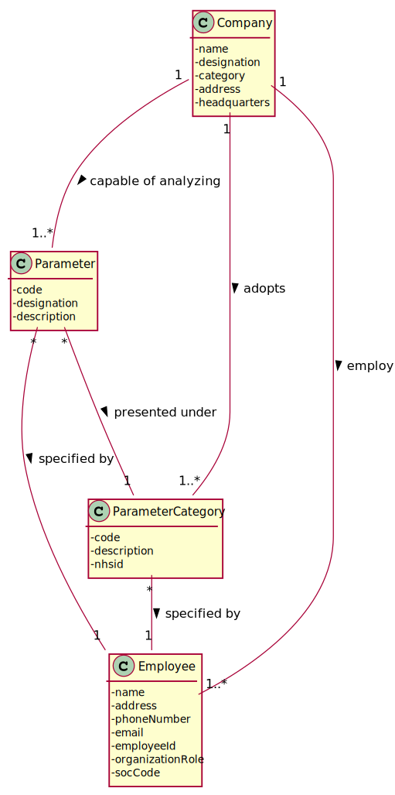
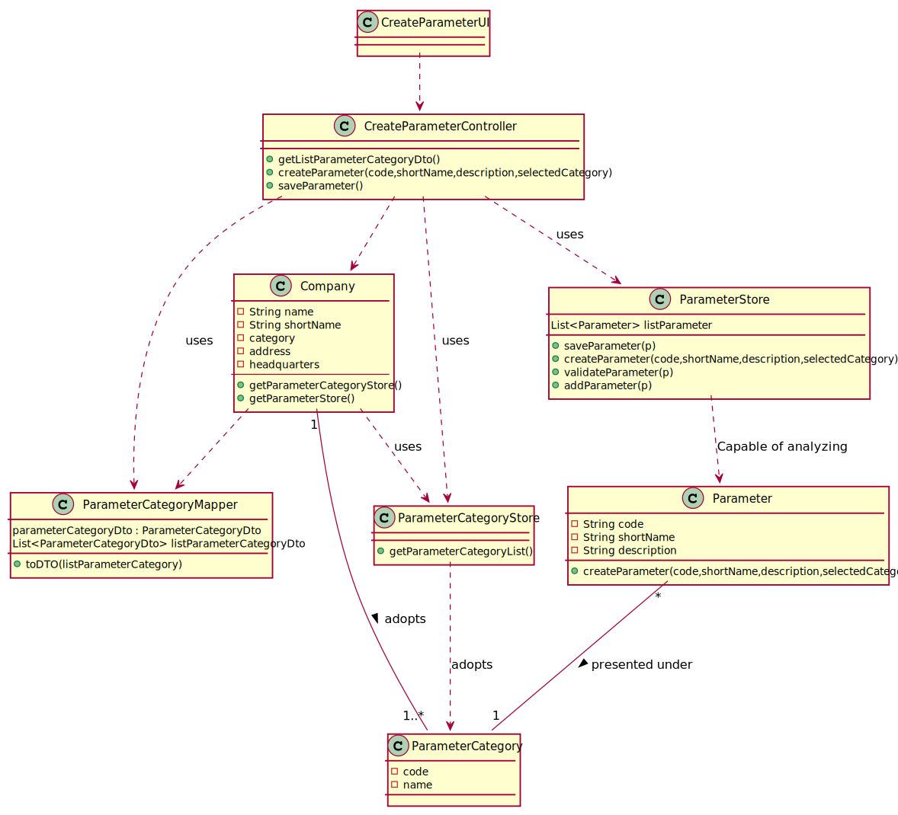

# US 10 - I want to specify a new test parameter and categorize it.

## 1. Requirements Engineering

*In this section, it is suggested to capture the requirement description and specifications as provided by the client as well as any further clarification on it. It is also suggested to capture the requirements acceptance criteria and existing dependencies to other requirements. At last, identfy the involved input and output data and depicted an Actor-System interaction in order to fulfill the requirement.*

### 1.1. User Story Description

*As an administrator, I want to specify a new parameter and categorize it.*

### 1.2. Customer Specifications and Clarifications 

*Insert here any related specification and/or clarification provided by the client together with **your interpretation**. When possible, provide a link to such specifications/clarifications.*

**From the specifications document:**

> Blood tests are frequently characterized by measuring several parameters which for presentation/reporting purposes are organized by categories. For example, parameters such as the number of Red Blood Cells (RBC), White Blood Cells (RBC) and Platelets (PLT) are usually presented under the blood count (Hemogram) category.
> 
> Regardless, such tests rely on measuring one or more parameters that can be grouped/organized by categories.

**From the client clarifications:**

> **Question:** What is the data that characterize a parameter? Should we follow the same data as the parameter category, for example, would each parameter have its own code, description and NHS identifier?
Each parameter is associated with one category. Each parameter has a Code, a Short Name and a Description.
> 
> [**Awnser:**](https://moodle.isep.ipp.pt/mod/forum/discuss.php?d=7507&parent=9763#p10106) The Code are five alphanumeric characters. The Short Name is a String with no more than 8 characters. The Description is a String with no more than 20 characters.

> **Question:** Can a parameter be classified in more than one parameter category?
> 
> [**Awnser:**](https://moodle.isep.ipp.pt/mod/forum/discuss.php?d=7749) No. Each parameter has only one category. There are no subcategories.

> **Question:** When specifying more than one parameter at the same time, all that parameters will be categorized to one single category or should I ask the category to each parameter?
>
> [**Awnser:**](https://moodle.isep.ipp.pt/mod/forum/discuss.php?d=7888) You should always ask the category of each parameter.

> **Question:** Is the code of a parameter the same as its respective category? Or can they be different?
>
> [**Awnser:**](https://moodle.isep.ipp.pt/mod/forum/discuss.php?d=8041) No, they are different things.

> **Question:** Will the administrator give the reference values for the new parameter?
>
> [**Awnser:**](https://moodle.isep.ipp.pt/mod/forum/discuss.php?d=8041) A: In Sprint C we will make available an API that returns the reference values.

 
>**Question:** Is the categorization of a parameter mandatory or optional?
>
> [**Awnser:**](https://moodle.isep.ipp.pt/mod/forum/discuss.php?d=7649) Yes.

> **Question:** Does the administrator need to log in order to create a parameter and categorize it?
> 
> [**Awnser:**](https://moodle.isep.ipp.pt/mod/forum/discuss.php?d=7639) Yes.

> **Question:** Does the client want to specify more than one new parameter at a time?
> 
> [**Awnser:**](https://moodle.isep.ipp.pt/mod/forum/discuss.php?d=7616) Yes.

### 1.3. Acceptance Criteria

*Insert here the client acceptance criteria.*

* **AC1:** The Code are five alphanumeric characters. 
* **AC2:** The Short Name is a String with no more than 8 characters.
* **AC3:** The Description is a String with no more than 20 characters.
* **AC4:** Each parameter has only one category.
* **AC5:** The parameter code must be different from the parameter category code.

### 1.4. Found out Dependencies

*Identify here any found out dependency to other US and/or requirements.*

* *There is a dependency to "US11 - Specify a new parameter category" since at least a parameter category must exist to classify the parameter being created.*

### 1.5 Input and Output Data

*Identity here the data to be inputted by the system actor as well as the output data that the system have/needs to present in order to properly support the actor actions. Regarding the inputted data, it is suggested to distinguish between typed data and selected data (e.g. from a list)*

**Input Data:**

* Typed data:
    *  code
    *  designation
    *  description
  
* Selected data:
    *  category

**Output Data:**
* (In)Success of the operation

### 1.6. System Sequence Diagram (SSD)

*Insert here a SSD depicting the envisioned Actor-System interactions and throughout which data is inputted and outputted to fulfill the requirement. All interactions must be numbered.*

### 1.7 Other Relevant Remarks

*Use this section to capture other relevant information that is related with this US such as (i) special requirements ; (ii) data and/or technology variations; (iii) how often this US is held.* 

## 2. OO Analysis

### 2.1. Relevant Domain Model Excerpt 
*In this section, it is suggested to present an excerpt of the domain model that is seen as relevant to fulfill this requirement.* 

### 2.2. Other Remarks

*Use this section to capture some aditional notes/remarks that must be taken into consideration into the design activity. In some case, it might be usefull to add other analysis artifacts (e.g. activity or state diagrams).* 

## 3. Design - User Story Realization 

### 3.1. Rationale

**The rationale grounds on the SSD interactions and the identified input/output data.**

| Interaction ID | Question: Which class is responsible for... | Answer  | Justification (with patterns)  |
|:-------------  |:--------------------- |:------------|:---------------------------- |
| Step 1  		 |	... interacting with the user? | CreateParameterUI   |  Pure Fabrication: there is no reason to assign this responsibility to any existing class in the Domain Model.           |
| 			     |	... coordinating the US? | CreateParameterController | Controller                             |
|                |  ... knowing who is responsible for creating the Parameter? | Company | Creator (R1) |
| 			  	 |	... instantiating a new Parameter? | Organization   | Creator (Rule 1): in the DM Organization has a Task.   |
| 			  	 |	... showing the existing parameter categories? | CreateParameterUI | IE: has registed all Organizations |
|                | ... knowing the user using the system? | UserSession |            |
| Step 2  		 |							 |             |                              |
| Step 3  		 |	...saving the inputted data? | Parameter  | IE: object created in step 1 has its own data.  |
| Step 4  		 | ... knowing the parameter categories to show?                   | ParameterCategoryStore   | IE: knows all the categories of parameters.                                                                               |
| Step 5  		 | ... saving the selected category?                             | Parameter                 | IE: the object created in step 1 contains one or more categories of parameters                                            |
| Step 6  		 |                                                                 |                          |                                                                                                                           |
| Step 7  		 | ... validating all data (local validation)?                     | Parameter                 | IE: owns its data.                                                                                                        |
|                | ... validating all data (global validation)?                    | ParameterStore            | IE: knows all types of tests.                                                                                             |
|                | ... saving the created task?                                    | ParameterStore            | IE: owns all types of tests.                                                                                              |
| Step 8  		 | ... informing operation success?                                | CreateParameterUI         | IE: is responsible for user interactions.                                                                                 |             

### Systematization ##

According to the taken rationale, the conceptual classes promoted to software classes are: 

 * Company
 * Parameter
 * ParameterCategory

Other software classes (i.e. Pure Fabrication) identified: 
 * CreateParameterUI  
 * CreateParameterController
 * ParameterCategoryMapper
 * ParameterCategoryStore
 * ParameterStore

## 3.2. Sequence Diagram (SD)

*In this section, it is suggested to present an UML dynamic view stating the sequence of domain related software objects' interactions that allows to fulfill the requirement.* 

## 3.3. Class Diagram (CD)

*In this section, it is suggested to present an UML static view representing the main domain related software classes that are involved in fulfilling the requirement as well as and their relations, attributes and methods.*

# 4. Tests 
*In this section, it is suggested to systematize how the tests were designed to allow a correct measurement of requirements fulfilling.* 

**Test 1:** Check that the Code is five alphanumeric characters - AC1.

    @Test(expected = IllegalArgumentException.class)
    public void ensureCodeMeetsAC1() {
      Parameter p = new Parameter("TT0","shortName","description",pc);
    }

**Test 2:** The Short Name is a String with no more than 8 characters - AC2.

    @Test(expected = IllegalArgumentException.class)
    public void ensureCodeMeetsAC2() {
      Parameter p = new Parameter("code","RBC","description",pc);
    }

**Test 3:** The Description is a String with no more than 20 characters - AC3 

    @Test(expected = IllegalArgumentException.class)
    public void ensureCodeMeetsAC3() {
      Parameter p = new Parameter("code","shortName","Red Blood Cells",pc);
    }

**Test 4:** The parameter code must be different from the parameter category code - AC5.

    @Test(expected = IllegalArgumentException.class)
    public void ensureCodeMeetsAC5() {
      Parameter p = new Parameter("code","shortName","Red Blood Cells",pc);
      String codeParam = p.getCode();
      String codeCatParam = pc.getCode();
      Assert.assertNotEquals(codeParam,codeCatParam);
    }

*It is also recommended to organize this content by subsections.* 

# 5. Construction (Implementation)

*In this section, it is suggested to provide, if necessary, some evidence that the construction/implementation is in accordance with the previously carried out design. Furthermore, it is recommeded to mention/describe the existence of other relevant (e.g. configuration) files and highlight relevant commits.*

*It is also recommended to organize this content by subsections.* 

##ParameterStore
    /**
    * Save the parameter case it is in a valid state.
    * @param parameter The parameter we intend to save.
    * @return true if the parameter was saved. Otherwise, false.
    */
    public boolean saveParameter(Parameter parameter) {
      if (!validateParameter(parameter))
        return false;
      return this.addParameter(parameter);
    }

    /**
     * Global validation of a parameter.
     * @param p parameter that we intend to validate.
     * @return false if the parameter already exists or is null. Otherwise, it returns true.
     */
    public boolean validateParameter(Parameter p) {
        if (p == null)
            return false;
        return !this.listParameter.contains(p);
    }
    /**
    * Adds a new Parameter to the List.
    * @param p The parameter we intend to add.
    * @return true if the parameter was added. Otherwise, false.
    */
    public boolean addParameter(Parameter p) {
    return listParameter.add(p);
    }

    /**
     * New Parameter.
     * @param code The Parameter code.
     * @param shortName The Parameter short name.
     * @param description The Parameter description.
     * @param category The Parameter category.
     */
    public Parameter createParameter(String code, String shortName, String description,ParameterCategory category){
        return new Parameter(code,shortName,description,category);
    }

##Class CreateParameterController
    /**
    * New parameter category.
    * @param code The parameter category code.
    * @param name The parameter category name.
    * @return false if the parameter category already exists or is null. Otherwise, it returns true.
    */
    public boolean createParameterCategory(String code, String name){
    this.pc=pcStore.createParameterCategory(code,name);
    return this.pcStore.validateParameterCategory(pc);
    }

# 6. Integration and Demo 

*In this section, it is suggested to describe the efforts made to integrate this functionality with the other features of the system.*

# 7. Observations

*In this section, it is suggested to present a critical perspective on the developed work, pointing, for example, to other alternatives and or future related work.*

