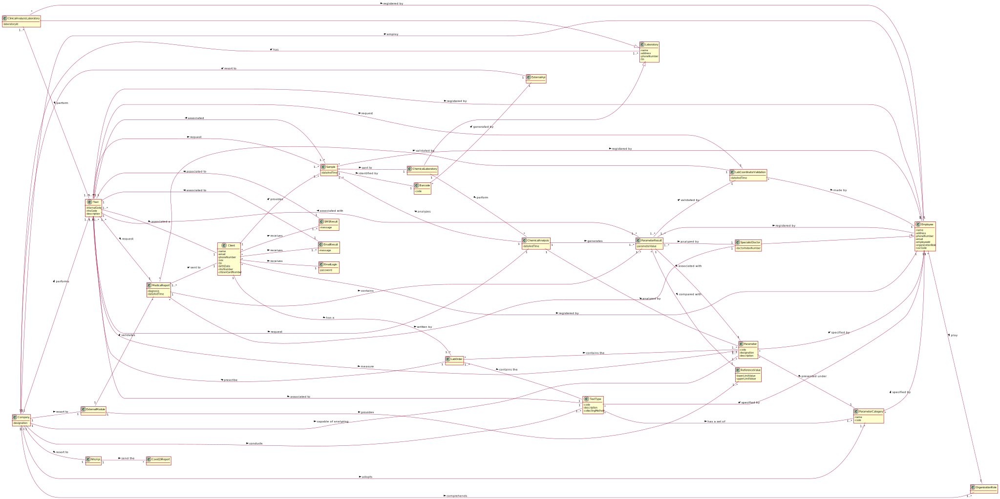

# OO Analysis #

The construction process of the domain model is based on the client specifications, especially the nouns (for _concepts_) and verbs (for _relations_) used. 

## Rationale to identify domain conceptual classes ##
To identify domain conceptual classes, start by making a list of candidate conceptual classes inspired by the list of categories suggested in the book "Applying UML and Patterns: An Introduction to Object-Oriented Analysis and Design and Iterative Development". 

### _Conceptual Class Category List_ ###

**Business Transactions**

* Test

---

**Transaction Line Items**

* Sample

---

**Product/Service related to a Transaction or Transaction Line Item**

* Lab Order
* Parameter
* Category
* Barcode
* Reference Value

---

**Transaction Records**

* Lab Order
* Medical Report
* Collection Method
* Test Parameter Result
* Test Parameter

---  

**Roles of People or Organizations**

* Receptionist
* Medical Lab Technician
* Client
* Clinical Chemistry Technologist
* Laboratory Coordinator
* Courier
* Administrator
* Specialist Doctor

---

**Places**

* Headquarter
* Chemical Laboratory
* Clinical Analysis laboratory 
* Laboratory

---

**Noteworthy Events**

* Chemical Analysis

---

**Physical Objects**

* Lab Order

---

**Descriptions of Things**

* Lab Order
* Category
* Test Type 
* Medical Report
* Barcode
* Covid19 Report
* E-mail Login
* E-mail Result
* SMS Result
* Reference Value
* Lab Coordinator Validation

---

**Catalogs**

*  

---

**Containers**

* Employee
* Laboratory

---

**Elements of Containers**

*  

---

**Organizations**

* Company

---

**Other External/Collaborating Systems**

* External API
* External module
* NHS API

---

**Records of finance, work, contracts, legal matters**

* NHS
* Courier 

---

**Financial Instruments**

*  Test

---

**Documents mentioned/used to perform some work**

* Covid-19 Report
* Chemical Analysis

---

### **Rationale to identify associations between conceptual classes**

An association is a relationship between instances of objects that indicates a relevant connection and that is worth of remembering, or it is derivable from the List of Common Associations: 

+ **_A_** is physically or logically part of **_B_**
+ **_A_** is physically or logically contained in/on **_B_**
+ **_A_** is a description for **_B_**
+ **_A_** known/logged/recorded/reported/captured in **_B_**
+ **_A_** uses or manages or owns **_B_**
+ **_A_** is related with a transaction (item) of **_B_**
+ etc.

| Concept (A) 	                  |  Association   	        	    | Concept (B)                  |
|:----------:	                  |:-------------:	        	    |:---------:                   |
| Barcode    	                  | generated by            	    | External API                 |
| Chemical Analysis 	          | analyzes        	    	    | Sample                       |
|                   	          | generates      	        	    | Test Parameter Result        |
| Chemical Laboratory 	          | is a             	    	    | Laboratory                   |
|                   	          | perform      	        	    | Chemical Analysis            |
| Client                          | has a  	                	    | Lab Order                    |
|                   	          | provides     	        	    | Sample                       |
|                   	          | receives     	        	    | SMS Result                   |
|                   	          | receives     	       	        | E-mail Result                |
|                   	          | receives     	        	    | E-mail Login                 |
|                   	          | registered by  	       	        | Employee                     |
| Clinical Analysis Laboratory    | is a  	                	    | Laboratory                   |
|                   	          | perform      	        	    | Test                         |
|                   	          | registered by	        	    | Employee                     |
| Company                         | employ     		        	    | Employee                     |
|                                 | has       		        	    | Laboratory                   |
|                                 | comprehends 	        	    | Organization Role            |
|                                 | capable of analyzing    	    | Parameter                    |
|                                 | adopts     		        	    | Parameter Category           |
|                                 | performs                	    | Test                         |
|                                 | conducts    	        	    | Test Type                    |
|                                 | resort to      		    	    | External Api                 |
|                                 | resort to 		        	    | External Module              |
|                                 | resort to 		        	    | Nhs Api                      |
| Email Result                    | associated to                   | Test
| Employee                        | play      		        	    | Organization Role            |
| External Module        	      | validates    	        	    | Medical Report               |
|                   	          | provides    	        	    | Reference Value              |
| Lab Coordinator Validation      | made by                         | Employee                     |
| Lab Order          	          | contains the  	        	    | Test Type                    |
|                   	          | prescribe    	        	    | Test                         |
|                                 | contains the    	    	    | Parameter                    |
| Medical Report       	          | contains     	        	    | Test Parameter Result        |
|                                 | sent to      	        	    | Client                       |
|                                 | validated by  	        	    | Lab Coordinator Validation   |
|                                 | written by                      | Specialist Doctor            |
| Nhs Api           	          | send the    	        	    | Covid 19 Report              |
| Parameter  	                  | presented under  	   	        | Parameter Category           |
|                                 | analyzed by	            	    | Chemical Analysis            |
|                                 | specified by  	        	    | Employee                     |
| Parameter Category              | specified by                    | Employee                     |
| Test Parameter                  | contains                        | Test Parameter Result        |
| Test Parameter Result  	      | associated with    	    	    | Parameter                    | 
|                                 | associated with         	    | Test                         |
|                                 | registered by           	    | Employee                     |
|                                 | validated by  	        	    | Lab Coordinator Validation   |
|                                 | compared with                   | Reference Value              |
|                                 | analyzed by                     | Specialist Doctor            |
| Sample 	                      | sent to   	    	    	    | Chemical Laboratory          |
|                                 | identified by     	    	    | Barcode                      |
|                   	          | associated with            	    | Test                         |
|                                 | registered by           	    | Employee                     |
| SMS Result                      | associated with                 | Test                         |
| Specialist Doctor               | is a  	                	    | Employee                     |
| Test                            | associated a            	    | Client                       |
|                                 | registered by                   | Employee                     |
|                                 | request                 	    | Sample                       |
|                                 | measure                 	    | Parameter                    |
|                                 | is of                           | Test Type                    |
|                                 | request                 	    | Chemical Analysis            |
|                                 | request                 	    | Medical Report               |
|                                 | request                         | Lab Coordinator Validation   |
| Test Type 	                  | has a set of            	    | Parameter Category           |
|                                 | specified by                    | Employee                     |

## Domain Model

**Do NOT forget to identify concepts atributes too.**

**Insert below the Domain Model Diagram in a SVG format**

