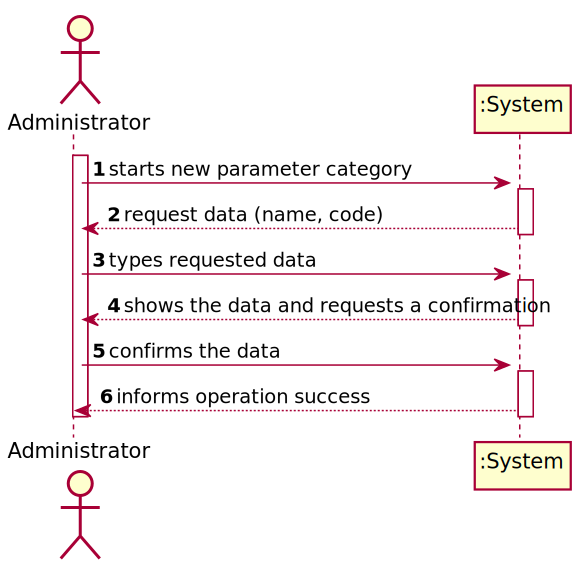
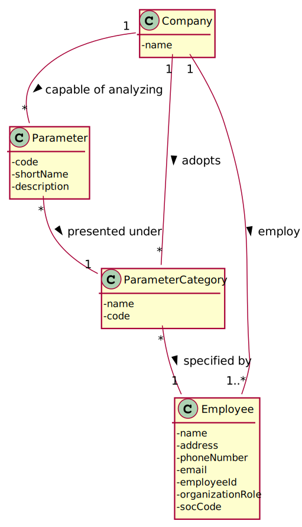
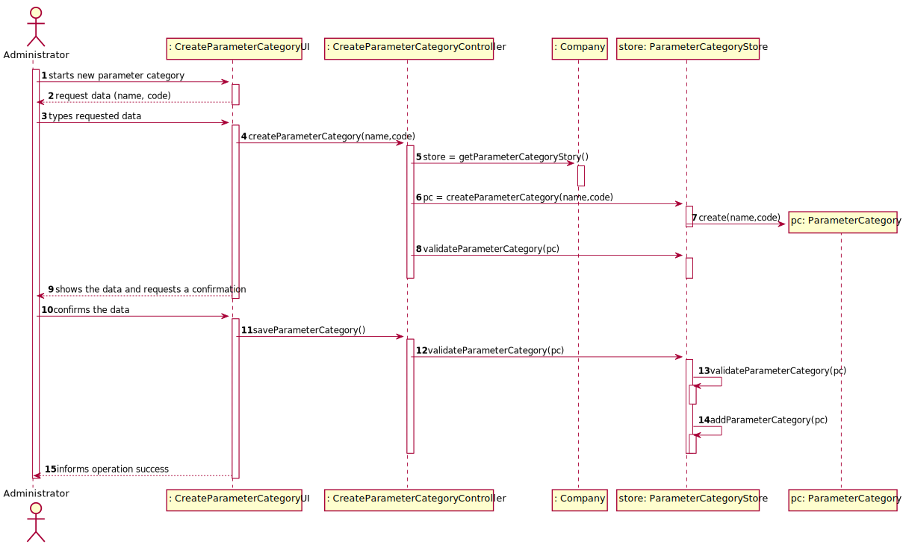
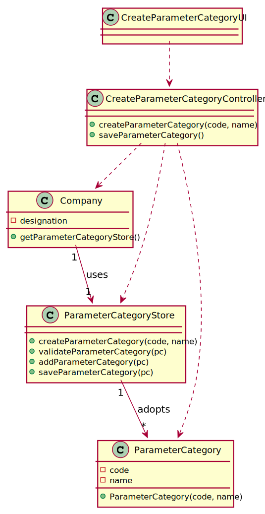

# US 11 - Specify a new parameter category. 

## 1. Requirements Engineering

### 1.1. User Story Description

*As an administrator, I want to specify a new parameter category.*

### 1.2. Customer Specifications and Clarifications 

>Blood tests are frequently characterized by measuring several parameters which for presentation/reporting purposes are organized
by categories. For example, parameters such as the number of Red Blood Cells (RBC), White Blood Cells (RBC) and Platelets (PLT) are
usually presented under the blood count (Hemogram) category.

>Regardless, such tests rely on measuring one or more parameters that can be grouped/organized by categories.

***From the client clarifications:***

> *Question:* What are the information related to a Parameter Category?
> 
> [*Answer:*](https://moodle.isep.ipp.pt/mod/forum/discuss.php?d=7318#p9859) Each category has a name and a unique code. There are no subcategories.

> *Question:* Regarding the creation of a new category, what should be the format of the code in terms of length, should it be alphanumeric or numbers only?
>
> [*Answer:*](https://moodle.isep.ipp.pt/mod/forum/discuss.php?d=7899#p10415) The format of the attributes of one category are:
> * Name: is a string with no more than 10 characters;
> * Code: are five alphanumeric characters. The code is unique and is not automatically generated.

> *Question:* Can we assume that both attributes are mandatory?
>
> [*Answer:*](https://moodle.isep.ipp.pt/mod/forum/discuss.php?d=7899#p10415) Both attributes are mandatory.

### 1.3. Acceptance Criteria

- AC1: The name is a string with a maximum of 10 characters.
- AC2: The code is unique, is not automatically generated and are five alphanumeric characters.
- AC3: There are no subcategories.

### 1.4. Found out Dependencies

- No dependencies were found.

### 1.5 Input and Output Data
***Input Data***

* Typed data:
    * name
    * code

* Selected data:
    * (none)

***Output Data***

- (In)Success of the operation

### 1.6. System Sequence Diagram (SSD)

*Insert here a SSD depicting the envisioned Actor-System interactions and throughout which data is inputted and outputted to fulfill the requirement. All interactions must be numbered.*

### 1.7 Other Relevant Remarks

*Use this section to capture other relevant information that is related with this US such as (i) special requirements ; (ii) data and/or technology variations; (iii) how often this US is held.* 

## 2. OO Analysis

### 2.1. Relevant Domain Model Excerpt 
*In this section, it is suggested to present an excerpt of the domain model that is seen as relevant to fulfill this requirement.* 

### 2.2. Other Remarks

*Use this section to capture some aditional notes/remarks that must be taken into consideration into the design activity. In some case, it might be usefull to add other analysis artifacts (e.g. activity or state diagrams).* 

## 3. Design - User Story Realization 

### 3.1. Rationale

**The rationale grounds on the SSD interactions and the identified input/output data.**

| Interaction ID | Question: Which class is responsible for...                     | Answer                            | Justification (with patterns)                                                                                             |
|:-------------  |:--------------------------------------------------------------- |:---------------------------------:|:------------------------------------------------------------------------------------------------------------------------- |
| Step 1  		 | ... interacting with the actor?                                 | CreateParameterCategoryUI         | Pure Fabrication: there is no justification for assigning this responsibility to any existing class in the Domain Model.  |
|                | ... coordinating the US?                                        | CreateParameterCategoryController | Controller                                                                                                                |
|                | ... knowing who is responsible for creating test type instances?| Company                           | Creator (R1)                                                                                                              |
|                | ... creates Parameter Category instance?                        | ParameterCategoryStore            | HC+LC on the Company. By HC / LC the Company delegates these responsibilities in ParameterCategoryStore.                  |
|                | ... knowing the user using the system?                          | UserSession                       |                                                                                                                           |
| Step 2  		 |                                                                 |                                   |                                                                                                                           |
| Step 3  		 | ... saving the inputted data?                                   | ParameterCategory                 | IE: object created in step 1 has its own data.                                                                            |
| Step 4  		 |                                                                 |                                   |                                                                                                                           |
| Step 5  		 | ... validating all data (local validation)?                     | ParameterCategory                 | IE: owns its data.                                                                                                        |
|                | ... validating all data (global validation)?                    | ParameterCategoryStore            | IE: knows all parameter categories.                                                                                       |
|                | ... saving the created parameter category?                      | ParameterCategoryStore            | IE: owns all parameter categories.                                                                                        |
| Step 6  		 | ... informing operation success?                                | CreateParameterCategoryUI         | IE: is responsible for user interactions.                                                                                 |
           

### Systematization ##

According to the taken rationale, the conceptual classes promoted to software classes are: 

* Company
* ParameterCategory

Other software classes (i.e. Pure Fabrication) identified: 

 * CreateParameterCategoryUI  
 * CreateParameterCategoryController
 * ParameterCategoryStore

## 3.2. Sequence Diagram (SD)

*In this section, it is suggested to present an UML dynamic view stating the sequence of domain related software objects' interactions that allows to fulfill the requirement.* 

## 3.3. Class Diagram (CD)

*In this section, it is suggested to present an UML static view representing the main domain related software classes that are involved in fulfilling the requirement as well as and their relations, attributes and methods.*

# 4. Tests 
*In this section, it is suggested to systematize how the tests were designed to allow a correct measurement of requirements fulfilling.* 

**_DO NOT COPY ALL DEVELOPED TESTS HERE_**

*It is also recommended to organize this content by subsections.* 

# 5. Construction (Implementation)

*In this section, it is suggested to provide, if necessary, some evidence that the construction/implementation is in accordance with the previously carried out design. Furthermore, it is recommeded to mention/describe the existence of other relevant (e.g. configuration) files and highlight relevant commits.*

*It is also recommended to organize this content by subsections.* 

# 6. Integration and Demo 

*In this section, it is suggested to describe the efforts made to integrate this functionality with the other features of the system.*

# 7. Observations

*In this section, it is suggested to present a critical perspective on the developed work, pointing, for example, to other alternatives and or future related work.*

* In the future, the user story will be developed with a graphical interface, making the user experience more appealing.

