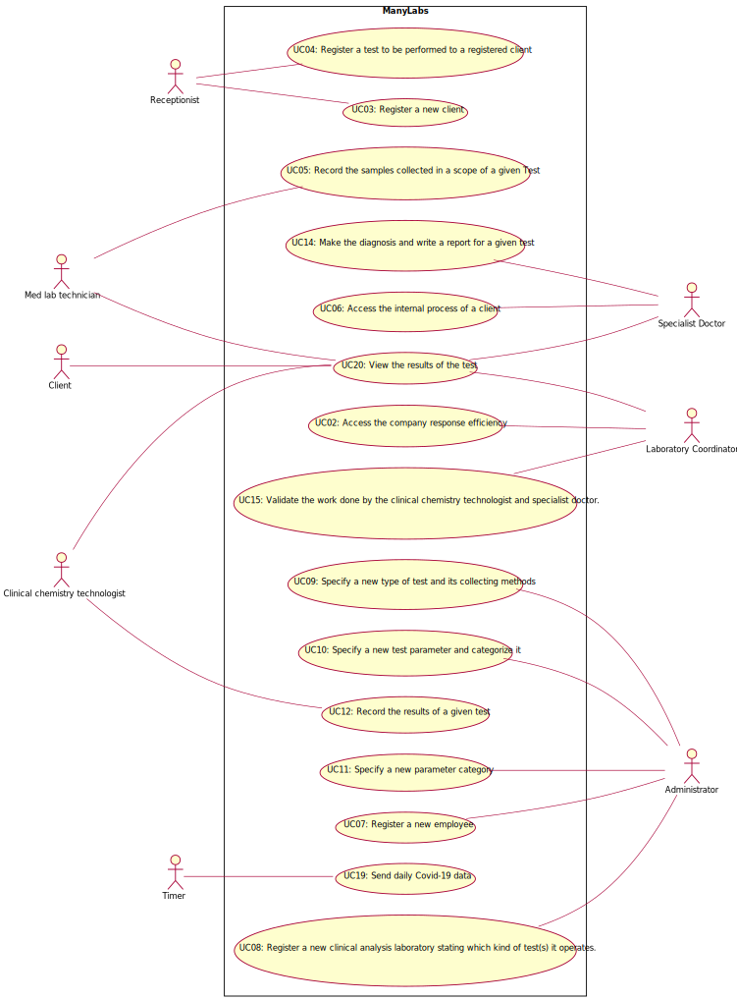

# Use Case Diagram (UCD)

**In the scope of this project, there is a direct relationship of _1 to 1_ between Use Cases (UC) and User Stories (US).**

However, be aware, this is a pedagogical simplification. On further projects and curricular units might also exist _1 to N **and/or** N to 1 relationships between US and UC.

**Insert below the Use Case Diagram in a SVG format**

**For each UC/US, it must be provided evidences of applying main activities of the software development process (requirements, analysis, design, tests and code). Gather those evidences on a separate file for each UC/US and set up a link as suggested below.**

# Use Cases / User Stories
| UC/US  | Description                                                                                                  |                   
|:------:|:-------------------------------------------------------------------------------------------------------------|
| US01   | [I want to validate the test performed.](US01.md)|
| US02   | [I want to know the company response efficiency.](US02.md)|
| US03   | [I want to register a client.](US03.md)|
| US04   | [I intend to register a test to be performed to a registered client.](US04.md)|
| US05   | [I want to record the samples collected in a scope of a given Test.](US05.md)|
| US06   | [I want to access the internal process of a client.](US06.md)|
| US07   | [I want to register a new employee.](US07.md)|
| US08   | [I want to register a new clinical analysis laboratory stating which kind of test(s) it operates.](US.08)|
| US09   | [I want to specify a new type of test and its collecting methods.](US09.md) |
| US10   | [I want to specify a new test parameter and categorize it.](US10.md)|
| US11   | [I want to specify a new parameter category.](US11.md)                                        |
| US12   | 
| US13   | |
| US14   | [I want to register the tests perfomed locally.](US14.md) |
| US15   | [I intend write a report.](US15.md)|
| US16   | |
| US17   | [I intend to record the result of chemistry analysis.](US17.md)  |
| US18   | |
| US19   | [I want to send daily Covid-19 data.](US19.md) |
| US20   | [We want to view the results of the test](US20.md)|

