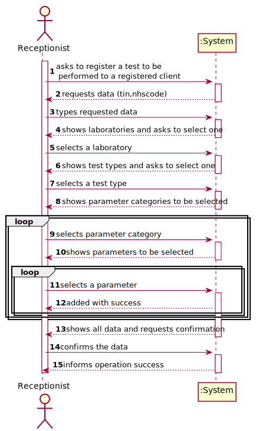
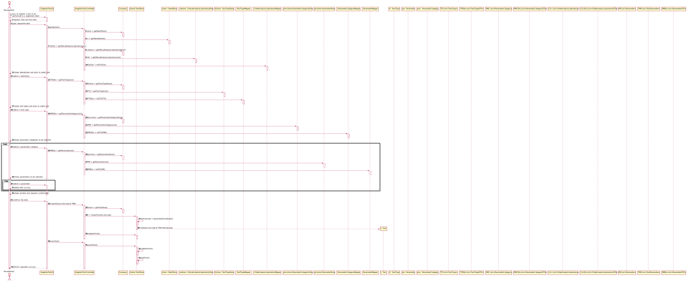
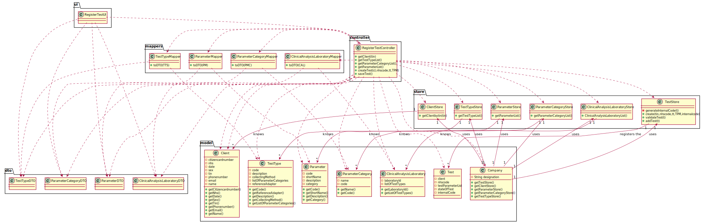

# US 004 - To register a Test

## 1. Requirements Engineering

### 1.1. User Story Description

As a receptionist of the laboratory, I intend to register a test to be performed to a registered client.

### 1.2. Customer Specifications and Clarifications

**From the specifications document:**

>Once there, a receptionist asks the client’s citizen card number, the lab order (which
contains the type of test and parameters to be measured), and registers in the application the test to
be performed to that client.

**From the client clarifications:**

> **Question:** I wanted to ask if the NHS code of which test is unique or not.
>
> **[Answer:](https://moodle.isep.ipp.pt/mod/forum/discuss.php?d=8432#p11173)** Yes.

> **Question:** On the project description we have multiple attributes of date and time ("date and time when the samples were collected", etc). Are these attributes filled by the author of the respective act or is it generated by the system when those acts are performed?
>
> **[Answer:](https://moodle.isep.ipp.pt/mod/forum/discuss.php?d=8442#p11177)** The system should automatically generate the date and time of the event (test registration, chemical analysis, diagnosis and validation).

> **Question:** When the receptionist chooses the test type, should the categories appear, and then when selecting the category, the receptionist can choose the parameters for the test? Or when the Receptionist chooses the test type, should appear all the parameters that it includes immediately?
>
> **[Answer:](https://moodle.isep.ipp.pt/mod/forum/discuss.php?d=8181#p11011)** Firstly, the receptionist should choose a test type. Then choose a category from a set of categories. Last, the receptionist should choose a parameter.

> **Question:** What are the attributes of a test and the acceptance criteria?
>
> **[Answer:](https://moodle.isep.ipp.pt/mod/forum/discuss.php?d=8181#p11011)** A: A test has the following attributes:Test code(Sequential number with 12 digits, the code is automatically generated), NHS code(12 alphanumeric characters).

> **Question:** When the receptionist is registering a test for a client, the test can have more than one category and many parameters of the chosen categories or it only can have one category?
>
> **[Answer:](https://moodle.isep.ipp.pt/mod/forum/discuss.php?d=8522#p11185)** Each test can have more than one category.

> **Question:** We are aware that both the receptionist and the MLT are two employees that may work on different labs. As such, do you want that Tests become associated to a specific Lab?
>
> **[Answer:](https://moodle.isep.ipp.pt/mod/forum/discuss.php?d=8596#p11375)** Yes.

> **Question:** This means that, when the receptionist creates a new Test, this test will only be "visible" for that specific LAB (for the receptionist and the MLT only), which means that all other roles (Chemistry Technologist, Specialist Doctor and the Laboratory Coordinator) will be able to see a list of all the tests performed in any lab.
>
> **[Answer:](https://moodle.isep.ipp.pt/mod/forum/discuss.php?d=8596#p11375)** Yes. The test will only be visible for that specific LAB and for all those working in the Chemical Laboratory.

> **Question:** Can the client have two identical tests? or the system should stop from creating the same test?
>
> **[Answer:](https://moodle.isep.ipp.pt/mod/forum/discuss.php?d=8628#p11365)** A test is unique in the system.

> **Question:** Shouldn't the receptionist locate the Client by the Citizen Card Number instead of TIN Number?
>
> **[Answer:](https://moodle.isep.ipp.pt/mod/forum/discuss.php?d=8684#p11376)** The receptionist should use the TIN number to find the client.

### 1.3. Acceptance Criteria

* **AC1:** The receptionist must select the parameters to be analysed from all possible parameters in accordance with the test type.

### 1.4. Found out Dependencies

* There is a dependency to US03 since at least a client must exist to register a test to be performed.

### 1.5 Input and Output Data

**Input Data:**

* Typed data:
	* a reference,
	* a designation,
	* an informal description
	* a technical description
	* an estimated duration
	* an estimated cost

* Selected data:
	* Classifying task category

**Output Data:**

* List of existing task categories
* (In)Success of the operation

### 1.6. System Sequence Diagram (SSD)

### 1.7 Other Relevant Remarks

* The created task stays in a "not published" state in order to distinguish from "published" tasks.

## 2. OO Analysis

### 2.1. Relevant Domain Model Excerpt

### 2.2. Other Remarks

n/a

## 3. Design - User Story Realization

### 3.1. Rationale

**SSD - Alternative 1 is adopted.**

| Interaction ID | Question: Which class is responsible for... | Answer  | Justification (with patterns)  |
|:-------------  |:--------------------- |:------------|:---------------------------- |
| Step 1  		 |	... interacting with the actor? | CreateTaskUI   |  Pure Fabrication: there is no reason to assign this responsibility to any existing class in the Domain Model.           |
| 			  		 |	... coordinating the US? | CreateTaskController | Controller                             |
| 			  		 |	... instantiating a new Task? | Organization   | Creator (Rule 1): in the DM Organization has a Task.   |
| 			  		 | ... knowing the user using the system?  | UserSession  | IE: cf. A&A component documentation.  |
| 			  		 |	... knowing to which organization the user belongs to? | Platform  | IE: has registed all Organizations |
| 			  		 |							 | Organization   | IE: knows/has its own Employees|
| 			  		 |							 | Employee  | IE: knows its own data (e.g. email) |
| Step 2  		 |							 |             |                              |
| Step 3  		 |	...saving the inputted data? | Task  | IE: object created in step 1 has its own data.  |
| Step 4  		 |	...knowing the task categories to show? | Platform  | IE: Task Categories are defined by the Platform. |
| Step 5  		 |	... saving the selected category? | Task  | IE: object created in step 1 is classified in one Category.  |
| Step 6  		 |							 |             |                              |              
| Step 7  		 |	... validating all data (local validation)? | Task | IE: owns its data.| 
| 			  		 |	... validating all data (global validation)? | Organization | IE: knows all its tasks.| 
| 			  		 |	... saving the created task? | Organization | IE: owns all its tasks.| 
| Step 8  		 |	... informing operation success?| CreateTaskUI  | IE: is responsible for user interactions.  | 

### Systematization ##

According to the taken rationale, the conceptual classes promoted to software classes are:

* Organization
* Platform
* Task

Other software classes (i.e. Pure Fabrication) identified:

* CreateTaskUI
* CreateTaskController

## 3.2. Sequence Diagram (SD)

## 3.3. Class Diagram (CD)

# 4. Tests

**Test 1:** Check that it is not possible to create an instance of the Task class with null values.

	@Test(expected = IllegalArgumentException.class)
		public void ensureNullIsNotAllowed() {
		Task instance = new Task(null, null, null, null, null, null, null);
	}

**Test 2:** Check that it is not possible to create an instance of the Task class with a reference containing less than five chars - AC2.

	@Test(expected = IllegalArgumentException.class)
		public void ensureReferenceMeetsAC2() {
		Category cat = new Category(10, "Category 10");
		
		Task instance = new Task("Ab1", "Task Description", "Informal Data", "Technical Data", 3, 3780, cat);
	}

*It is also recommended to organize this content by subsections.*

# 5. Construction (Implementation)

## Class CreateTaskController

		public boolean createTask(String ref, String designation, String informalDesc, 
			String technicalDesc, Integer duration, Double cost, Integer catId)() {
		
			Category cat = this.platform.getCategoryById(catId);
			
			Organization org;
			// ... (omitted)
			
			this.task = org.createTask(ref, designation, informalDesc, technicalDesc, duration, cost, cat);
			
			return (this.task != null);
		}

## Class Organization

		public Task createTask(String ref, String designation, String informalDesc, 
			String technicalDesc, Integer duration, Double cost, Category cat)() {
		
	
			Task task = new Task(ref, designation, informalDesc, technicalDesc, duration, cost, cat);
			if (this.validateTask(task))
				return task;
			return null;
		}

# 6. Integration and Demo

* A new option on the Employee menu options was added.

* Some demo purposes some tasks are bootstrapped while system starts.

# 7. Observations

Platform and Organization classes are getting too many responsibilities due to IE pattern and, therefore, they are becoming huge and harder to maintain.

Is there any way to avoid this to happen?

