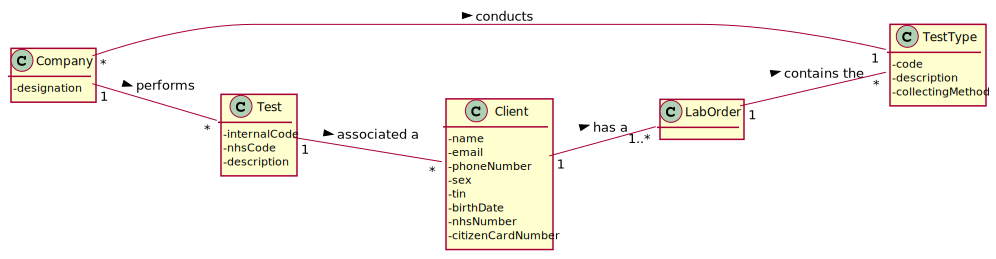

# US 004 - To register a Test

## 1. Requirements Engineering

### 1.1. User Story Description

As a receptionist of the laboratory, I intend to register a test to be performed to a registered client.

### 1.2. Customer Specifications and Clarifications

**From the specifications document:**

>Once there, a receptionist asks the client’s citizen card number, the lab order (which
contains the type of test and parameters to be measured), and registers in the application the test to
be performed to that client.

**From the client clarifications:**

> **Question:** I wanted to ask if the NHS code of which test is unique or not.
>
> **[Answer:](https://moodle.isep.ipp.pt/mod/forum/discuss.php?d=8432#p11173)** Yes.

> **Question:** On the project description we have multiple attributes of date and time ("date and time when the samples were collected", etc). Are these attributes filled by the author of the respective act or is it generated by the system when those acts are performed?
>
> **[Answer:](https://moodle.isep.ipp.pt/mod/forum/discuss.php?d=8442#p11177)** The system should automatically generate the date and time of the event (test registration, chemical analysis, diagnosis and validation).

> **Question:** When the receptionist chooses the test type, should the categories appear, and then when selecting the category, the receptionist can choose the parameters for the test? Or when the Receptionist chooses the test type, should appear all the parameters that it includes immediately?
>
> **[Answer:](https://moodle.isep.ipp.pt/mod/forum/discuss.php?d=8181#p11011)** Firstly, the receptionist should choose a test type. Then choose a category from a set of categories. Last, the receptionist should choose a parameter.

> **Question:** What are the attributes of a test and the acceptance criteria?
>
> **[Answer:](https://moodle.isep.ipp.pt/mod/forum/discuss.php?d=8181#p11011)** A: A test has the following attributes:Test code(Sequential number with 12 digits, the code is automatically generated), NHS code(12 alphanumeric characters).

> **Question:** When the receptionist is registering a test for a client, the test can have more than one category and many parameters of the chosen categories or it only can have one category?
>
> **[Answer:](https://moodle.isep.ipp.pt/mod/forum/discuss.php?d=8522#p11185)** Each test can have more than one category.

> **Question:** We are aware that both the receptionist and the MLT are two employees that may work on different labs. As such, do you want that Tests become associated to a specific Lab?
>
> **[Answer:](https://moodle.isep.ipp.pt/mod/forum/discuss.php?d=8596#p11375)** Yes.

> **Question:** This means that, when the receptionist creates a new Test, this test will only be "visible" for that specific LAB (for the receptionist and the MLT only), which means that all other roles (Chemistry Technologist, Specialist Doctor and the Laboratory Coordinator) will be able to see a list of all the tests performed in any lab.
>
> **[Answer:](https://moodle.isep.ipp.pt/mod/forum/discuss.php?d=8596#p11375)** Yes. The test will only be visible for that specific LAB and for all those working in the Chemical Laboratory.

> **Question:** Can the client have two identical tests? or the system should stop from creating the same test?
>
> **[Answer:](https://moodle.isep.ipp.pt/mod/forum/discuss.php?d=8628#p11365)** A test is unique in the system.

> **Question:** Shouldn't the receptionist locate the Client by the Citizen Card Number instead of TIN Number?
>
> **[Answer:](https://moodle.isep.ipp.pt/mod/forum/discuss.php?d=8684#p11376)** The receptionist should use the TIN number to find the client.

### 1.3. Acceptance Criteria

* **AC1:** The receptionist must select the parameters to be analysed from all possible parameters in accordance with the test type.
* **AC2:** The test code is a Sequential number with 12 digits and automatically generated
* **AC3:** The nhs code has 12 alphanumeric characters

### 1.4. Found out Dependencies

* There is a dependency to US03 since at least a client must exist to register a test to be performed.
* There needs to be at least a test type, a parameter and a parameter category registered in the system to register a test to be performed.

### 1.5 Input and Output Data

**Input Data:**

* Typed data:
	* Test code
	* Nhs code
	* Tax identification number

* Selected data:
	* Test Type
	* Parameter Category
	* Parameter

**Output Data:**

* List of existing tests
* (In)Success of the operation

### 1.6. System Sequence Diagram (SSD)

### 1.7 Other Relevant Remarks

## 2. OO Analysis

### 2.1. Relevant Domain Model Excerpt

### 2.2. Other Remarks

## 3. Design - User Story Realization

### 3.1. Rationale

| Interaction ID | Question: Which class is responsible for...                     | Answer                        | Justification (with patterns)                                                                                                                                                                          |
|:-------------  |:--------------------------------------------------------------- |:-----------------------------:|:------------------------------------------------------------------------------------------------------------------------------------------------------------------------------------------------------ |
| Step 1  		 | ... interacting with the actor?                                 | RegisterTestUI                | **Pure Fabrication**: There is no justification for assigning this responsibility to any existing class in the Domain Model.                                                                           |
|                | ... coordinating the US?                                        | RegisterTestController        | **Controller**                                                                                                                                                                                         |
| Step 2  		 |                                                                 |                               |                                                                                                                                                                                                        |
| Step 3  		 | ... saving the typed data?                                      | Test                          | **IE**: The test knows its own data.                                                                                                                                                                   |
| Step 4  		 | ... knowing the Clinical Analysis Laboratories?                 | ClinicalAnalysisLaboratoryStore| **IE**: The ClinicalAnalysisLaboratoryStore knows all the clinical laboratories.                                                                                                                      |
|                | ... transferring business data in DTO?                          | ClinicalAnalysisLaboratoryMapper| **DTO**: In order for the UI not to have direct access to business objects, it is best to choose to use a DTO.                                                                                       |
| Step 5         | ... saving the typed data?                                      | Test                          | **IE**: Owns its data.                                                                                                                                                                                 |
| Step 6  		 | ... knowing the Test Types?                                     | TestTypeStore                 | **IE**: The TestTypeStore knows all the test types.                                                                                                                                                    |
|                | ... transferring business data in DTO?                          | TestTypeMapper                | **DTO**: In order for the UI not to have direct access to business objects, it is best to choose to use a DTO.                                                                                         |
| Step 7         | ... saving the typed data?                                      | Test                          | **IE**: Owns its data.                                                                                                                                                                                 |
| Step 8  		 | ... knowing the Parameter Categories?                           | ParameterCategoryStore        | **IE**: The ParameterCategoryStore knows all parameter categories.                                                                                                                                     |
|                | ... transferring business data in DTO?                          | ParameterCategoryMapper       | **DTO**: In order for the UI not to have direct access to business objects, it is best to choose to use a DTO.                                                                                         |
| Step 9         | ... saving the typed data?                                      | Test                          | **IE**: Owns its data.                                                                                                                                                                                 |
| Step 10  		 | ... knowing the Parameters?                                     | ParameterStore                | **IE**: The ParameterStore knows all the parameters.                                                                                                                                                   |
|                | ... transferring business data in DTO?                          | ParameterMapper               | **DTO**: In order for the UI not to have direct access to business objects, it is best to choose to use a DTO.                                                                                         |
| Step 11        | ... saving the typed data?                                      | Test                          | **IE**: Owns its data.                                                                                                                                                                                 |
| Step 12  		 |                                                                 |                               |                                                                                                                                                                                                        |
| Step 13  		 |                                                                 |                               |                                                                                                                                                                                                        |
| Step 14        | ... validating all data (global validation)?                    | TestStore                     | **IE**: Knows if theres alredy a test registered.                                                                                                                                                      |
|        		 | ... validating all data (local validation)?                     | Test                          | **IE**: Owns its data.                                                                                                                                                                                 |
|                | ... saving the creation time?                                   | Test                          | **IE**: The Test knows when it was created.                                                                                                                                                            |
| Step 15  		 | ... informing operation success?                                | RegisterTestUI                | **IE**: Is responsible for user interactions.                                                                                                                                                          |

### Systematization ##

According to the taken rationale, the conceptual classes promoted to software classes are:

* Organization
* Platform
* Task

Other software classes (i.e. Pure Fabrication) identified:

* CreateTaskUI
* CreateTaskController

## 3.2. Sequence Diagram (SD)

## 3.3. Class Diagram (CD)

# 4. Tests

**Test 1:** Check that it is not possible to create an instance of National Healthcare Service code without 12 digits -AC3.

	@Test(expected = IllegalArgumentException.class)
    public void ensureNhsCodeMeetsAC3() {
        new Nhscode("123");
    }

# 5. Construction (Implementation)

## Class RegisterTestController

		/**
     * Create a test by receiving a client, nhscode, testType, testParameterList, lab as parameter
     * @param cl the client associated with the test
     * @param nhscode the clients nhscode
     * @param testType the client testtype DTO
     * @param ParameterList the ParameterDTO List 
     * @param lab the lab where the receptionist is working
     * @return false if the test already exists or is null. Otherwise, it returns true.
     */
    public boolean createTest(Client cl, NhsCode nhscode, TestTypeDTO testType, List<ParameterDTO> ParameterList, ClinicalAnalysisLaboratoryDTO lab) {
        List<TestParameter> listpm = new ArrayList<>();
        listpm = addParameter(pmmapper.toModel(ParameterList),listpm);
        this.t=tStore.createTest(cl,nhscode,ttmapper.toModel(testType),listpm,labmapper.toModel(lab));
        return this.tStore.validateTest(t);
    }
	/**
     * Save the test case it is in a valid state.
     * @return true if the test was saved. Otherwise, false.
     */
    public boolean saveTest() {
        return this.tStore.saveTest(t);
    }

## Class TestStore

		/**
     * Create a test
     * @param cl the client associated with the test
     * @param nhsCode the nhs code of the test
     * @param testType the test type associated with the test
     * @param testParameterList the list of parameters associated with the test
     * @return the test created
     */
    public Test createTest(Client cl, NhsCode nhsCode, TestType testType, List<TestParameter> testParameterList,ClinicalAnalysisLaboratory lab){
        return new Test(cl,nhsCode,testType,testParameterList,lab,generateInternalCode(testList.size()));
	}
	/**
     * Save the Test case it is in a valid state.
     * @param t The Test we intend to save
     * @return true if Test was saved. Otherwise, false.
     */
    public boolean saveTest(Test t) {
        if (!validateTest(t)){
            return false;
        }else{
            return testList.add(t);
        }
    }

## Class Test

	/**
     * Constructs an instance of {@code Test} receiving the client, National Healthcare Service code, test type, test parameter list , Clinical Analysis Laboratory and internal code by parameter
     * @param cl a client
     * @param nhscode the National Healthcare Service code
     * @param testType the test type
     * @param testParameterList the Test Parameter List
     * @param lab the Clinical Analysis Laboratory
     * @param internalCode the Internal code
     */
    public Test(Client cl, NhsCode nhscode, TestType testType, List<TestParameter> testParameterList,ClinicalAnalysisLaboratory lab,String internalCode) {
        this.client = cl;
        this.nhscode = new NhsCode(nhscode);
        this.testType = testType;
        this.testParameterList = testParameterList;
        this.stateOfTest = StateOfTest.TestRegistered;
        this.internalCode = internalCode;
        this.testAddDate = Calendar.getInstance().getTime();
        this.description = testType.getCollectingMethod();
        this.lab = lab;
        this.md = null;
        this.samples = new ArrayList<>();
        this.lcv = null;
    }

# 6. Integration and Demo

* Some demo purposes some tasks are bootstrapped while system starts.

# 7. Observations