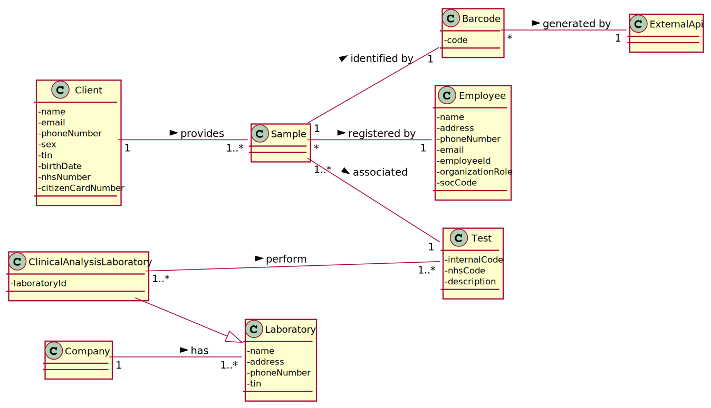
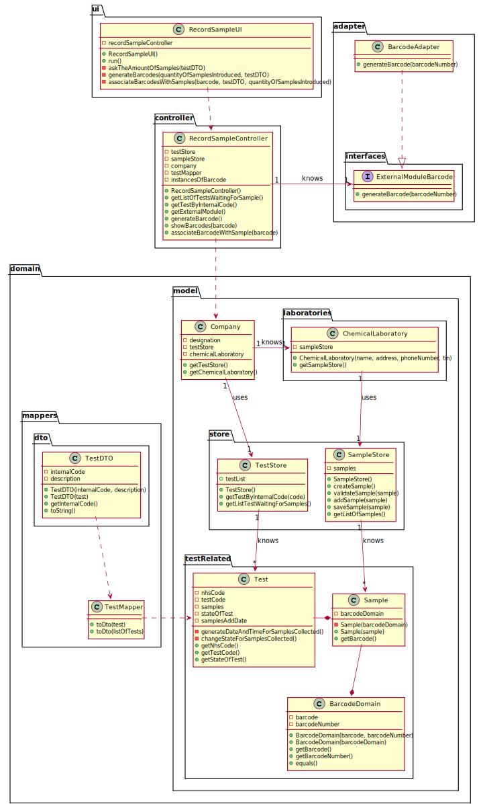

# US05 - Record the samples collected in the scope of a given test.

## 1. Requirements Engineering

### 1.1. User Story Description

*As a medical lab technician, I want to record the samples collected in the scope of a
given test.*

### 1.2. Customer Specifications and Clarifications 

**From the specifications document:**

> The client should wait until a medical lab technician calls him/her
to collect the samples required to perform a given test.

> All the tests (clinical blood tests and Covid-19 tests) performed by the network of laboratories are
registered locally by the medical lab technicians who collect the samples.

> When sampling (blood or swab) the medical lab technician records the samples in the system,
associating the samples with the client/test, and identifying each sample with a barcodeDomain that is
automatically generated using an external API.

**From the client clarifications:**

> **Question:** What kind of attributes should a sample have?
> 
> [**Answer:**](https://moodle.isep.ipp.pt/mod/forum/discuss.php?d=8244#p10890) Each sample is associated with a test. A sample has only one attribute, a barcodeDomain number (UPC) that is a sequential number and is automatically generated by the system. Each sample has a unique barcodeDomain number.

> [In US5, the medical lab technician checks the system and see all tests for which there are no samples collected. The medical lab technician selects a test and the system asks for the number of samples to collect.](https://moodle.isep.ipp.pt/mod/forum/discuss.php?d=8244#p10890)

> **Question:** Can a test have more than one sample?
> 
>  [**Answer:**](https://moodle.isep.ipp.pt/mod/forum/discuss.php?d=8244#p10890) Yes.

> **Question:** We didn't fully understand what will the API do in this US, so here's out interpretation from the US, correct us if we're wrong please: The API will be generated randomly and the API is an attribute from the sample.
> 
>  [**Answer:**](https://moodle.isep.ipp.pt/mod/forum/discuss.php?d=8244#p10890) The API will be used to generate/print barcodes.

> **Question:** What information does the medical lab technician needs to input to the record a new sample?
> 
>  [**Answer:**](https://moodle.isep.ipp.pt/mod/forum/discuss.php?d=8360#p11021) The medical lab technician checks a list of tests and selects one. Then, the application generates barcodes (one or more). After printing the barcodes (one or more) the use case ends.

> **Question:** During the current sprint, how should we allow the barcodes to be printed? After generating them via the API, should we save the barcodeDomain images to the disk?
> 
>  [**Answer:**](https://moodle.isep.ipp.pt/mod/forum/discuss.php?d=8491#p11182) Each generated barcodeDomain should be saved in a folder as a jpeg file.

> **Question:** It was answered in one of the previous questions that the sample only has one attribute, the barcodeDomain, however the description of the project also mentions a date of collection of the samples, is this date supposed to be an attribute of the test and not of the sample itself?
> 
> [**Answer:**](https://moodle.isep.ipp.pt/mod/forum/discuss.php?d=8450#p11178) Yes. The system should record the date (DD/MM/YYYY) and time (HH:MM) when the sample is collect made. The date and time are automatically generated by the system when the barcodeDomain is issued.

> **Question:** If there were multiple samples for a single test, would there be only one collection date for all of them?
> 
>  [**Answer:**](https://moodle.isep.ipp.pt/mod/forum/discuss.php?d=8450#p11178) Only one collection date and time for a test.

> **Question:** Shouldn't there be a way for technicians to add more samples to an existing test?
>
>  [**Answer:**](https://moodle.isep.ipp.pt/mod/forum/discuss.php?d=8437#p11175) No.

> **Question:**  Should there be a validation of the number of samples?
>
>  [**Answer:**](https://moodle.isep.ipp.pt/mod/forum/discuss.php?d=8437#p11175) No.

### 1.3. Acceptance Criteria

- *_AC1:_* The system should support several barcodeDomain APIs. 
  
- *_AC2:_* The API to use is defined by configuration.
  
- *_AC3:_* A test can have more than one sample.

- *_AC4:_* The date and time associated with a sample must be automatically generated by the system.

- *_AC5:_* Each samples has a unique barcodeDomain number.

- *_AC6:_* All bar codes generated must be saved in jpeg format in a file.

- *_AC7:_* After certain samples have been associated with a test, it is not possible to associate more samples with that test.

- *_AC8:_* The date must be in the format DD/MM/YYYY.

- *_AC9:_* The time must have the following format HH:MM.

### 1.4. Found out Dependencies

* This user story has a dependency with user story 4 since it is only possible to collect and identify samples from a test registered.

### 1.5 Input and Output Data

**Input Data:**

* Typed data:
  * The number of samples associated with a test

* Selected data:
  * The test waiting to be associated with a sample

* Automatically generated data:
  * Barcode
  * Data
  * Time
  
**Output Data:**

* The barcodes associated with the samples were recorded

### 1.6. System Sequence Diagram (SSD)

### 1.7 Other Relevant Remarks

* This user story will be used during the entire operation of the system, since, every test performed by Many labs requires sample collection.

## 2. OO Analysis

### 2.1. Relevant Domain Model Excerpt  

### 2.2. Other Remarks

*Use this section to capture some aditional notes/remarks that must be taken into consideration into the design activity. In some case, it might be usefull to add other analysis artifacts (e.g. activity or state diagrams).* 

## 3. Design - User Story Realization 

### 3.1. Rationale
| Interaction ID | Question: Which class is responsible for...                     | Answer                        | Justification (with patterns)                                                                                                                                                                          |
|:-------------  |:--------------------------------------------------------------- |:-----------------------------:|:------------------------------------------------------------------------------------------------------------------------------------------------------------------------------------------------------ |
| Step 1  		 | ... interacting with the actor?                                 | RecordSampleUI                | **Pure Fabrication**: none of the domain models classes had the responsability of interactiong with the user.                                                                                          |
|                | ... coordinating the US?                                        | RecordSampleController        | **Controller**                                                                                                                                                                                         |
| Step 2  		 | ... knowing the tests to show?                                  | TestStore                     | **Information Expert**: Owns the existing tests.                                                                                                                                                       |
|                | ... process the data and convert it to dto                      | TestDTO                       | **DTO**: So that the UI can't interact directly with the domain.                                                                                                                                       |
| Step 3  		 | ... saving the selected test?                                   | Sample                        | **Information Expert**: knowing to which test is associated                                                                                                                                            |
| Step 4  		 |                                                                 |                               |                                                                                                                                                                                                        |
| Step 5  		 | ... knowing the number of samples?                              | Test                          |**Information Expert**: knowing how many samples were collected.                                                                                                                                        |
| 		         | ... instantiating a new Sample?                                 | Test                          | **Creator (R1)** and **HC+LC**: Applying the Creator (R1) would be in the "Company". But, by applying HC + LC to the "Company", this transfers the responsibility to the test class                    |
|        		 | ... validating all data (local validation)?                     | Sample                        | IE: owns its data.                                                                                                                                                                                     |
|        		 | ... validating all data (global validation)?                    | Test                          | IE: owns its data.                                                                                                                                                                                     |
| Step 6  		 |                                                                 |                               |                                                                                                                                                                                                        |
| Step 7  		 | ... validating all data (global validation)?                    | Test                          | IE: owns its data.                                                                                                                                                                                     |
| Step 8  		 | ... informing operation success?                                | RecordSampleUI

### Systematization ##

According to the taken rationale, the conceptual classes promoted to software classes are: 

 * Employee
 * Sample
 * Test
 * Client 

Other software classes (i.e. Pure Fabrication) identified: 
 * RecordSampleUI  
 * RecordSampleController
 * TestStore
 * SampleStore
 * BarcodeAdapter
 * TestMapper
 * TestDTO

## 3.2. Sequence Diagram (SD)

### 3.2.1 Reference to Sequence Diagram using the Interaction use principle

## 3.3. Class Diagram (CD)

# 4. Tests 
*In this section, it is suggested to systematize how the tests were designed to allow a correct measurement of requirements fulfilling.* 

**_DO NOT COPY ALL DEVELOPED TESTS HERE_**

**Test 1:** Check that it is not possible to create an instance of the Example class with null values. 

	@Test(expected = IllegalArgumentException.class)
		public void ensureNullIsNotAllowed() {
		Exemplo instance = new Exemplo(null, null);
	}

*It is also recommended to organize this content by subsections.* 

# 5. Construction (Implementation)
 
##Class RecordSamplesController

    /**
     * Generates the date and time when the samples were associated with a test
     * @param test the test that will be associated with the date and time of sample collection
     */
    public void generateDataAndTimeForSamplesCollected(Test test) {
        testStore.generateDataAndTimeForSamplesCollected(test);
    }

    /**
     * After the samples are added to the test, it needs to change its status to SamplesCollected
     * @param test the test that needs to change state
     */
    public void changeTheStatusOfTest(Test test){
        testStore.changeTheStatusOfTest(test);
    }

##Class TestStore

    /**
     * Generates the date and time when the samples were associated with a test
     * @param test the test that will be associated with the date and time of sample collection
     */
    public void generateDataAndTimeForSamplesCollected(Test test){
        test.generateDataAndTimeForSamplesCollected();
    }

    /**
     * After the samples are added to the test, it needs to change its status to SamplesCollected
     * @param test the test that needs to change state
     */
    public void changeTheStatusOfTest(Test test){
        test.changeStateForSamplesCollected();
    }

##Class Test

    /**
     * Change the status of a test for Samples collected
     */
    public void changeStateForSamplesCollected() {
        this.state = StateOfTest.SamplesCollected;
    }
    /**
    * Generates the date and time when the samples were associated with a test
    */
    public void generateDataAndTimeForSamplesCollected(){
    this.samplesAddDate = Calendar.getInstance().getTime();
    }

# 6. Integration and Demo 

*In this section, it is suggested to describe the efforts made to integrate this functionality with the other features of the system.*

# 7. Observations

*In this section, it is suggested to present a critical perspective on the developed work, pointing, for example, to other alternatives and or future related work.*

