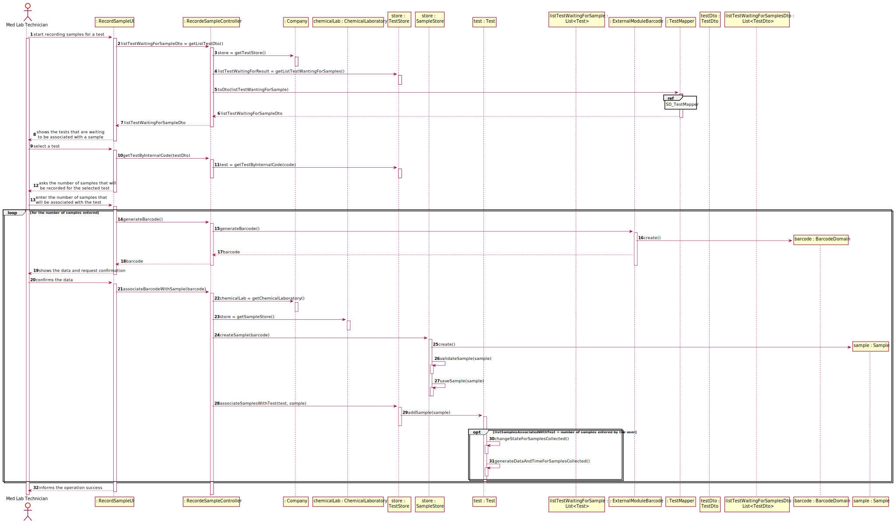

# US05 - Record the samples collected in the scope of a given test.

## 1. Requirements Engineering

### 1.1. User Story Description

*As a medical lab technician, I want to record the samples collected in the scope of a
given test.*

### 1.2. Customer Specifications and Clarifications 

**From the specifications document:**

> The client should wait until a medical lab technician calls him/her
to collect the samples required to perform a given test.

> All the tests (clinical blood tests and Covid-19 tests) performed by the network of laboratories are
registered locally by the medical lab technicians who collect the samples.

> When sampling (blood or swab) the medical lab technician records the samples in the system,
associating the samples with the client/test, and identifying each sample with a barcode that is
automatically generated using an external API.

**From the client clarifications:**

> **Question:** What kind of attributes should a sample have?
> 
> [**Answer:**](https://moodle.isep.ipp.pt/mod/forum/discuss.php?d=8244#p10890) Each sample is associated with a test. A sample has only one attribute, a barcode number (UPC) that is a sequential number and is automatically generated by the system. Each sample has a unique barcode number.

> [In US5, the medical lab technician checks the system and see all tests for which there are no samples collected. The medical lab technician selects a test and the system asks for the number of samples to collect.](https://moodle.isep.ipp.pt/mod/forum/discuss.php?d=8244#p10890)

> **Question:** Can a test have more than one sample?
> 
>  [**Answer:**](https://moodle.isep.ipp.pt/mod/forum/discuss.php?d=8244#p10890) Yes.

> **Question:** We didn't fully understand what will the API do in this US, so here's out interpretation from the US, correct us if we're wrong please: The API will be generated randomly and the API is an attribute from the sample.
> 
>  [**Answer:**](https://moodle.isep.ipp.pt/mod/forum/discuss.php?d=8244#p10890) The API will be used to generate/print barcodes.

> **Question:** What information does the medical lab technician needs to input to the record a new sample?
> 
>  [**Answer:**](https://moodle.isep.ipp.pt/mod/forum/discuss.php?d=8360#p11021) The medical lab technician checks a list of tests and selects one. Then, the application generates barcodes (one or more). After printing the barcodes (one or more) the use case ends.

> **Question:** During the current sprint, how should we allow the barcodes to be printed? After generating them via the API, should we save the barcode images to the disk?
> 
>  [**Answer:**](https://moodle.isep.ipp.pt/mod/forum/discuss.php?d=8491#p11182) Each generated barcode should be saved in a folder as a jpeg file.

> **Question:** It was answered in one of the previous questions that the sample only has one attribute, the barcode, however the description of the project also mentions a date of collection of the samples, is this date supposed to be an attribute of the test and not of the sample itself?
> 
> [**Answer:**](https://moodle.isep.ipp.pt/mod/forum/discuss.php?d=8450#p11178) Yes. The system should record the date (DD/MM/YYYY) and time (HH:MM) when the sample is collect made. The date and time are automatically generated by the system when the barcode is issued.

> **Question:** If there were multiple samples for a single test, would there be only one collection date for all of them?
> 
>  [**Answer:**](https://moodle.isep.ipp.pt/mod/forum/discuss.php?d=8450#p11178) Only one collection date and time for a test.

> **Question:** Shouldn't there be a way for technicians to add more samples to an existing test?
>
>  [**Answer:**](https://moodle.isep.ipp.pt/mod/forum/discuss.php?d=8437#p11175) No.

> **Question:**  Should there be a validation of the number of samples?
>
>  [**Answer:**](https://moodle.isep.ipp.pt/mod/forum/discuss.php?d=8437#p11175) No.

> **Question:** We are aware that both the receptionist and the MLT are two employees that may work on different labs. As such, do you want that Tests become associated to a specific Lab?
> 
> [**Answer:**](https://moodle.isep.ipp.pt/mod/forum/discuss.php?d=8596#p11375)  Yes.

> **Question:** This means that, when the receptionist creates a new Test, this test will only be "visible" for that specific LAB (for the receptionist and the MLT only), which means that all other roles (Chemistry Technologist, Specialist Doctor and the Laboratory Coordinator) will be able to see a list of all the tests performed in any lab.
> 
>  [**Answer:**](https://moodle.isep.ipp.pt/mod/forum/discuss.php?d=8596#p11375) Yes. The test will only be visible for that specific LAB and for all those working in the Chemical Laboratory.
### 1.3. Acceptance Criteria

- *_AC1:_* The system should support several barcode APIs. 
  
- *_AC2:_* The API to use is defined by configuration.
  
- *_AC3:_* A test can have more than one sample.

- *_AC4:_* The date and time associated with a sample must be automatically generated by the system.

- *_AC5:_* Each samples has a unique barcode number.

- *_AC6:_* All bar codes generated must be saved in jpeg format in a file.

- *_AC7:_* After certain samples have been associated with a test, it is not possible to associate more samples with that test.

- *_AC8:_* The date must be in the format DD/MM/YYYY.

- *_AC9:_* The time must have the following format HH:MM.

### 1.4. Found out Dependencies

* This user story has a dependency with user story 4 since it is only possible to collect and identify samples from a test registered.

### 1.5 Input and Output Data

**Input Data:**

* Typed data:
  * The number of samples associated with a test

* Selected data:
  * The test waiting to be associated with a sample

* Automatically generated data:
  * Barcode
  * Data
  * Time
  
**Output Data:**

* The barcodes associated with the samples were recorded

### 1.6. System Sequence Diagram (SSD)

### 1.7 Other Relevant Remarks

* This user story will be used during the entire operation of the system, since, every test performed by Many labs requires sample collection.

## 2. OO Analysis

### 2.1. Relevant Domain Model Excerpt  

### 2.2. Other Remarks

* For the integration between user stories 4, 5, 12, and 15 to be carried out correctly, the test must change its status as it goes through each step of the user stories.
 

## 3. Design - User Story Realization 

### 3.1. Rationale
| Interaction ID | Question: Which class is responsible for...                     | Answer                        | Justification (with patterns)                                                                                                                                                                          |
|:-------------  |:--------------------------------------------------------------- |:-----------------------------:|:------------------------------------------------------------------------------------------------------------------------------------------------------------------------------------------------------ |
| Step 1  		 | ... interacting with the actor?                                 | RecordSampleUI                | **Pure Fabrication**: There is no justification for assigning this responsibility to any existing class in the Domain Model.                                                                           |
|                | ... coordinating the US?                                        | RecordSampleController        | **Controller**                                                                                                                                                                                         |
| Step 2  		 | ... know the tests that are waiting to collect the samples?     | TestStore                     | **IE**: Knows all the tests.                                                                                                                                                                           |
|                | ... knowing the TestStore?                                      | Company                       | **IE**: The company knows the TestStore to which it is delegating some tasks.                                                                                                                          |
|                | ... transferring business data in DTO?                          | TestDto                       | **DTO**: In order for the UI not to have direct access to business objects, it is best to choose to use a DTO.                                                                                         |
| Step 3  		 |                                                                 |                               |                                                                                                                                                                                                        |
| Step 4  		 |   |                          |                                                                                                                                                               |
| Step 5         | ...generate the barcodes?                                       | BarcodeAdapter                | **Protected Variation**: The system must support several API's.     |                                                                                                                                                                         |
| Step 6         | ...show the barcodes?                                           | RecordSampleUI                | **IE**: Is responsible for user interactions.  |
| Step 7         | ...know the chemical laboratory?                                | Company                       | **IE**: The company knows all its laboratories |
|                | ...create a sample?                                             | SampleStore                   | **HC+LC:** The chemical laboratory delegates the responsibility of managing the samples in the SampleStore |
|                | ...associate the sample with the barcode?                       | Sample                        | **IE:** The sample owns our on data |
|                | ...save the sample in system?                                   | sampleStore                   | **IE:** Know all the samples in system. | 
|                | ...associate the sample with the test?                          | Test                          | **IE:** The test owns your on data. |
|                | ...changing the status of the test?                             | Test                          | **IE:** Only the test knows our state and it's the only one capable of the change it. |
|                | ...generate the data end time for sample collection?            | Test                          | **IE:** The test owns our on data. |
| Step 8  		 | ... informing operation success?                                | RecordSampleUI                | **IE**: Is responsible for user interactions.                                                                                                                                                          |

### Systematization ##

According to the taken rationale, the conceptual classes promoted to software classes are: 

 * Employee
 * Sample
 * Test
 * Client 

Other software classes (i.e. Pure Fabrication) identified: 
 * RecordSampleUI  
 * RecordSampleController
 * TestStore
 * SampleStore
 * BarcodeAdapter
 * TestMapper
 * TestDTO

## 3.2. Sequence Diagram (SD)

### 3.2.1 Reference to Sequence Diagram using the Interaction use principle

## 3.3. Class Diagram (CD)

# 4. Tests 

**Test 1:** Check that it is not possible to create an instance of the sample class with null values. 

    @Test(expected = IllegalArgumentException.class)
    public void notNullSample(){
        barcodeDomain = new BarcodeDomain(null, null);
        sample = new Sample(barcodeDomain);
    }

**Test 2:** Check that it is not possible to create an instance of the BarcodeDomain class with null values.

    @Test(expected = IllegalArgumentException.class)
    public void barcodeNotNull(){
    barcodeDomain = new BarcodeDomain(null, null);
    }

**Test 3:** Checks that it is not possible to save a sample that is already saved in the store.

    @Test
    public void saveTestAlreadyExistInSystem() throws BarcodeException {
    sampleStore = new SampleStore();
    sample = new Sample(new BarcodeDomain(BarcodeFactory.createUPCA("00000000000"), "0000000000"));
    sampleStore.saveSample(sample);
    Sample sampleAux = sample;
    boolean result = sampleStore.saveSample(sampleAux);
    Assert.assertFalse(result);
    }

**Test 4:** Check that it is not possible to save a sample that is not valid.

     @Test
    public void saveInvalidSample(){
        sampleStore = new SampleStore();
        sample = null;
        boolean result = sampleStore.saveSample(sample);
        Assert.assertFalse(result);

    }

# 5. Construction (Implementation)

##Class RecordSampleUI

    /**
     * Generates the amount of barcode entered by the user
     * @param i the amount of samples entered by the user
     * @return a list of bar codes the same size as the number of samples entered by the user
     */
    private void generateBarcodes(int i, TestDTO testDTO){
        for (int j=0; j<i; j++){
            boolean invalidData = true;
            do {
                try {
                    BarcodeDomain barcodeDomain = recordSampleController.generateBarcode();
                    recordSampleController.showBarcodes(barcodeDomain);
                    boolean flag = Utils.confirm("Do you really intend to associate these barcodes with the samples? (S/N)");
                    if (flag) {
                        associateBarcodesWithSamples(barcodeDomain, testDTO, i);
                        recordSampleController.imageIoWrite(recordSampleController.barcodeImage(barcodeDomain), "Barcode_"+barcodeDomain.getBarcodeNumber());
                    }
                    invalidData = false;
                } catch (ClassNotFoundException e) {
                    e.printStackTrace();
                } catch (InstantiationException e) {
                    e.printStackTrace();
                } catch (IllegalAccessException e) {
                    e.printStackTrace();
                } catch (IOException e) {
                    e.printStackTrace();
                } catch (BarcodeException e) {
                    e.printStackTrace();
                } catch (OutputException e) {
                    e.printStackTrace();
                }
            }while (invalidData);

        }
    }

##Class Test

    /**
     * Change the status of a test for Samples collected
     */
    private void changeStateForSamplesCollected() {
        this.state = StateOfTest.SamplesCollected;
    }

    /**
    * Generates the date and time when the samples were associated with a test
    */
    private void generateDataAndTimeForSamplesCollected(){
    this.samplesAddDate = Calendar.getInstance().getTime();
    }

    /**
     * Adds the samples to the test
     * @param sample the sample that will be added to the test
     * @return true, if the copy of the sample list passed by parameter is successful, false otherwise
     */
    public boolean addSamples(Sample sample, int flag){
        if (this.samples.size()==flag) {
            changeStateForSamplesCollected();
            generateDataAndTimeForSamplesCollected();
        }
        return this.samples.add(sample);
    }

# 6. Integration and Demo 

* For some demonstration purposes, the following objects were added in the bootstrap method: parameter category, parameter, test type and a client.
  
* An integration with the Clinical Analysis Laboratory class was necessary so that only the tests associated with a given laboratory are shown to the user.

# 7. Observations

* In the future, the user story will be developed with a graphical interface for a better experience for the user.

