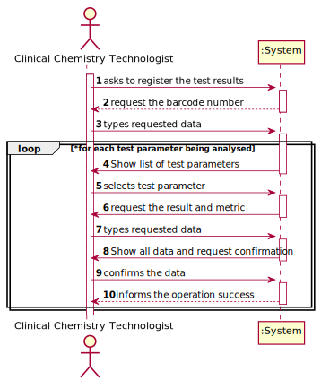

# US 12 - Record Test Results

## 1. Requirements Engineering

### 1.1. User Story Description

As a clinical chemistry technologist, I intend to record the results of a given test

### 1.2. Customer Specifications and Clarifications 

**From the specifications document:**

>	At the company's headquarters, the clinical chemistry technologist receives the samples (delivered
by a courier) and performs the chemical analysis, recording the results in the software application.

>   To facilitate and simplify the validation work performed by the specialist doctor, the application
uses an external module that is responsible for doing an automatic validation using test reference
values.

**From the client clarifications:**
> **Question:** "Which type/format has LaboratoryID, address, name, phone number, and TIN number on Clinical Analysis Laboratory?"
>  
> [**Answer:**](https://moodle.isep.ipp.pt/mod/forum/discuss.php?d=7636)
>Each Clinical Analysis Laboratory is characterized by the following attributes:

### 1.3. Acceptance Criteria

* **AC1:** The application should use an external module that is responsible for providing the test reference values.

### 1.4. Found out Dependencies

* There is a dependency to "US10 Specify a new parameter and categorize it" since at least the parameter must exist to record the results .

### 1.5 Input and Output Data

**Input Data:**

* Typed data:
	*  
	
* Selected data:
	* 

**Output Data:**

* (In)Success of the operation

### 1.6. System Sequence Diagram (SSD)

**Alternative 1**

### 1.7 Other Relevant Remarks

## 2. OO Analysis

### 2.1. Relevant Domain Model Excerpt 

### 2.2. Other Remarks

n/a

## 3. Design - User Story Realization 

### 3.1. Rationale

**SSD - Alternative 1 is adopted.**

| Interaction ID | Question: Which class is responsible for... | Answer  | Justification (with patterns)  |
|:-------------  |:--------------------- |:------------|:---------------------------- |
| Step 1  		 |	... interacting with the actor? | CreateClinicalAnalysisLaboratoryUI   |  Pure Fabrication: there is no reason to assign this responsibility to any existing class in the Domain Model.           |
| 			     |	... coordinating the US? | CreateClinicalAnalysisLaboratoryController | Controller                             |
| 			     |	... knowing who is responsible for creating Clinical Analysis Laboratory instances? | Company   | Creator (R1)   |
| 			  	 | ... knowing the user using the system?  | UserSession  |   |
| 			  	 |	... creates Clinical Analysis Laboratory instance? | ClinicalAnalysisLaboratoryStore  | HC+LC on the Company. By HC / LC the Company delegates these responsibilities in TestTypeStore. |
| Step 2  		 |							 |             |                              |
| Step 3  		 |	...saving the inputted data? | ClinicalAnalysisLaboratory  | IE: object created in step 1 has its own data.  |
| Step 4  		 |	...knowing the TestType to show? | TestTypeStore  | IE: knows all the TestTypes. |
| Step 5  		 |	... saving the selected TestTypes? | ClinicalAnalysisLaboratory  | IE: the object created contains one or more TestTypes.  |
| Step 6  		 |							 |             |                              |              
| Step 7  		 |	... validating all data (local validation)? | ClinicalAnalysisLaboratory | IE: owns its data.| 
| 			  		 |	... validating all data (global validation)? | ClinicalAnalysisLaboratoryStore| IE: knows all its Clinical Analysis Laboratories.| 
| 			  		 |	... saving the created task? | ClinicalAnalysisLaboratoryStore | IE: owns all its Clinical Analysis Laboratories.| 
| Step 8  		 |	... informing operation success?| CreateClinicalAnalysisLaboratoryUI  | IE: is responsible for user interactions.  | 

### Systematization ##

According to the taken rationale, the conceptual classes promoted to software classes are: 

 * 

Other software classes (i.e. Pure Fabrication) identified: 

 * 

## 3.2. Sequence Diagram (SD)

**Alternative 1**

## 3.3. Class Diagram (CD)

**From alternative 1**

# 4. Tests 

**Test 1:** Check that it is not possible to create an instance of the Clinical Analysis Laboratory class with null values. 

	@Test(expected = IllegalArgumentException.class)
    public void ensureNullIsNotAllowed(){
        ClinicalAnalysisLaboratory call = new ClinicalAnalysisLaboratory(null,null,null,null,null,null);
    }

# 5. Construction (Implementation)

## Class CreateClinicalAnalysisLaboratoryController 

# 6. Integration and Demo

# 7. Observations

