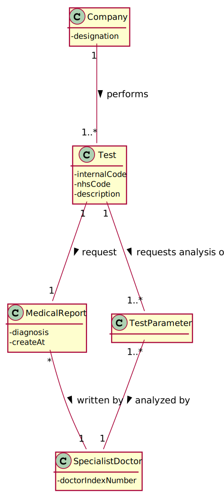

# US 14 - Make the diagnosis and write a report 

## 1. Requirements Engineering

### 1.1. User Story Description

As a specialist doctor, I intend to make the diagnosis and write a report for a given test.

### 1.2. Customer Specifications and Clarifications 

**From the specifications document:**

>After completing the chemical analysis, the results of all chemical analyses are analysed by a
specialist doctor who makes a diagnosis and writes a report that afterwards will be delivered to the
client.

>To facilitate and simplify the validation work performed by the specialist doctor, the application
uses an external module that is responsible for doing an automatic validation using test reference
values.

>Each test is characterized by [...] , the date and time of the diagnosis made
by the specialist doctor, [...].

**From the client clarifications:**

> **Question:**  Is there a limit of characters for the report and the diagnosis that will be made by the Specialist Doctor?
>
> [_**Answer:**_](https://moodle.isep.ipp.pt/mod/forum/discuss.php?d=8182#p10891)   Yes, the report is free text and should have no more than 400 words.

> **Question:**  What characterizes a diagnosis?
>
> [_**Answer:**_](https://moodle.isep.ipp.pt/mod/forum/discuss.php?d=8292#p10897)   The report contains the diagnosis.

> **Question:**  Can the Specialist Doctor edit a report once it has already been written?
>
> [_**Answer:**_](https://moodle.isep.ipp.pt/mod/forum/discuss.php?d=8268#p10898)   No.

> **Question:**  Should the specialist doctor choose from a list of tests?
>
> [_**Answer:**_](https://moodle.isep.ipp.pt/mod/forum/discuss.php?d=8250#p10889)   The system shows all tests ready to make the diagnosis and the Specialist Doctor selects one test.

> **Question:**  Once the specialist doctor decides to write the report for a given test, should the results of the chemical analysis and the reference values be presented on the screen?
>
> [_**Answer:**_](https://moodle.isep.ipp.pt/mod/forum/discuss.php?d=8497#p11183)   After selecting a test (to make the diagnosis/report) the results of the chemical analysis and the reference values should be presented on the screen. Then the Specialist Doctor should write the report.

> **Question:**  While in the "Make a diagnosis and write a report" option of the main menu, should the specialist doctor be able to make a diagnosis and write a report for more than one test?
>
> [_**Answer:**_](https://moodle.isep.ipp.pt/mod/forum/discuss.php?d=8497#p11183)   After writing a report the SD can choose to write other reports without leaving the use case.

### 1.3. Acceptance Criteria

* **AC1:** The report is free text and should have no more than 400 words.
* **AC2:** The medical report cannot be edited.
* **AC3:** Specialist doctor be able to make a diagnosis and write a report for more than one test.

### 1.4. Found out Dependencies

* There is a dependency to "US12 Record the results of a given test" because the results of the chemical analysis have to be in the system for the specialist doctor to be able to make a diagnosis.

### 1.5 Input and Output Data

**Input Data:**

* Typed data:
	* Medical Report
	
* Selected data:
	* Test

**Output Data:**

* List of existing tests in the Samples Analyzed state
* List of test parameters
* (In)Success of the operation

### 1.6. System Sequence Diagram (SSD)

**Alternative 1**

**Other alternatives might exist.**

### 1.7 Other Relevant Remarks

* The test goes to the Diagnosis Made status after the conclusion of the medical report.

## 2. OO Analysis

### 2.1. Relevant Domain Model Excerpt 

### 2.2. Other Remarks

* For the integration between user stories 4, 5, 12, and 15 to be carried out correctly, the test must change its status as it goes through each step of the user stories.

## 3. Design - User Story Realization 

### 3.1. Rationale

**SSD - Alternative 1 is adopted.**

| Interaction ID | Question: Which class is responsible for...                     | Answer                        | Justification (with patterns)                                                                                                                                                                          |
|:-------------  |:--------------------------------------------------------------- |:-----------------------------:|:------------------------------------------------------------------------------------------------------------------------------------------------------------------------------------------------------ |
| Step 1  		 | ... interacting with the actor?                                 | WriteMedicalReportUI          | **Pure Fabrication**: There is no justification for assigning this responsibility to any existing class in the Domain Model.                                                                           |
|                | ... coordinating the US?                                        | WriteMedicalReportController  | **Controller**                                                                                                                                                                                         |
| Step 2  		 | ... knowing the tests that are waiting for the medical report?  | TestStore                     | **IE**: Knows all the tests.                                                                                                                                                                           |
|                | ... knowing the TestStore?                                      | Company                       | **IE**: The company knows the TestStore to which it is delegating some tasks.                                                                                                                          |
|                | ... transferring business data in DTO?                          | TestMapper                    | **DTO**: In order for the UI not to have direct access to business objects, it is best to choose to use a DTO.                                                                                         |
| Step 3  		 |                                                                 |                               |                                                                                                                                                                                                        |
| Step 4  		 | ... knowing the parameters analyzed and the respective data?    | Test                          | **IE**: The test knows its own results.                                                                                                                                                                |
|                | ... transferring business data in DTO?                          | TestParameterMapper           | **DTO**: In order for the UI not to have direct access to business objects, it is best to choose to use a DTO.                                                                                         |
| Step 5         | ... saving the typed data?                                      | MedicalReport                 | **IE**: Owns its data.                                                                                                                                                                                 |
| Step 6  		 |                                                                 |                               |                                                                                                                                                                                                        |
| Step 7         | ... validating all data (global validation)?                    | Test                          | **IE**: Know if already have a medical report.                                                                                                                                                         |
|                | ... instantiating a new Medical Report?                         | Test                          | **Creator (R1)**                                                                                                                                                                                       |
|        		 | ... validating all data (local validation)?                     | MedicalReport                 | **IE**: Owns its data.                                                                                                                                                                                 |
|        		 | ... saving the creation time?                                   | MedicalReport                 | **IE**: The medical report knows when it was created.                                                                                                                                                  |
| Step 8  		 | ... informing operation success?                                | WriteMedicalReportUI          | **IE**: Is responsible for user interactions.                                                                                                                                                          |

### Systematization ##

According to the taken rationale, the conceptual classes promoted to software classes are: 

 * Company
 * Test
 * MedicalReport 

Other software classes (i.e. Pure Fabrication) identified: 

 * WriteMedicalReportUI
 * WriteMedicalReportController
 * TestStore
 * TestMapper
 * TestParameterMapper

## 3.2. Sequence Diagram (SD)

**Alternative 1**

## 3.3. Class Diagram (CD)

**From alternative 1**

# 4. Tests

**Test 1:** Check that it is not possible to create an instance of the medical report class with null values.

    @Test(expected = IllegalArgumentException.class)
    public void ensureNullIsNotAllowed(){
        MedicalReport md = new MedicalReport(null);
    }

**Test 2:** Check that it is not possible to create an instance of the Medical Report class with a diagnosis invalid - AC1.

    @Test(expected = IllegalArgumentException.class)
    public void ensureDiagnosisMeetsAC1_1(){
       MedicalReport md = new MedicalReport("Test Test Test Test Test Test Test Test Test Test Test Test Test Test Test Test Test Test Test Test Test Test Test Test Test Test Test Test Test Test Test Test Test Test Test Test Test Test Test Test Test Test Test Test Test Test Test Test Test Test Test Test Test Test Test Test Test Test Test Test Test Test Test Test Test Test Test Test Test Test Test Test Test Test Test Test Test Test Test Test Test Test Test Test Test Test Test Test Test Test Test Test Test Test Test Test Test Test Test Test Test Test Test Test Test Test Test Test Test Test Test Test Test Test Test Test Test Test Test Test Test Test Test Test Test Test Test Test Test Test Test Test Test Test Test Test Test Test Test Test Test Test Test Test Test Test Test Test Test Test Test Test Test Test Test Test Test Test Test Test Test Test Test Test Test Test Test Test Test Test Test Test Test Test Test Test Test Test Test Test Test Test Test Test Test Test Test Test Test Test Test Test Test Test Test Test Test Test Test Test Test Test Test Test Test Test Test Test Test Test Test Test Test Test Test Test Test Test Test Test Test Test Test Test Test Test Test Test Test Test Test Test Test Test Test Test Test Test Test Test Test Test Test Test Test Test Test Test Test Test Test Test Test Test Test Test Test Test Test Test Test Test Test Test Test Test Test Test Test Test Test Test Test Test Test Test Test Test Test Test Test Test Test Test Test Test Test Test Test Test Test Test Test Test Test Test Test Test Test Test Test Test Test Test Test Test Test Test Test Test Test Test Test Test Test Test Test Test Test Test Test Test Test Test Test Test Test Test Test Test Test Test Test Test Test Test Test Test Test Test Test Test Test Test Test Test Test Test Test Test Test Test Test Test Test Test Test Test Test Test Test Test Test Test Test Test Test Test Test Test Test Test Test Test Test Test Test Test Test Test Test Test Test Test Test Test Test Test Test Test Test Test Test Test Test Test Test Test Test Test Test Test");
    }

**Test 3:** Check that it is not possible to add more than one Medical Report to the test - AC2.

    @Test
    public void addInvalidMedicalReport(){
        Company company = new Company("Many Labs");
        ParameterCategory pc1 = new ParameterCategory("HM000","Hemogram");
        Parameter p1 = new Parameter("HB000","HB","Hemoglobin",pc1);
        List<ParameterCategory> list=new ArrayList();
        list.add(pc1);
        Client client = new Client("Rita","1231231231231231","1231231231","26/11/2002","Female","1231231231","12312312312","rita@gmail.com");
        NhsCode nhs = new NhsCode("123456789012");
        TestType tt = new TestType("BL000","blood","syringe",list,"ExternalModule2API");
        RefValue rv = new RefValue("mg",10,20);
        TestParameterResult tpr = new TestParameterResult(rv,"15","mg");
        TestParameter tp = new TestParameter(p1,tpr);
        List<TestParameter> tpList = new ArrayList<>();
        tpList.add(tp);
        List<TestType> ttlist = new ArrayList<>();
        ttlist.add(tt);
        ClinicalAnalysisLaboratory lab = new ClinicalAnalysisLaboratory("Chemical","1234","12312312312","1231231231","12345",ttlist);
        app.domain.model.testrelated.Test test = new app.domain.model.testrelated.Test(client,nhs,tt,tpList,lab,"123123123123");
        test.addMedicalReport("The patient is healthy");
        boolean result = test.addMedicalReport("The patient is healthy");
        Assert.assertFalse(result);
    }

# 5. Construction (Implementation)

##Class WriteMedicalReportController

     /**
     * Get a list of objects of type TestDTO.
     * @return list with the tests with the analyzed samples.
     */
    public List<TestDTO> getTestHasSamplesAnalyzedList(){
        this.testStore=company.getTestStore();
        checkPossibilityOfWriteAReport(testStore.getTestHasSamplesAnalyzedList());
        List<Test> testHasSamplesAnalyzedList = testStore.getTestHasSamplesAnalyzedList();
        return testMapper.toDto(testHasSamplesAnalyzedList);
    }

    /**
     * Check if there is any test waiting for the medical report.
     */
    public void checkPossibilityOfWriteAReport(List<Test> testHasSamplesAnalyzedList){
        if (testHasSamplesAnalyzedList.isEmpty())
            throw new IllegalArgumentException("There are no tests with the samples analyzed.");
    }
     
     /**
     * Get the list with the information of the analyzed parameters of the test that we are getting the diagnosis.
     * @param selectedTest Test that we intend to write the medical report.
     * @return the list with the information of the analyzed parameters of the test.
     */
    public List<TestParameterDTO> getTestParameterList(TestDTO selectedTest){
        test = testStore.getTestByInternalCode(selectedTest.getInternalCode());
        List<TestParameter> testParametersList =test.getTestParameterList();
        return testPMapper.toDTO(testParametersList);
    }

    /**
     * Add the medical report to the test.
     * @param diagnosis The diagnosis made by the specialist doctor.
     * @return true if the medical report was added. Otherwise, false.
     */
    public boolean addMedicalReport(String diagnosis){
        return test.addMedicalReport(diagnosis);
    }

##Class Test

     /**
     * Adds the medical report to the test.
     * @param diagnosis The diagnosis made by the specialist doctor.
     * @return true if the medical report was added. Otherwise, false.
     */
    public boolean addMedicalReport(String diagnosis) {
        if (validateMedicalReport()) {
            this.md = new MedicalReport(diagnosis);
            this.stateOfTest = StateOfTest.DiagnosisMade;
            return true;
        }
        return false;
    }

##Class MedicalReport

    /**
     * Build an instance of {@code MedicalReport} by receiving the diagnosis.
     * @param diagnosis The report of the test.
     */
    public MedicalReport(String diagnosis){
        checkReportRules(diagnosis);
        this.diagnosis=diagnosis;
        this.createdAt=Calendar.getInstance().getTime();
    }

    /**
     * Checks whether the diagnosis contains all business rules.
     * @param diagnosis diagnosis made by specialist doctor.
     */
    private void checkReportRules (String diagnosis) {
        if (StringUtils.isBlank(diagnosis))
            throw new IllegalArgumentException("Report cannot be blank.");
        String[] aux = diagnosis.split(" ");
        if ( aux.length > 400 )
            throw new IllegalArgumentException("The report should have no more than 400 words.");
    }

# 6. Integration and Demo 

* For some demonstration purposes, the following objects were added in the bootstrap method: parameter category, parameter, test type and a client.

# 7. Observations

* In the future, the user story will be developed with a graphical interface for a better experience for the user.

