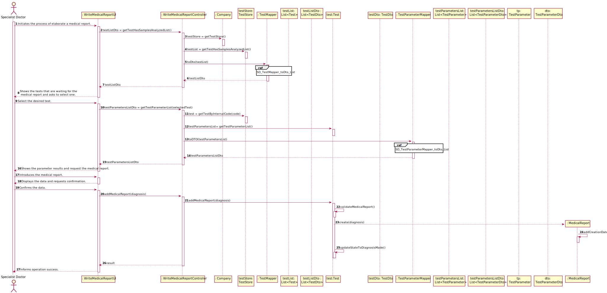
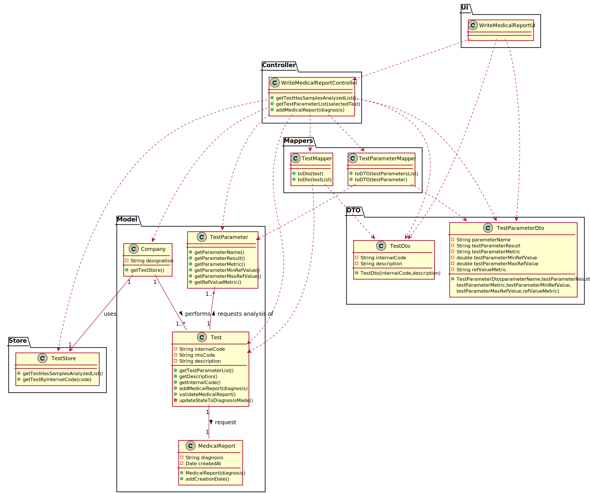

# US 14 - Make the diagnosis and write a report 

## 1. Requirements Engineering

### 1.1. User Story Description

As a specialist doctor, I intend to make the diagnosis and write a report for a
given test.

### 1.2. Customer Specifications and Clarifications 

**From the specifications document:**

>After completing the chemical analysis, the results of all chemical analyses are analysed by a
specialist doctor who makes a diagnosis and writes a report that afterwards will be delivered to the
client.

**From the client clarifications:**

> **Question:**  Is there a limit of characters for the report and the diagnosis that will be made by the Specialist Doctor?
>
> [_**Answer:**_](https://moodle.isep.ipp.pt/mod/forum/discuss.php?d=8182#p10710)  

> **Question:**  What fields should the specialist doctor report have?
>
> [_**Answer:**_](https://moodle.isep.ipp.pt/mod/forum/discuss.php?d=8178#p10705)  

### 1.3. Acceptance Criteria

* **AC1:** 

### 1.4. Found out Dependencies

* There is a dependency to "US12 Record the results of a given test" because the results of the chemical analysis have to be in the system for the specialist doctor to be able to make a diagnosis.

### 1.5 Input and Output Data

**Input Data:**

* Typed data:
	* 
	
* Selected data:
	* 

**Output Data:**

* 

### 1.6. System Sequence Diagram (SSD)

**Alternative 1**

**Other alternatives might exist.**

### 1.7 Other Relevant Remarks

* The medical report stays in a "to validate" state in order to distinguish from "validated" medical reports.

## 2. OO Analysis

### 2.1. Relevant Domain Model Excerpt 

### 2.2. Other Remarks

n/a

## 3. Design - User Story Realization 

### 3.1. Rationale

**SSD - Alternative 1 is adopted.**

| Interaction ID | Question: Which class is responsible for...                     | Answer                   | Justification (with patterns)                                                                                             |
|:-------------  |:--------------------------------------------------------------- |:------------------------:|:------------------------------------------------------------------------------------------------------------------------- |
| Step 1  		 | ... interacting with the actor?                                 | CreateTestTypeUI         | Pure Fabrication: there is no justification for assigning this responsibility to any existing class in the Domain Model.  |
|                | ... coordinating the US?                                        | CreateTestTypeController | Controller                                                                                                                |
|                | ... knowing who is responsible for creating test type instances?| Company                  | Creator (R1)                                                                                                              |
|                | ... creates Test Type instance?                                 | TestTypeStore            | HC+LC on the Company. By HC / LC the Company delegates these responsibilities in TestTypeStore.                           |
| Step 2  		 |                                                                 |                          |                                                                                                                           |
| Step 3  		 | ... saving the inputted data?                                   | TestType                 | IE: object created in step 1 has its own data.                                                                            |
| Step 4  		 | ... knowing the parameter categories to show?                   | ParameterCategoryStore   | IE: knows all the categories of parameters.                                                                               |
|                | ... process the data and convert it to dto                      | ParameterCategoryMapper  | Pure Fabrication: there is no justification for assigning this responsibility to any existing class in the Domain Model.  |
| Step 5  		 | ... saving the selected categories?                             | TestType                 | IE: the object created in step 1 contains one or more categories of parameters                                            |
| Step 6  		 |                                                                 |                          |                                                                                                                           |
| Step 7  		 | ... validating all data (local validation)?                     | TestType                 | IE: owns its data.                                                                                                        |
|                | ... validating all data (global validation)?                    | TestTypeStore            | IE: knows all types of tests.                                                                                             |
|                | ... saving the created test type?                               | TestTypeStore            | IE: owns all types of tests.                                                                                              |
| Step 8  		 | ... informing operation success?                                | CreateTestTypeUI         | IE: is responsible for user interactions.                                                                                 |

### Systematization ##

According to the taken rationale, the conceptual classes promoted to software classes are: 

 *

Other software classes (i.e. Pure Fabrication) identified: 

 *

## 3.2. Sequence Diagram (SD)

**Alternative 1**

## 3.3. Class Diagram (CD)

**From alternative 1**

# 4. Tests

# 5. Construction (Implementation)

# 6. Integration and Demo 

# 7. Observations

