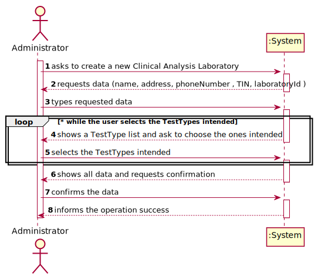
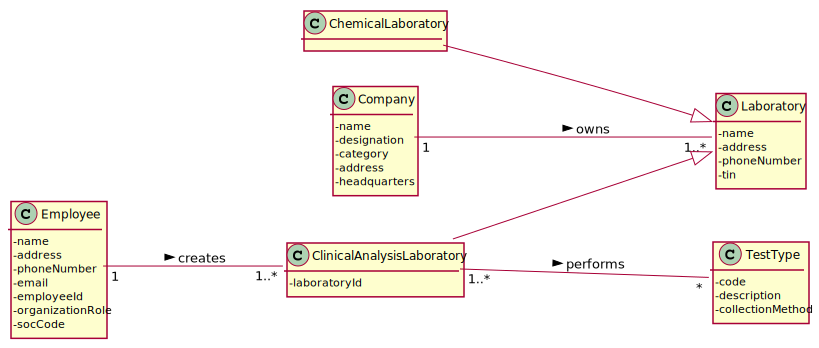
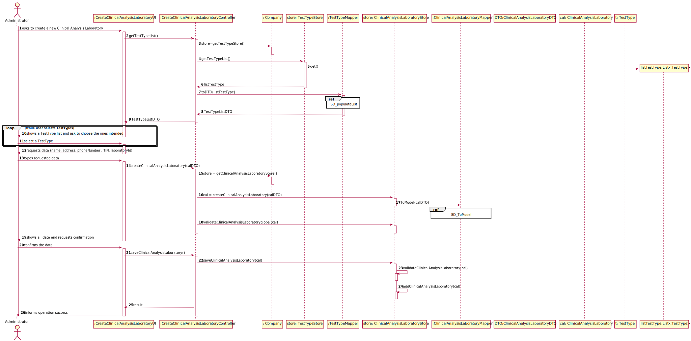
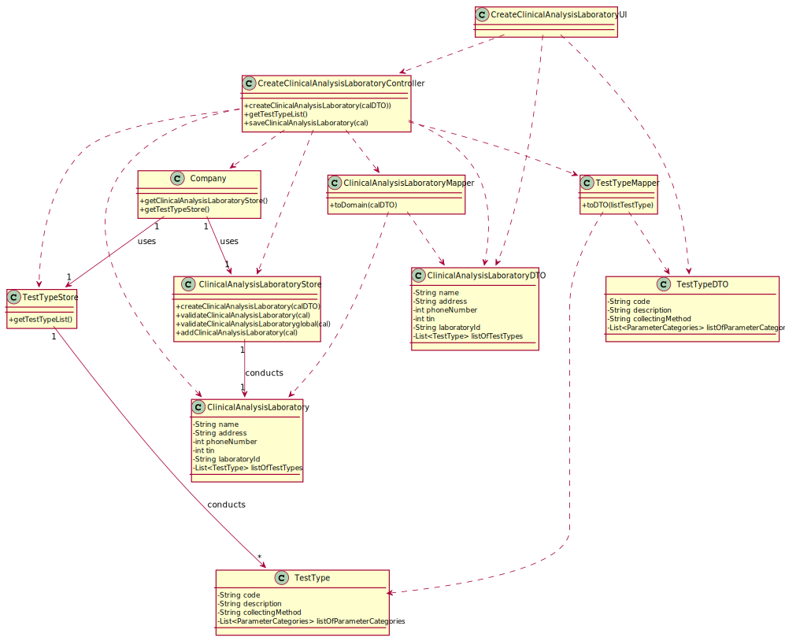

# US 08 - Register a new clinical analysis laboratory 

## 1. Requirements Engineering

### 1.1. User Story Description

As an administrator, I want to register a new clinical analysis laboratory stating which
kind of test(s) it operates.

### 1.2. Customer Specifications and Clarifications 

**From the specifications document:**

>	All Many Labs clinical analysis laboratories perform clinical blood tests, and a subset of
these laboratories also performs Covid-19 tests.

> The set of Many Labs clinical analysis laboratories form a network that covers all England, and it is
responsible for collecting samples and interacting with clients.

>The samples collected by the
network of laboratories are then sent to the chemical laboratory located in the company's
headquarters and the chemical analysis are performed there.
 

**From the client clarifications:**

> **Question:** What kind of information does the company store about about their clinical analysis laboratory
>  
> [**Answer:**](https://moodle.isep.ipp.pt/mod/forum/discuss.php?d=7126) 
> The clinical analysis laboratory is caracterized by its name, address , phone number and its TIN number

> **Question:** Are two Clinical Analysis Laboratories with the same,Laboratory ID OR name OR address OR phone Number OR TIN number allowed to exist?
> 
> [**Answer:**](https://moodle.isep.ipp.pt/mod/forum/discuss.php?d=7911)
> Only the name of two CAL can be same.

> **Question:** "Which type/format has LaboratoryID, address, name, phone number, and TIN number on Clinical Analysis Laboratory?"
>  
> [**Answer:**](https://moodle.isep.ipp.pt/mod/forum/discuss.php?d=7636)
>Each Clinical Analysis Laboratory is characterized by the following attributes:
> * Laboratory ID: five alphanumeric characters;
> * Name: A string with no more than 20 characters;
> * Address: A string with no more than 30 characters;
> * Phone Number: 11 digit number;
> * TIN number: 10 digit number;
> * Type of tests performed by the lab.

All information is required.

### 1.3. Acceptance Criteria

* **AC1:** Every Clinical Analysis Laboratory must perform blood tests
* **AC2:** The laboratoryId has 5 alphanumeric characters
* **AC3:** The name must have no more than 20 characters
* **AC4:** The address must have no more than 30 characters
* **AC5:** The phone number is an 11-digit number
* **AC6:** TIN is a 10-digit number
* **AC7:** Every field is required
* **AC8:** Only the name of two Clinical Analysis Laboratory can be same.

### 1.4. Found out Dependencies

* There is a dependency to "US09 Specify a new type of test" since at least the types of test must exist to associate them to the Clinical Analysis Laboratory.

### 1.5 Input and Output Data

**Input Data:**

* Typed data:
	*  name 
	*  address
	*  phoneNumber
	*  TIN
	*  laboratoryId
	
* Selected data:
	* Test Types

**Output Data:**

* (In)Success of the operation

### 1.6. System Sequence Diagram (SSD)

**Alternative 1**

### 1.7 Other Relevant Remarks

## 2. OO Analysis

### 2.1. Relevant Domain Model Excerpt 

### 2.2. Other Remarks

n/a

## 3. Design - User Story Realization 

### 3.1. Rationale

**SSD - Alternative 1 is adopted.**

| Interaction ID | Question: Which class is responsible for... | Answer  | Justification (with patterns)  |
|:-------------  |:--------------------- |:------------|:---------------------------- |
| Step 1  		 |	... interacting with the actor? | CreateClinicalAnalysisLaboratoryUI   |  Pure Fabrication: there is no reason to assign this responsibility to any existing class in the Domain Model.           |
| 			     |	... coordinating the US? | CreateClinicalAnalysisLaboratoryController | Controller                             |
| 			     |	... knowing who is responsible for creating Clinical Analysis Laboratory instances? | Company   | Creator (R1)   |
| 			  	 | ... knowing the user using the system?  | UserSession  |   |
| 			  	 |	... creates Clinical Analysis Laboratory instance? | ClinicalAnalysisLaboratoryStore  | HC+LC on the Company. By HC / LC the Company delegates these responsibilities in TestTypeStore. |
| Step 2  		 |							 |             |                              |
| Step 3  		 |	...saving the inputted data? | ClinicalAnalysisLaboratory  | IE: object created in step 1 has its own data.  |
| Step 4  		 |	...knowing the TestType to show? | TestTypeStore  | IE: knows all the TestTypes. |
| Step 5  		 |	... saving the selected TestTypes? | ClinicalAnalysisLaboratory  | IE: the object created contains one or more TestTypes.  |
| Step 6  		 |							 |             |                              |              
| Step 7  		 |	... validating all data (local validation)? | ClinicalAnalysisLaboratory | IE: owns its data.| 
| 			  		 |	... validating all data (global validation)? | ClinicalAnalysisLaboratoryStore| IE: knows all its Clinical Analysis Laboratories.| 
| 			  		 |	... saving the created task? | ClinicalAnalysisLaboratoryStore | IE: owns all its Clinical Analysis Laboratories.| 
| Step 8  		 |	... informing operation success?| CreateClinicalAnalysisLaboratoryUI  | IE: is responsible for user interactions.  | 

### Systematization ##

According to the taken rationale, the conceptual classes promoted to software classes are: 

 * Company
 * ClinicalAnalysisLaboratory
 * TestType

Other software classes (i.e. Pure Fabrication) identified: 

 * CreateClinicalAnalysisLaboratoryUI  
 * CreateClinicalAnalysisLaboratoryController
 * CreateClinicalAnalysisLaboratoryMapper
 * ClinicalAnalysisLaboratoryStore
 * TestTypeStore
 * TestTypeMapper

## 3.2. Sequence Diagram (SD)

**Alternative 1**

## 3.3. Class Diagram (CD)

**From alternative 1**

# 4. Tests 

**Test 1:** Check that it is not possible to create an instance of the Clinical Analysis Laboratory class with null values. 

	@Test(expected = IllegalArgumentException.class)
    public void ensureNullIsNotAllowed(){
        ClinicalAnalysisLaboratory call = new ClinicalAnalysisLaboratory(null,null,null,null,null,null);
    }
	

**Test 2:** Check that it is not possible to create an instance of the Clinical Analysis Laboratory class with a laboratoryId containing different from five chars - AC2. 

	@Test(expected = IllegalArgumentException.class)
    public void LaboratoryIdValidation1(){
        ClinicalAnalysisLaboratory call = new ClinicalAnalysisLaboratory("Carlos","Rua das cavalas","12345678912","1234567891","12k",testTypeList);
    }

**Test 3:** Check that it is not possible to create an instance of the Clinical Analysis Laboratory class with a name with more than 20 characters - AC3

    @Test(expected = IllegalArgumentException.class)
    public void NameValidation1(){
        ClinicalAnalysisLaboratory call = new ClinicalAnalysisLaboratory("Carlos Jose da Silva Pinheiro","Rua das cavalas","12345678912","1234567891","12ki3",testTypeList);
    }

**Test 4:**  Check that it is not possible to create an instance of the Clinical Analysis Laboratory class with an address with more than 30 characters - AC4
    
    @Test(expected = IllegalArgumentException.class)
    public void AddressValidation1(){
        ClinicalAnalysisLaboratory call = new ClinicalAnalysisLaboratory("Carlos","Rua das cavalas assadas no forno","12345678912","1234567891","12ki3",testTypeList);
    }

**Test 5:**  Check that it is not possible to create an instance of the Clinical Analysis Laboratory class with a Phone Number with different from 11 digit - AC5

    @Test(expected = IllegalArgumentException.class)
    public void PhoneNumberValidation2(){
        ClinicalAnalysisLaboratory call = new ClinicalAnalysisLaboratory("Carlos","Rua das cavalas","12345678","1234567891","12ki3",testTypeList);
    }

**Test 6:**  Check that it is not possible to create an instance of the Clinical Analysis Laboratory class with a Tin different from 10 digit - AC6

     @Test(expected = IllegalArgumentException.class)
    public void TinValidation2(){
        ClinicalAnalysisLaboratory call = new ClinicalAnalysisLaboratory("Carlos","Rua das cavalas","12345678912","1234567891123","12ki3",testTypeList);
    }

**Test 7:**  Check that it is not possible to create an instance of the Clinical Analysis Laboratory class with an attribute with equal information as an attribute of other Clinical Analysis Laboratory instance - AC8

     @Test
    public void validateGlobalLaboratory1(){
        ClinicalAnalysisLaboratory call = new ClinicalAnalysisLaboratory("Ricardo","Rua das cavalas","12345678913","1234567892","12ki7",testTypeList);
        calStore.addClinicalAnalysisLaboratory(call);
        boolean result = calStore.validateClinicalAnalysisLaboratoryglobal(cal);
        Assert.assertFalse(result);
    }

# 5. Construction (Implementation)

## Class CreateClinicalAnalysisLaboratoryController 
  
    /**
     * Get a list of objects of TestTYpeDTO
     * @return list of TestTypeDTO
     */
    public List<TestTypeDTO> getTestTypeList(){
       TestTypeStore store = company.getTestTypeStore();
       return ttmapper.toDTO(store.getTestTypeList());
    }

    /**
     * Creates a  new Clinical Analysis Laboratory
     * @param calDTO An object of the type ClinicalAnalysisLaboratoryDTO with the information to create a ClinicalAnalysisLaboratory
     * @return false if the ClinicalAnalysisLaboratory created has an attribute with the same information as an already created. Otherwise return true.
     */
     public boolean CreateClinicalAnalysisLaboratory(ClinicalAnalysisLaboratoryDTO calDTO) {
     this.cal = store.createClinicalAnalysisLaboratory(calDTO,calMapper);
     return store.validateClinicalAnalysisLaboratoryglobal(cal);
     }

    /**
     * Save the ClinicalAnalysisLaboratory if it is valid
     * @return true if the ClinicalAnalysisLaboratory was saved. Otherwise, false
     */
    public boolean saveClinicalAnalysisLaboratory() {
        return store.saveClinicalAnalysisLaboratory(cal);
    }

## Class ClinicalAnalysisLaboratoryStore

     /**
     * Creates a new ClinicalAnalysisLaboratory
     * @param calDTO An Object of the Type ClinicalAnalysisLaboratoryDTO with all information to create the ClinicalAnalysisLaboratory
     * @param calMapper The ClinicalAnalysisLaboratory Mapper that will transform the information in Object of the Type ClinicalAnalysisLaboratoryDTO
     * @return The ClinicalAnalysisLaboratory
     */
    public ClinicalAnalysisLaboratory createClinicalAnalysisLaboratory(ClinicalAnalysisLaboratoryDTO calDTO, CreateClinicalAnalysisLaboratoryMapper calMapper){
        return calMapper.ToModel(calDTO);
    }

    /**
     * Checks if the ClinicalAnalysisLaboratory already exist
     * @param clinicalAnalysisLaboratory the ClinicalAnalysisLaboratory we want to validate
     * @return false if the ClinicalAnalysisLaboratory already exist or it is null. Otherwise return true
     */
    public boolean validateClinicalAnalysisLaboratory(ClinicalAnalysisLaboratory clinicalAnalysisLaboratory) {
        if (clinicalAnalysisLaboratory == null)
            return false;
        return !this.clinicalAnalysisLaboratoryList.contains(clinicalAnalysisLaboratory);
    }

    /**
     * Checks if the ClinicalAnalysisLaboratory has an attribute with the same information as an already created
     * @param clinicalAnalysisLaboratory  the ClinicalAnalysisLaboratory we want to validate
     * @return false the ClinicalAnalysisLaboratory has an attribute with the same information as an already created . Otherwise it return true
     */
    public boolean validateClinicalAnalysisLaboratoryglobal (ClinicalAnalysisLaboratory clinicalAnalysisLaboratory){
        for (ClinicalAnalysisLaboratory cal: clinicalAnalysisLaboratoryList) {
            if (clinicalAnalysisLaboratory.equals(cal)){
                return false;
            }
        }
        return true;

    }

    /**
     * Get the list of all ClinicalAnalysisLaboratory that exist in the company
     * @return list of all ClinicalAnalysisLaboratory that exist in the company
     */
    public List<ClinicalAnalysisLaboratory> getClinicalAnalysisLaboratoryList() {
        return clinicalAnalysisLaboratoryList;
    }

    /**
     * Save the ClinicalAnalysisLaboratory if it is valid
     * @param clinicalAnalysisLaboratory a ClinicalAnalysisLaboratory we want to save
     * @return true if the ClinicalAnalysisLaboratory was saved. Otherwise it returns false
     */
    public boolean saveClinicalAnalysisLaboratory(ClinicalAnalysisLaboratory clinicalAnalysisLaboratory) {
        if (!validateClinicalAnalysisLaboratory(clinicalAnalysisLaboratory)) {
            return false;
        }else {
            this.clinicalAnalysisLaboratoryList.add(clinicalAnalysisLaboratory);
            return true;
        }
    }

## Class CreateClinicalAnalysisLaboratoryMapper

     /**
     * Transforms an Objects of the type ClinicalAnalysisLaboratoryDTO into an Objects of the type ClinicalAnalysisLaboratory
     * @param calDTO an Object of the type ClinicalAnalysisLaboratoryDTO
     * @return an Object of the type ClinicalAnalysisLaboratory
     */
     public ClinicalAnalysisLaboratory ToModel(ClinicalAnalysisLaboratoryDTO calDTO){
       return new ClinicalAnalysisLaboratory(calDTO.getName(),calDTO.getAddress(), calDTO.getPhoneNumber(), calDTO.getTin(), calDTO.getLaboratoryId(),toModel(calDTO.getListOfTestTypes()));
     }

## Class TestTypeMapper

      /**
     * Transforms the list of TestType into a list of TestTypeDTO
     * @param testTypeList A list of TestType
     * @return A list of TestTypeDTO
     */
    public List<TestTypeDTO> toDTO(List<TestType> testTypeList) {
        List<TestTypeDTO> testTypeListDTO =new ArrayList();
        TestTypeDTO objDTO;
        for (TestType lista : testTypeList) {
            if (lista != null){
                objDTO = toDTO(lista);
                testTypeListDTO.add(objDTO);
            }
        }
        return testTypeListDTO;
    }

# 6. Integration and Demo

# 7. Observations

