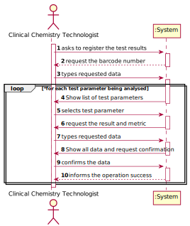
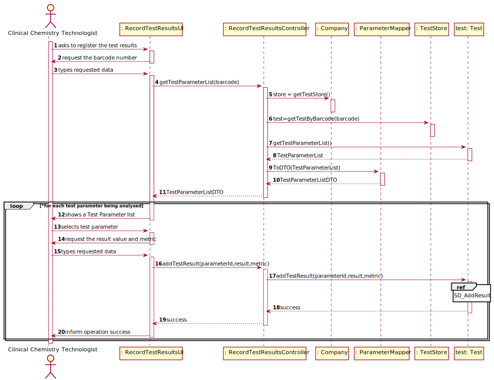
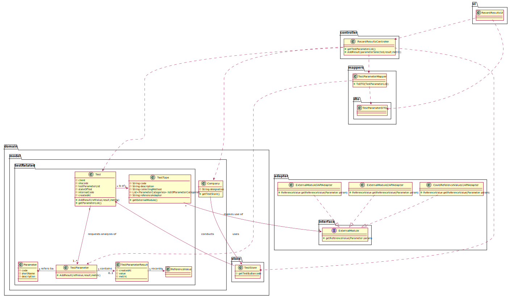

# US 12 - Record Test Results

## 1. Requirements Engineering

### 1.1. User Story Description

As a clinical chemistry technologist, I intend to record the results of a given test

### 1.2. Customer Specifications and Clarifications 

**From the specifications document:**

>	At the company's headquarters, the clinical chemistry technologist receives the samples (delivered
by a courier) and performs the chemical analysis, recording the results in the software application.

>   To facilitate and simplify the validation work performed by the specialist doctor, the application
uses an external module that is responsible for doing an automatic validation using test reference
values.

**From the client clarifications:**
> **Question:** "When the Clinical Chemistry Technologist wants to record the results of a test, how does he has access to that test? By internal code, NHS code?"
>  
> [**Answer:**](https://moodle.isep.ipp.pt/mod/forum/discuss.php?d=8301)
>Each sample has a unique barcode. The clinical chemistry technologist should use the sample barcode number to find the test for which the sample was collected.

> **Question:** "Should the system present a result for each test parameter or a single result for the test to be recorded?"
>
> [**Answer:**](https://moodle.isep.ipp.pt/mod/forum/discuss.php?d=8301)
> The Clinical Chemistry Technologist should register a value/result for each parameter of the test.

> **Question:** "What information is the system going to have to ask the clinical chemistry technologist to be able to create the test results?"
>
> [**Answer:**](https://moodle.isep.ipp.pt/mod/forum/discuss.php?d=8272)
>  Some answers I already gave here in this forum:
>     The clinical chemistry technologist should use the sample barcode number to find (in the system) the test for which the sample was collected.
>     The Clinical Chemistry Technologist should register a value/result for each parameter of the (selected) test.
>     All parameter values of the test should be filled/defined (by the Clinical Chemistry Technologist) when the use case finishes.

> **Question:** "Does this "at most" express that there are some parameters of the API request that are optional? If so, could you clarify the parameters that are optional?"
> 
> [**Answer:**](https://moodle.isep.ipp.pt/mod/forum/discuss.php?d=8291)
> "At most" means the maximum number of parameters that will be used. Depending on the API being used, all parameters above may be required or some may be optional. Did you already studied ESOFT (Protected Variations) and the APIs provided in moodle?
>  Important: The number of parameters depends on the API that is being used.

### 1.3. Acceptance Criteria

* **AC1:** The application should use an external module that is responsible for providing the test reference values.
* **AC2:** All parameter values of the test should be filled/defined (by the Clinical Chemistry Technologist) when the use case finishes.

### 1.4. Found out Dependencies

* There is a dependency to "US04 Register a test to be performed to a registered client " since at least the test must exist to record the results .

* There is a dependency to "US05 - Record the samples collected in the scope of a given test. " since at least the test must have a barcode associated to record the results .

### 1.5 Input and Output Data

**Input Data:**

* Typed data:
	*  Barcode number
	*  Parameter Result
	*  Metric
	
* Selected data:
	* Test parameter

**Output Data:**

* (In)Success of the operation

### 1.6. System Sequence Diagram (SSD)

**Alternative 1**

### 1.7 Other Relevant Remarks

## 2. OO Analysis

### 2.1. Relevant Domain Model Excerpt 

### 2.2. Other Remarks

n/a

## 3. Design - User Story Realization 

### 3.1. Rationale

| Interaction ID | Question: Which class is responsible for... | Answer  | Justification (with patterns)  |
|:-------------  |:--------------------- |:------------|:---------------------------- |
| Step 1  		 |	 ... interacting with the actor?                                 | RecordResultsUI          | **Pure Fabrication**: There is no justification for assigning this responsibility to any existing class in the Domain Model.                                                                           |
|                |   ... coordinating the US?                                        | RecordResultsController  | **Controller**                                                                                                                                                                                         |
| Step 2  		 |							 |             |                              |
| Step 3  		 |	...knowing the tests to find it by the barcode of the sample?    | TestStore                     | **IE**: TestStore knows all Tests.  |
|   		     |	...knowing the TestStore?                                        | Company  |**IE**: The company knows the TestStore to which it is delegating some tasks   | 
| Step 4  		 |	...knowing the TestParameters to show?                           | Test                     | **IE**: knows all the TestParameters. |
|       		 |	...transferring business data in DTO?                            | TestParameterDTO   | **DTO**: In order for the UI not to have direct access to business objects, it is best to choose to use a DTO.   |
| Step 5  		 |	                                                                  |   |   |
| Step 6  		 |	                                                                  |   |   | 
| Step 7  		 |	... saving the input data? | TestParameterResult | **IE**: owns its data.| 
| 			     |	... knowing the TestParameterResult? | TestParameter | **IE**: knows its results.|
| Step 8  		 |	... knowing the data to be shown?| TestParameterResult  | **IE**:owns its data.  | 
| Step 9  		 |	... saving the created TestParameterResult | TestParameter | **IE**: knows its results.|      
| Step 10 		 |	... informing operation success?   | RecordResultsUI  | **IE**: responsible for user interaction   | 

### Systematization ##

According to the taken rationale, the conceptual classes promoted to software classes are: 

 * Test
 * Company
 * TestParameter
 * TestParameterResult
 

Other software classes (i.e. Pure Fabrication) identified: 

 * RecordTestResultsUI
 * RecordTestResultsController
 * TestParemeterDTO
 * TestStore

## 3.2. Sequence Diagram (SD)

## 3.3. Class Diagram (CD)

# 4. Tests 

**Test 1:** Check that it is not possible to create an instance of the TestParameterResult class with null values. 

	@Test(expected = IllegalArgumentException.class)
    public void ensureNullIsNotAllowed(){
        RefValue ref = new RefValue("metric1",30.0,50.0);
        TestParameterResult tr = new TestParameterResult(ref,null,null);
    }

**Test 2:** Check that it is not possible to create an instance of the TestParameterResult class with empty result

      @Test (expected = IllegalArgumentException.class)
       public void  resultValidation1() {
        RefValue ref = new RefValue("metric1",30.0,50.0);
        TestParameterResult tr = new TestParameterResult(ref," ","metric");

    }

**Test 3:** Check that it is not possible to create an instance of the TestParameterResult class with empty metric

      @Test (expected = IllegalArgumentException.class)
    public void  metricValidation1() {
        RefValue ref = new RefValue("metric1",30.0,50.0);
        TestParameterResult tr = new TestParameterResult(ref,"45","     ");

    }

# 5. Construction (Implementation)

## Class RecordResultsController 

     /**
     * Gets an list of TestParameterDTO
     * @param barcode the barcode of a Sample
     * @return A list Of TestParameterDTO
     */
    public List<TestParameterDTO> getTestParameterList(String barcode){
        test = store.getTestByBarcode(barcode);
        if (test==null){
            throw new IllegalArgumentException("There are no tests with samples associated with this barcode");
        }
        return tpMapper.testParameterListToDTO(test.getTestParameterList());
    }

    /**
     * It adds the result of the test
     * @param parameterID The code of the parameter
     * @param result The result of the test
     * @param metric The metric of the result
     * @return True if the result was added successful. Otherwise return False
     */
    public boolean addTestResult(String parameterID,String result,String metric) throws IllegalAccessException, ClassNotFoundException, InstantiationException {
            return test.addTestResult(parameterID, result, metric);

    }

    /**
     * It checks if the test List has tests with Samples Collected
     * @return True if the list has a test with Samples Collected
     */
    public boolean PossibilityOfRecordResult(){

        return !(store.getTestWithSamplesCollectedList().size() == 0);

    }

## Class Test

    /**
     * It adds the result of a TestParameter
     * @param parameterID The code of the parameter
     * @param result the result of the TestParameter
     * @param metric the metric of the result
     */
    public boolean addTestResult(String  parameterID, String result, String metric) throws IllegalAccessException, InstantiationException, ClassNotFoundException {
        boolean verificacao=false;
        for (TestParameter testParameter: testParameterList) {
            if (testParameter.getParameterId().equals(parameterID)){
                    verificacao =  testParameter.addResult(testType.getExternalModule().getRefValue(testParameter.getParameterId()) ,result,metric);
                if (!verificacao){
                    return false;
                }
                countAddResult++;
            }
        }
        if (countAddResult==testParameterList.size()){
            stateOfTest = StateOfTest.SamplesAnalyzed;
        }
        return verificacao;

    }

## Class TestParameter

     /**
     * It adds the result of the testParameter
     * @param refValue An object of RefValue with the reference values
     * @param result The result of the testParameter
     * @param metric the metric of the result
     * @return true if the result was successful
     */
    public boolean addResult(RefValue refValue, String result, String metric){
        try {
            tparamresult = new TestParameterResult(refValue, result, metric);
            return true;
        }catch (Exception e){
            return false;
        }

    }

# 6. Integration and Demo

# 7. Observations

