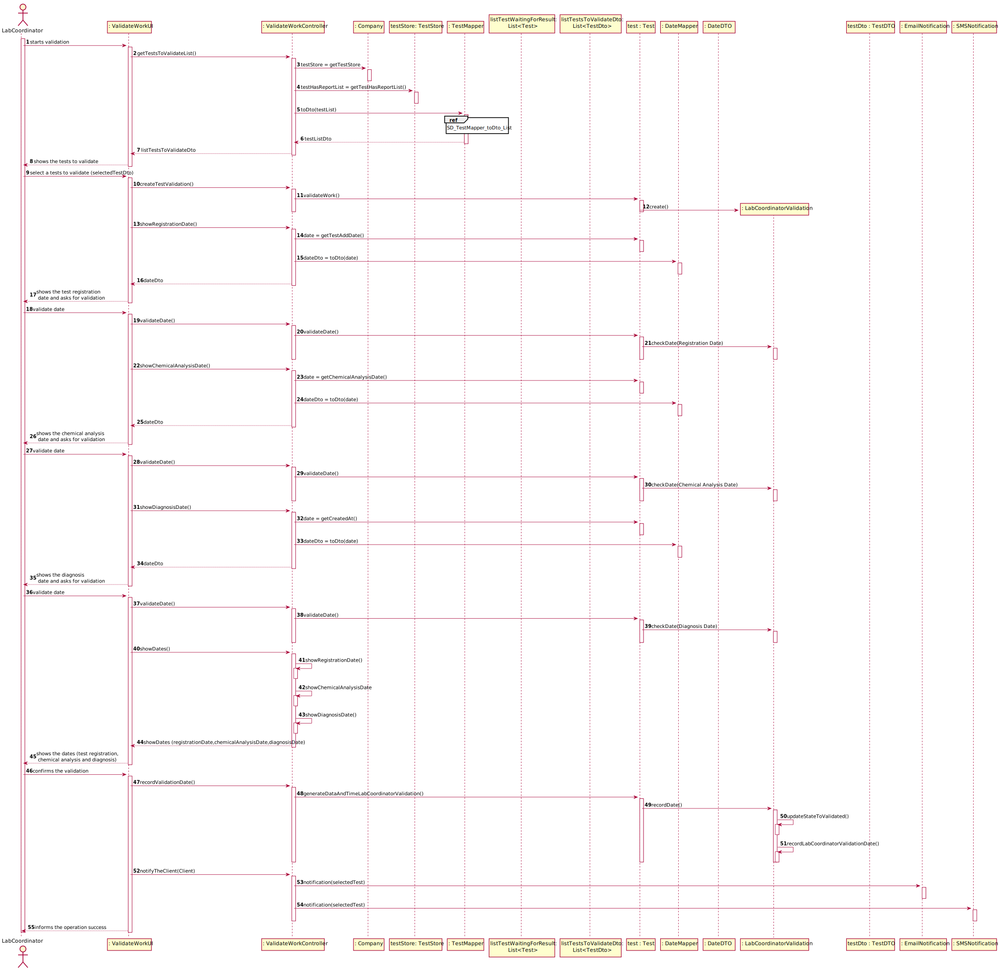

# US 15 - I want to validate the work done by the clinical chemistry technologist and specialist doctor.

## 1. Requirements Engineering

*In this section, it is suggested to capture the requirement description and specifications as provided by the client as well as any further clarification on it. It is also suggested to capture the requirements acceptance criteria and existing dependencies to other requirements. At last, identfy the involved input and output data and depicted an Actor-System interaction in order to fulfill the requirement.*

### 1.1. User Story Description

*As a laboratory coordinator, I want to validate the work done by the clinical chemistry technologist and specialist doctor.*

### 1.2. Customer Specifications and Clarifications 

*Insert here any related specification and/or clarification provided by the client together with **your interpretation**. When possible, provide a link to such specifications/clarifications.*

**From the specifications document:**

> After the specialist doctor has completed the diagnosis, the results of the clinical analyses and the
report become available in the system and must be validated by the laboratory coordinator. To
validate the work done, the laboratory coordinator checks the chemical test/result and associated
diagnosis made and confirms that everything was done correctly.
> 
> Many Labs performs two types of tests. Each test is characterized by an internal code, an NHS
code, a description that identifies the sample collection method, the date and time when the samples
were collected, the date and time of the chemical analysis, the date and time of the diagnosis made
by the specialist doctor, the date and time when the laboratory coordinator validated the test, and the
test type (whether it is blood test or Covid test).
> 
> Once the laboratory coordinator
confirms that everything was done correctly, the client receives a notification alerting that the
results are already available in the central application and informing that he/she must access the
application to view those results. The client receives the notification by SMS and e-mail.

**From the client clarifications:**

> **Question:** Should the laboratory coordinator validate the test results one by one or should he do only one validation of all of them?
>
> [**Awnser:**](https://moodle.isep.ipp.pt/mod/forum/discuss.php?d=8180) The coordinator can validate all or a subset of test results. The system does not show client personal information but shows all dates (test registration date, chemical analysys date and diagnosis date).

> **Question:** Regarding the process of validating a certain test/result, what validation states should be considered by the laboratory coordinator?
> For example, can "Valid" or "Invalid" be accepted as a confirmation for the chemical test/result and its diagnosis?
>
> [**Awnser:**](https://moodle.isep.ipp.pt/mod/forum/discuss.php?d=8251) Only Valid state. The system shows all tests ready to validate (tests that already have the test registration date, the chemical analysys date and the diagnosis date registered in the system) and the laboratory coordinator selects one or more tests to mark as validated.

> **Question:** : When the laboratory coordinator wants to validate a test does all the tests available show up for him or does he search using a code that identifies a specific test?
>
> [**Awnser:**](https://moodle.isep.ipp.pt/mod/forum/discuss.php?d=8177) The system shows all tests ready to validate (tests that already have the test registration date, the chemical analysys date and the diagnosis date registered in the system) and the laboratory coordinator selects one or more tests to mark as validated.

> **Question:** What should happen to a test if either the test report or the results are invalid? Should we prompt for a redo of either process or simply erase the test?
>
> [**Awnser:**](https://moodle.isep.ipp.pt/mod/forum/discuss.php?d=8177) The laboratory coordinator only sees the test dates of tests that already have all dates registered in the system (test registration date, the chemical analysys date and the diagnosis date). 
> **The objective of this user story is only for the laboratory coordinator to be aware of the work developed in the chemical laboratory and to mark the job as done.**

> **Question:** Can the Specialist Doctor edit a report after the Laboratory Coordinator has already approved the report?
> 
> [**Awnser:**](https://moodle.isep.ipp.pt/mod/forum/discuss.php?d=8268) No.

> **Question:** How should the laboratory coordinator choose the test to operate on, from a list of all the tests with a result and report or by inputting the code unique to a specific test?
>
> [**Awnser:**](https://moodle.isep.ipp.pt/mod/forum/discuss.php?d=8264) From a list of all tests that have a test registration date, a chemical analysis date and a diagnosis date.

> **Question:** What information does the laboratory coordinator needs to be able do validate a test? We got from the description that it's suposed to show all dates. Should the system provide any more information?
>
> [**Awnser:**](https://moodle.isep.ipp.pt/mod/forum/discuss.php?d=8270) Only the dates. Moreover, the system should record the validation date.

> **Question:** Does the laboratory coordinator choose which client's results to validate?
>
> [**Awnser:**](https://moodle.isep.ipp.pt/mod/forum/discuss.php?d=8256) The laboratory coordinator chooses a set of tests he wants to validate.

> **Question:** Does the notification sent to client informing them that they have their results on the central application get sent automatically after the laboratory coordinator confirms the clinical chemistry technologist and specialist doctor's work?
>
> [**Awnser:**](https://moodle.isep.ipp.pt/mod/forum/discuss.php?d=8256) From the Project Description: "Once the laboratory coordinator confirms that everything was done correctly, the client receives a notification alerting that the results are already available in the central application and informing that he/she must access the application to view those results."

> **Question:** After validation do we need to have the time and date of the validation?
>
> [**Awnser:**](https://moodle.isep.ipp.pt/mod/forum/discuss.php?d=8408) Yes, the system should record the date (DD/MM/YYYY) and time (HH:MM) when the validation was made.
Moreover, in this US, when the system shows to the laboratory coordinator all the dates (test registration date, chemical analysis date and diagnosis date), the system should show the date (DD/MM/YYYY) and the time (HH:MM).

> **Question:** About the US 15, in the clarification says that the program just validates dates, but in the statement of work, referues the use of a external model that validate the reference values of the parameters.
>
> [**Awnser:**](https://moodle.isep.ipp.pt/mod/forum/discuss.php?d=8505) Where did you saw that the program just validates dates? In the acceptance criteria of US 15 we get: "The system does not show client personal information but shows all dates (test registration date, chemical analysys date and diagnosis date)".

> **Question:** What's the Criteria to the validation of the test? We only receive dates but what do we have to do to check if everything is "ok" to validate?
>
> [**Awnser:**](https://moodle.isep.ipp.pt/mod/forum/discuss.php?d=8538) The lab coordinator only checks the dates (date and time) and validates a subset of tests that he selects. The lab coordinador does not check any other information.
From a previous post: "The system shows all tests ready to validate (tests that already have the test registration date, the chemical analysis date and the diagnosis date registered in the system) and the laboratory coordinator selects one or more tests to mark as validated".

> **Question:** After we validate, we send the email saying they can check the app for the results. But what happens to the test ifself? Does it stay within the system or is deleted?
>
> [**Awnser:**](https://moodle.isep.ipp.pt/mod/forum/discuss.php?d=8538) The tests should not be eliminated.

### 1.3. Acceptance Criteria

*Insert here the client acceptance criteria.*

* **AC1:** The lab coordinator only checks the dates (date and time) and validates a subset of tests that he selects.
* **AC2:** The system shows all tests ready to validate (tests that already have the test registration date, the chemical analysis date and the diagnosis date registered in the system).
* **AC3:** The laboratory coordinator selects one or more tests to mark as validated.
* **AC4:** The system should record the date (DD/MM/YYYY) and time (HH:MM) when the validation was made.
* **AC5:** The system should notify the client by SMS and Email.

### 1.4. Found out Dependencies

*Identify here any found out dependency to other US and/or requirements.*

* *There is a dependency to US4 - See the date when the test was registered.*
* *There is a dependency to US12 - See the date when the Chemical Analysis was performed.*
* *There is a dependency to US14 - See the date when the Diagnosis was made.*

### 1.5 Input and Output Data

*Identity here the data to be inputted by the system actor as well as the output data that the system have/needs to present in order to properly support the actor actions. Regarding the inputted data, it is suggested to distinguish between typed data and selected data (e.g. from a list)*

**Input Data:**

* Selected data:
  Test 

**Output Data:**
* Dates (registration date, chemical analysis date and the diagnosis date)
* Notifications - SMS and Email
* (In)Success of the operation

### 1.6. System Sequence Diagram (SSD)

*Insert here a SSD depicting the envisioned Actor-System interactions and throughout which data is inputted and outputted to fulfill the requirement. All interactions must be numbered.*

### 1.7 Other Relevant Remarks

*Use this section to capture other relevant information that is related with this US such as (i) special requirements ; (ii) data and/or technology variations; (iii) how often this US is held.* 

* The objective of this user story is only for the laboratory coordinator to be aware of the work developed in the chemical laboratory and to mark the job as done.

## 2. OO Analysis

### 2.1. Relevant Domain Model Excerpt 
*In this section, it is suggested to present an excerpt of the domain model that is seen as relevant to fulfill this requirement.* 

### 2.2. Other Remarks

*Use this section to capture some aditional notes/remarks that must be taken into consideration into the design activity. In some case, it might be usefull to add other analysis artifacts (e.g. activity or state diagrams).* 

## 3. Design - User Story Realization 

### 3.1. Rationale

**The rationale grounds on the SSD interactions and the identified input/output data.**

| Interaction ID | Question: Which class is responsible for... | Answer  | Justification (with patterns)  |
|:-------------  |:--------------------- |:------------|:---------------------------- |
| Step 1  		 | ... interacting with the actor?                                 | ValidateWorkUI                | **Pure Fabrication**: There is no justification for assigning this responsibility to any existing class in the Domain Model.                                                                           |
|                | ... coordinating the US?                                        | ValidateWorkController        | **Controller**                                                                                                                                                                                         |
| Step 2  		 | ... know the existing tests that are waiting for the Lab Coordinator Validation? | TestStore    | **IE**: Knows all the tests.                                                                                                                                                                           |
|                | ... knows TestStore?                                            | Company                       | **IE**: The company knows the TestStore to which it is delegating some tasks.                                                                                                                          |
|                | ... transfer domain data in DTO?                                | TestMapper                    | **DTO**: So that the UI does not have direct access to objects in the domain it is better to choose to use a DTO.                                                                                      |
| Step 3         | ... instantiating a Lab Coordinator Validation?                 | Test                          | **Creator (R1)**                                                                                                                                                                                       | 
| Step 4         | ... transfer domain data in DTO?                                | DateMapper                    | **DTO**: So that the UI does not have direct access to objects in the domain it is better to choose to use a DTO.                                                                                      |
|                | ... showing the Dates                                           | ValidateWorkUI                | **Pure Fabrication**: There is no justification for assigning this responsibility to any existing class in the Domain Model.
| Step 5         | ... validate Dates                                              | LabCoordinatorValidation      | **IE**: Owns its data.|
| Step 6  		 | ... knows Client Data?                                          | Client                        | **IE**: Owns its data.
|        		 | ... recording the Validation Date?                              | LabCoordinatorValidation      | **IE**: Owns its data.|
|                | ... notify the client by email                                  | EmailResult                   | **IE** and **Pure Fabrication**: has all the required information and means to send the email (IE)                                                                                                                                                 |
|                | ... notify the client by SMS                                    | SMSResult                     | **IE** and **Pure Fabrication**: has all the required information and means to send the SMS (IE)
| Step 7  		 | ... informing operation success?                                | ValidateWorkUI                | **IE**: Is responsible for user interactions.                                                                                                                                                          |

### Systematization ##

According to the taken rationale, the conceptual classes promoted to software classes are: 

 * Company
 * Test
 * LabCoordinatorValidation
 * Client

Other software classes (i.e. Pure Fabrication) identified: 

 * ValidateWorkUI  
 * ValidateWorkController
 * TestStore
 * TestMapper
 * TestDto
 * DateDTO
 * DateMapper
 * RegistrationDateDto
 * ChemicalAnalysisDto
 * DiagnosisDto
 * EmailResult
 * SMSResult

## 3.2. Sequence Diagram (SD)

*In this section, it is suggested to present an UML dynamic view stating the sequence of domain related software objects' interactions that allows to fulfill the requirement.* 

## 3.3. Class Diagram (CD)

*In this section, it is suggested to present an UML static view representing the main domain related software classes that are involved in fulfilling the requirement as well as and their relations, attributes and methods.*

# 4. Tests 
*In this section, it is suggested to systematize how the tests were designed to allow a correct measurement of requirements fulfilling.*

## DateDTOTest

    package app.mappers.dto;
    
    import org.junit.Assert;
    import org.junit.Test;
    import java.util.Date;
    
    public class DateDTOTest {
      @Test
      public void dateDtoEquals(){
        Date date = new Date(2020,12,9,11,30);
        DateDTO tDto1 = new DateDTO(date);
        DateDTO tDto2 = new DateDTO(date);
        Assert.assertEquals(tDto1,tDto2);
      }
      
      @Test
      public void testDtoNotEqualsNull(){
        Date date = new Date(2020,12,9,11,30);
        DateDTO tDto1 = null;
        DateDTO tDto2 = new DateDTO(date);
        Assert.assertNotEquals(tDto1,tDto2);
      }
      
      @Test
        public void testDtoRefEquals(){
        Date date = new Date(2020,12,9,11,30);
        DateDTO tDto1 = new DateDTO(date);
        DateDTO tDto2 = tDto1;
        Assert.assertEquals(tDto1,tDto2);
      }
    
    }

## DateMapperTest

    package app.mappers;
    
    import app.mappers.dto.DateDTO;
    import org.junit.Assert;
    import org.junit.Test;
    import java.util.ArrayList;
    import java.util.Date;
    import java.util.List;
    
    public class DateMapperTest {
    
        @Test
        public void toDto() {
            DateMapper mapper = new DateMapper();
            Date date = new Date(2020,12,9,11,30);
            DateDTO expected = new DateDTO(new Date(2020,12,9,11,30));
            Assert.assertEquals(expected,mapper.toDto(date));
        }
    
        @Test
        public void testToDto() {
            DateMapper mapper = new DateMapper();
            List<Date> list = new ArrayList();
            Date date = new Date(2020,12,9,11,30);
            list.add(date);
            List<DateDTO> result = mapper.toDto(list);
            List<DateDTO> lista = new ArrayList();
            DateDTO expected = new DateDTO(new Date(2020,12,9,11,30));
            lista.add(expected);
            Assert.assertEquals(lista,result);
        }
    }

*It is also recommended to organize this content by subsections.* 

# 5. Construction (Implementation)

##Class ValidateWorkController   
    package app.controller;
    
    import app.domain.model.Company;
    import app.domain.model.testrelated.EmailNotification;
    import app.domain.model.testrelated.SMSNotification;
    import app.domain.model.testrelated.Test;
    import app.domain.store.TestStore;
    import app.mappers.DateMapper;
    import app.mappers.TestMapper;
    import app.mappers.dto.TestDTO;
    import java.io.IOException;
    import java.util.List;
    
    /**
    * The Validate Work Controller.
    * @author Pedro Rocha <1201382@isep.ipp.pt>
      */
    
    public class ValidateWorkController {
    
        /**
         * Represents an instance of app.
         */
        private App app;
    
        /**
         * Represents a instance of company.
         */
        private Company company;
    
        /**
         * Represents an instance of the test store.
         */
        private TestStore testStore;
    
        /**
         * Represents an instance of test.
         */
        private Test test;
    
        /**
         * Represents an instance of the test mapper
         */
        private TestMapper testMapper;
    
        /**
         * Represents an instance of the test mapper
         */
        private DateMapper dateMapper;
    
        /**
         * Represents an instance of the Email Notification
         */
        private EmailNotification emailNotification;
    
        /**
         * Represents an instance of the SMS Notification
         */
        private SMSNotification smsNotification;
    
        /**
         * Constructs an instance of {@code ValidateWorkController}.
         */
        public ValidateWorkController(){
            this.app=App.getInstance();
            this.company=app.getCompany();
            testMapper = new TestMapper();
            dateMapper = new DateMapper();
            emailNotification = new EmailNotification();
            smsNotification = new SMSNotification();
        }
    
        /**
         * Constructs an instance of {@code ValidateWorkController} receiving a company.
         * @param company The company.
         */
        public ValidateWorkController(Company company) {
            this.app=App.getInstance();
            this.company =company;
            testMapper = new TestMapper();
            dateMapper = new DateMapper();
        }
    
        /**
         * Gets the list of tests to validate.
         * @return list of tests to validate.
         */
        public List<TestDTO> getTestsToValidateList(){
            this.testStore=company.getTestStore();
            List<Test> testHasReportList = testStore.getTestHasReportList();
            return testMapper.toDto(testHasReportList);
        }
    
        /**
         * Get the test with the Internal Code
         * @param selectedTest Test that we intend to get.
         * @return the wanted test.
         */
        public Test getSelectedTest(TestDTO selectedTest){
            test = testStore.getTestByInternalCode(selectedTest.getInternalCode());
            return test;
        }
    
        /**
         * Creates test validation.
         * @return true if Test Validation is created. Otherwise, returns false.
         */
        public boolean createTestValidation(){
            return test.validateWork();
        }
    
        /**
         * Validates requested Date.
         * @param date Date to validate
         * @return true if Date is valid. Otherwise, returns false.
         */
        public boolean validateDate(String date){
            return test.validateDate(date);
        }
    
        /**
         * Shows the Registration Date formatted.
         * @return Registration Date formatted.
         */
        public String showRegistrationDate() {
            return dateMapper.toDto(test.getTestAddDate()).toString();
        }
    
        /**
         * Shows the Chemical Analysis Date formatted.
         * @return Chemical Analysis Date formatted.
         */
        public String showChemicalAnalysisDate() {
            return dateMapper.toDto(test.getChemicalAnalysisDate()).toString();
        }
    
        /**
         * Shows the Diagnosis Date formatted.
         * @return Diagnosis Date formatted.
         */
        public String showDiagnosisDate() {
            return dateMapper.toDto(test.getCreatedAt()).toString();
        }
    
        /**
         * Shows the Lab Coordinator Validation Date formatted.
         * @return Lab Coordinator Validation Date formatted.
         */
        public String showLabCoordValidationDate(Test selectedTest) {
            return dateMapper.toDto(selectedTest.getLabValidationDate()).toString();
        }
    
        /**
         * Shows the Registration Date, Chemical Analysis Date, Diagnosis Date, all formatted.
         * @return Registration Date, Chemical Analysis Date, Diagnosis Date, all formatted.
         */
        public String showDates() {
            return String.format("%s%n%s%n%s",showRegistrationDate(),showChemicalAnalysisDate(),showDiagnosisDate());
        }
    
        /**
         * Records the Lab Coordinator Validation Date
         * @param selectedTest Lab Coordinator Validation Date
         */
        public Boolean recordValidationDate(Test selectedTest) {
            return selectedTest.generateDataAndTimeLabCoordinatorValidation();
    
        }
    
        /**
         * Notifies the client via Email and SMS.
         * @param selectedTest
         */
        public void notifyTheClient(Test selectedTest) throws IOException {
            emailNotification.notification(selectedTest);
            smsNotification.notification(selectedTest);
        }
    }

# 6. Integration and Demo 

*In this section, it is suggested to describe the efforts made to integrate this functionality with the other features of the system.*

##Class EmailNotification
    package app.domain.model.testrelated;
    
    import app.adapter.interfaces.Notification;
    import java.io.File;
    import java.io.FileWriter;
    import java.io.IOException;
    
    /**
    * Represents the email notification used to notify the customer that the results are available in the app
    * @author Pedro Rocha <1201302@isep.ipp.pt>
      */
    
    public class EmailNotification implements Notification {
    
        /**
         * Notifies results availability by email
         * @param selectedTest
         */
    
        public void notification(Test selectedTest) throws IOException {
            String pwd = System.getProperty("user.dir");
    
            File archive = new File(pwd + "\\src\\main\\notificationsEMAIL");
            if (!archive.exists()) {
                archive.mkdirs();
            }
            File arch = new File(pwd + "\\src\\main\\notificationsEMAIL\\"+ selectedTest.getNhsCode().getCode() + ".txt");
    
            FileWriter fw = new FileWriter(arch, true);
    
            try {
                if (arch.exists()) arch.delete();
                fw.write("Sender: noreply@manylabs.com \n");
                fw.write("Recipient: " + selectedTest.getCl().getEmail() + "\n");
                fw.write("Subject matter: Results are available ");
                fw.write("Dear Client, \n");
                fw.write("The results are available in the central application, you must access them.");
                fw.write("Many Labs");
            } catch (IOException e){
                e.printStackTrace();
            } finally {
                fw.close();
            }
        }
    }

##Class SMSNotification

    package app.domain.model.testrelated;
    
    import app.adapter.interfaces.Notification;
    import java.io.File;
    import java.io.FileWriter;
    import java.io.IOException;
    
    /**
    * Represents the SMS notification used to notify the customer that the results are available in the app
    * @author Pedro Rocha <1201302@isep.ipp.pt>
      */
    
    public class SMSNotification implements Notification {
    
        /**
         * Notifies results availability by SMS
         * @param selectedTest
         */
        public void notification(Test selectedTest) throws IOException {
            String pwd = System.getProperty("user.dir");
    
            File archive = new File(pwd + "\\src\\main\\notificationsSMS");
            if (!archive.exists()) {
                archive.mkdirs();
            }
            File arch = new File(pwd + "\\src\\main\\notificationsSMS\\"+ selectedTest.getNhsCode().getCode() + ".txt");
            FileWriter fw = new FileWriter(arch, true);
    
            try {
                if (arch.exists()) arch.delete();
                fw.write("Sender: +44 1980 301 565 \n");
                fw.write("Recipient" + selectedTest.getCl().getPhonenumber() + "\n");
                fw.write("Dear Client, \n");
                fw.write("The results are available in the central application, you must access them. \n");
                fw.write("\nMany Labs");
            } catch (IOException e){
                e.printStackTrace();
            } finally {
                fw.close();
            }
        }
    }

# 7. Observations

* In the future, the user story will be developed with a graphical interface for a better experience for the user.

