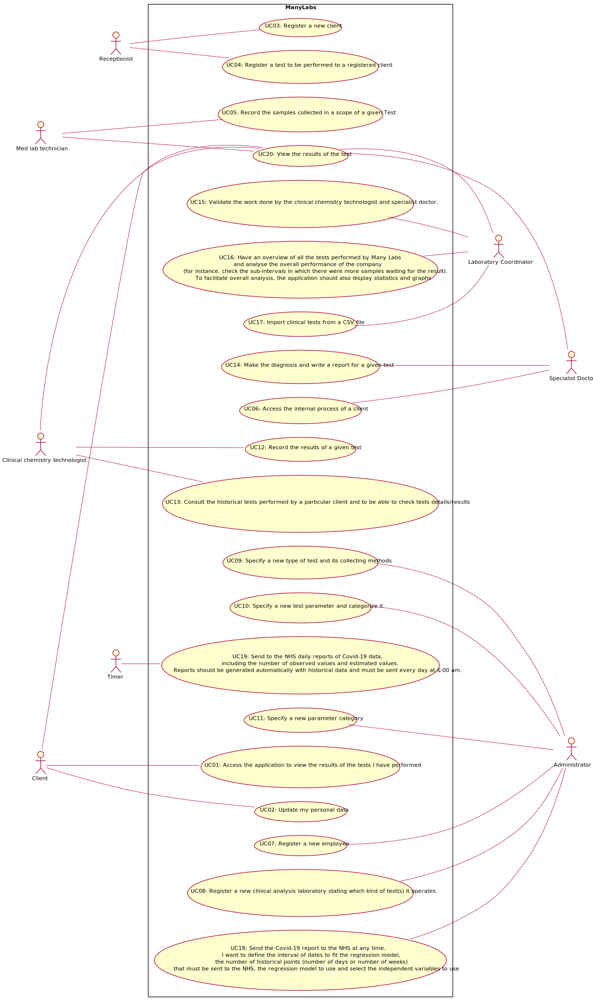

# Use Case Diagram (UCD)

**In the scope of this project, there is a direct relationship of _1 to 1_ between Use Cases (UC) and User Stories (US).**

However, be aware, this is a pedagogical simplification. On further projects and curricular units might also exist _1 to N **and/or** N to 1 relationships between US and UC.

**Insert below the Use Case Diagram in a SVG format**

**For each UC/US, it must be provided evidences of applying main activities of the software development process (requirements, analysis, design, tests and code). Gather those evidences on a separate file for each UC/US and set up a link as suggested below.**

# Use Cases / User Stories
| UC/US  | Description                                                                                                  |                   
|:------:|:-------------------------------------------------------------------------------------------------------------|
| US01   | [Access the application to view the results of the tests I have performed.](US01.md)|
| US02   | [Update my personal data.](US02.md)|
| US03   | [Register a client.](US03.md)|
| US04   | [Register a test to be performed to a registered client.](US04.md)|
| US05   | [Record the samples collected in a scope of a given Test.](US05.md)|
| US06   | [Access the internal process of a client.](US06.md)|
| US07   | [Register a new employee.](US07.md)|
| US08   | [Register a new clinical analysis laboratory stating which kind of test(s) it operates.](US.08)|
| US09   | [Specify a new type of test and its collecting methods.](US09.md) |
| US10   | [Specify a new test parameter and categorize it.](US10.md)|
| US11   | [Specify a new parameter category.](US11.md)                                        |
| US12   | [Record the results of a given test.](US12.md)
| US13   | [Consult the historical tests performed by a particular client and to be able to check tests details/results.](US13.md)|
| US14   | [Make the diagnosis and write a report for a given test.](US14.md) |
| US15   | [Validate the work done by the clinical chemistry technologist and specialist doctor. ](US15.md)|
| US16   | [Have an overview of all the tests performed by Many Labs and analyse the overall performance of the company (for instance, check the sub-intervals in which there were more samples waiting for the result). To facilitate overall analysis, the application should also display statistics and graphs.](US16.md)|
| US17   | [Import clinical tests from a CSV file.](US17.md)|
| US18   | [Send the Covid-19 report to the NHS at any time. I want to define the interval of dates to fit the regression model, the number of historical points (number of days or number of weeks) that must be sent to the NHS, the regression model to use and select the independent variables to use.](US18.md)|
| US19   | [Send to the NHS daily reports of Covid-19 data, including the number of observed values and estimated values. Reports should be generated automatically with historical data and must be sent every day at 6:00 am.](US19.md) |
| US20   | [View the results of the test](US20.md)|

