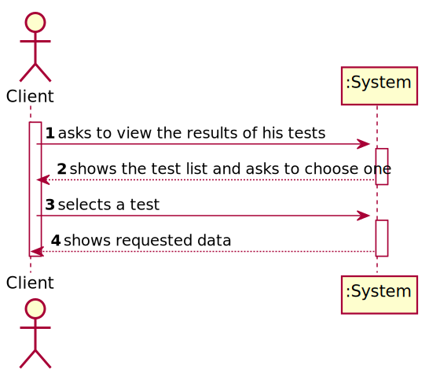
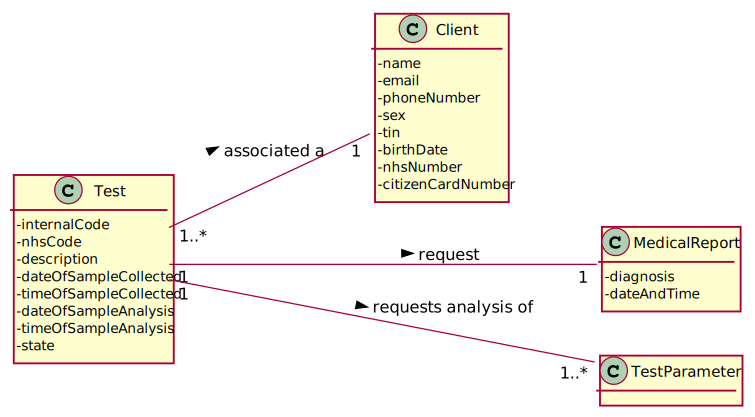
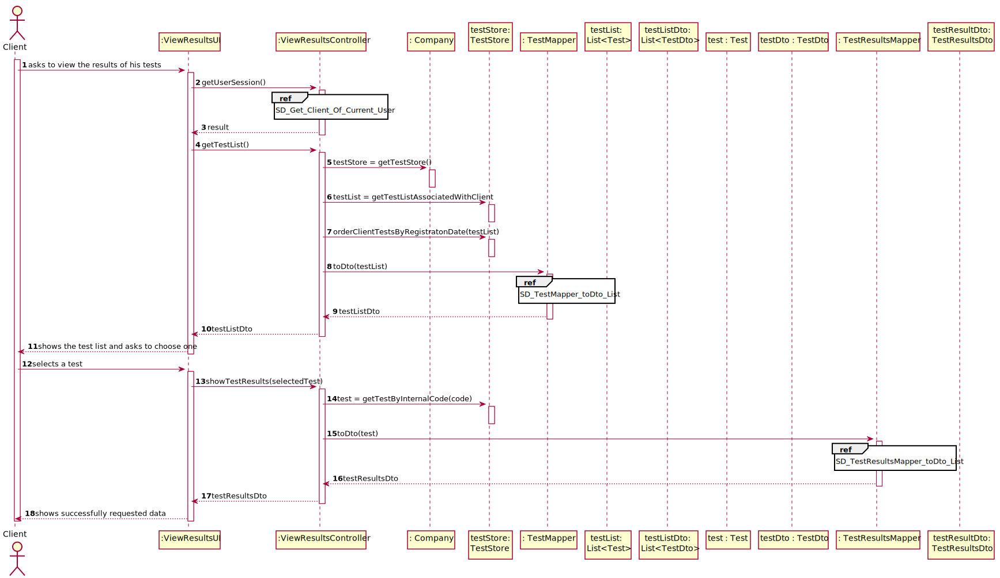
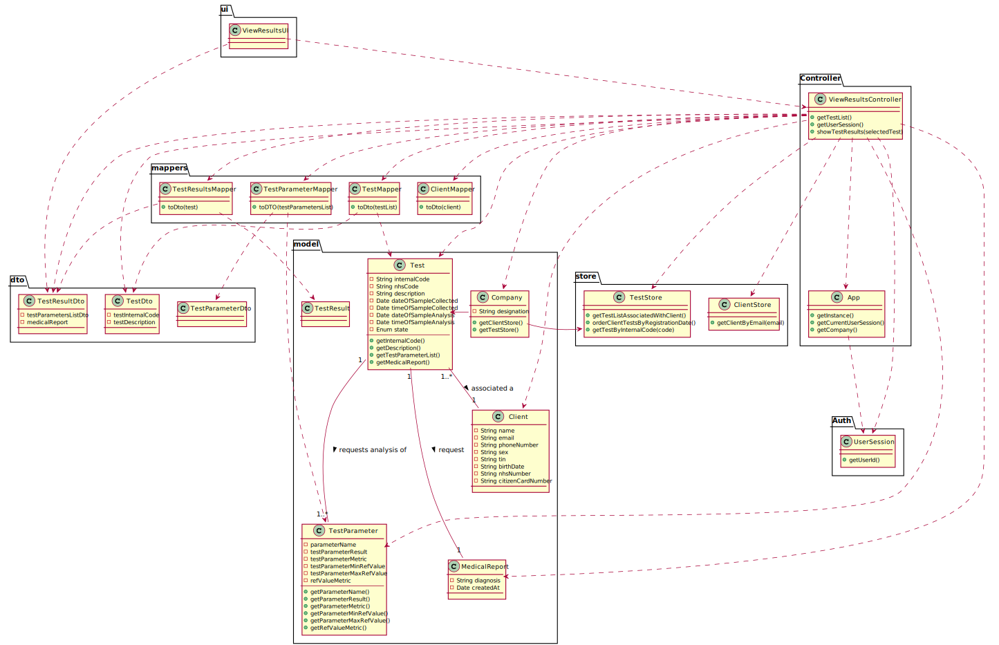

# US 1 -  I want to access the application to view the results of the tests I have performed.

## 1. Requirements Engineering

### 1.1. User Story Description

*As a client, I want to access the application to view the results of the tests I have performed.*

### 1.2. Customer Specifications and Clarifications 

**From the specifications document:**

>Once the laboratory coordinator confirms that everything was done correctly, the client receives a notification alerting that the
results are already available in the central application and informing that he/she must access the
application to view those results. 

**From the client clarifications:**

> **Question:** In US01 which date should be used to arrange the tests in order?The date the test is done or the validation date?
> 
> [**Awnser:**](https://moodle.isep.ipp.pt/mod/forum/discuss.php?d=8787) The test registration date.

> **Question:** What are the data to show the customer? and in what way do we have to show? do you have any examples you can give us?
>
> [**Awnser:**](https://moodle.isep.ipp.pt/mod/forum/discuss.php?d=9038) I want to access the application to view the results of the tests I have performed. This includes the report made by the specialist doctor.
The client tests must be shown ordered from the most recent to the oldest one. The test results are shown only after the client has selected a test.

> **Question:** My group is assuming that the client only wants to see the validated tests. Do you want to see tests in other states and if that's the case say the state of the test and show only the information available for that state?
>
> [**Awnser:**](https://moodle.isep.ipp.pt/mod/forum/discuss.php?d=9162) The client should only see tests that have already been validated.

### 1.3. Acceptance Criteria

*Insert here the client acceptance criteria.*

* **AC1:** The client tests must be shown ordered from the most recent to the oldest one. 
* **AC3:** The tests are ordered by registration date.
* **AC3:** The test results are shown only after the client has selected a test.

### 1.4. Found out Dependencies

*Identify here any found out dependency to other US and/or requirements.*

### 1.5 Input and Output Data

**Input Data:**

* Typed data:

* Selected data:
    * Test

**Output Data:**

* List of existing tests in the Validate state
* Test Result Informations   
* (In)Success of the operation

### 1.6. System Sequence Diagram (SSD)

## 2. OO Analysis

### 2.1. Relevant Domain Model Excerpt  

## 3. Design - User Story Realization 

### 3.1. Rationale

**The rationale grounds on the SSD interactions and the identified input/output data.**

| Interaction ID | Question: Which class is responsible for...                     | Answer                        | Justification (with patterns)                                                                                                                                                                          |
|:-------------  |:--------------------------------------------------------------- |:-----------------------------:|:------------------------------------------------------------------------------------------------------------------------------------------------------------------------------------------------------ |
| Step 1  		 | ... interacting with the actor?                                 | ViewResultsUI                 | **Pure Fabrication**: There is no justification for assigning this responsibility to any existing class in the Domain Model.                                                                           |
|                | ... coordinating the US?                                        | ViewResultsController         | **Controller**                                                                                                                                                                                         |
|                | ... knows the user using the system?                            | UserSession                   | **IE**: cf. user management component documentation.                                                                                                                                                   |
| Step 2  		 | ... knowing the tests that have already been validated?         | TestStore                     | **IE**: Knows all the tests.                                                                                                                                                                           |
|                | ... knowing the TestStore?                                      | Company                       | **IE**: The company knows the TestStore to which it is delegating some tasks.                                                                                                                          |
|                | ... transferring business data in DTO?                          | TestMapper                    | **DTO**: In order for the UI not to have direct access to business objects, it is best to choose to use a DTO.                                                                                         |
| Step 3  		 |                                                                 |                               |                                                                                                                                                                                                        |
| Step 4  		 | ... knowing the test results and its diagnosis?                 | Test                          | **IE**: Owns its data.                                                                                                                                                                                 |
|                | ... transferring business data in DTO?                          | TestResultsMapper             | **DTO**: In order for the UI not to have direct access to business objects, it is best to choose to use a DTO.                                                                                         |
|         		 | ... shows successfully test results?                            | ViewResultsUI                 | **IE**: Is responsible for user interactions.                                                                                                                                                          |

### Systematization ##

According to the taken rationale, the conceptual classes promoted to software classes are: 

 * Company
 * Test

Other software classes (i.e. Pure Fabrication) identified: 

 * ViewResultsUI
 * ViewResultsController
 * TestStore  
 * TestMapper
 * TestResultsMapper

## 3.2. Sequence Diagram (SD)
 

## 3.3. Class Diagram (CD)

# 4. Tests 

*In this section, it is suggested to systematize how the tests were designed to allow a correct measurement of requirements fulfilling.* 

# 5. Construction (Implementation)

*In this section, it is suggested to provide, if necessary, some evidence that the construction/implementation is in accordance with the previously carried out design. Furthermore, it is recommeded to mention/describe the existence of other relevant (e.g. configuration) files and highlight relevant commits.*

# 6. Integration and Demo 

*In this section, it is suggested to describe the efforts made to integrate this functionality with the other features of the system.*

# 7. Observations

*In this section, it is suggested to present a critical perspective on the developed work, pointing, for example, to other alternatives and or future related work.*

