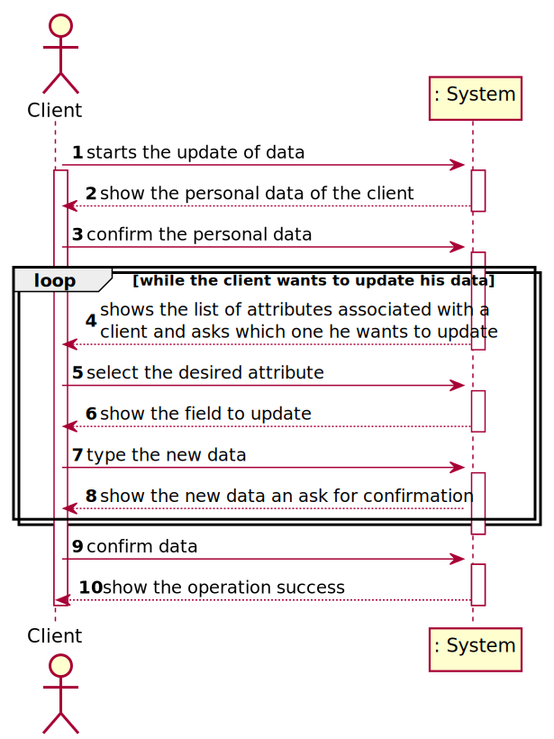
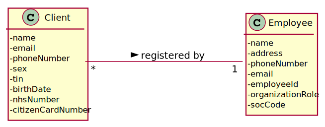
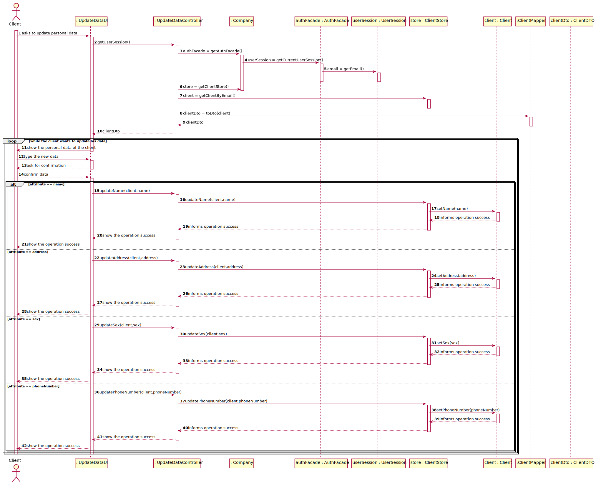
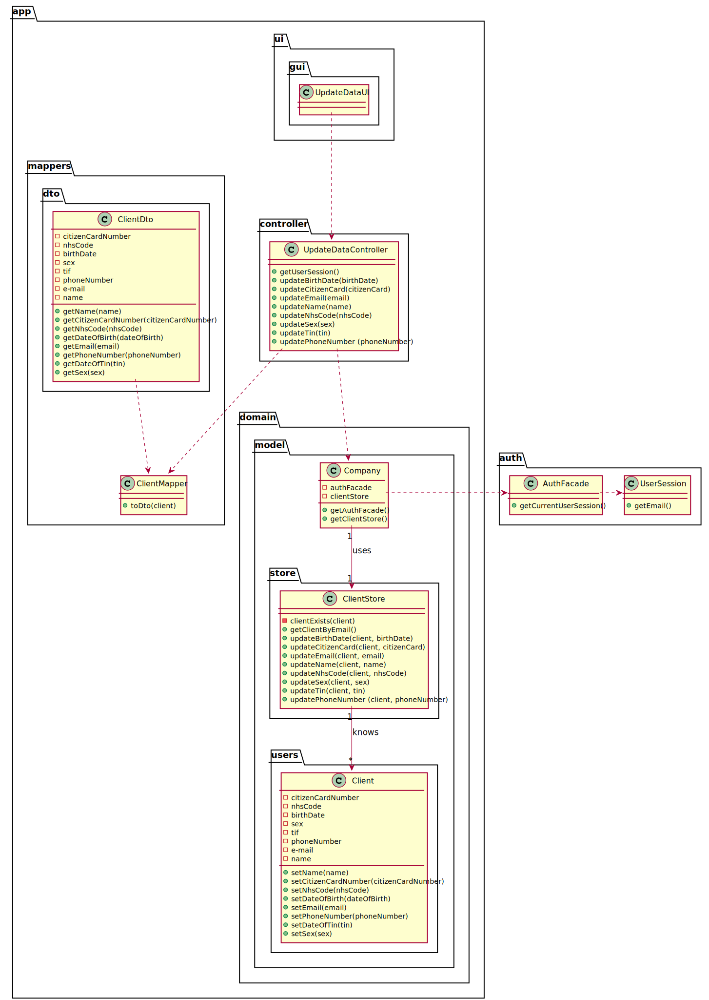

# US 02 - Update my personal data

## 1. Requirements Engineering

>In case of a new client, the receptionist registers the client in the application. To register a client, the
receptionist needs the client’s citizen card number, National Healthcare Service (NHS) number,
birth date, sex, Tax Identification number (TIF), phone number, e-mail and name.

### 1.1. User Story Description

* As a client, I want to update my personal data.

### 1.2. Customer Specifications and Clarifications 

*Insert here any related specification and/or clarification provided by the client together with **your interpretation**. When possible, provide a link to such specifications/clarifications.*

### 1.3. Acceptance Criteria

*Insert here the client acceptance criteria.*

### 1.4. Found out Dependencies

*Identify here any found out dependency to other US and/or requirements.*

### 1.5 Input and Output Data

*Identity here the data to be inputted by the system actor as well as the output data that the system have/needs to present in order to properly support the actor actions. Regarding the inputted data, it is suggested to distinguish between typed data and selected data (e.g. from a list)*

### 1.6. System Sequence Diagram (SSD)

### 1.7 Other Relevant Remarks

*Use this section to capture other relevant information that is related with this US such as (i) special requirements ; (ii) data and/or technology variations; (iii) how often this US is held.* 

## 2. OO Analysis

### 2.1. Relevant Domain Model Excerpt  

### 2.2. Other Remarks

*Use this section to capture some aditional notes/remarks that must be taken into consideration into the design activity. In some case, it might be usefull to add other analysis artifacts (e.g. activity or state diagrams).* 

## 3. Design - User Story Realization 

### 3.1. Rationale

**The rationale grounds on the SSD interactions and the identified input/output data.**

| Interaction ID | Question: Which class is responsible for... | Answer  | Justification (with patterns)  |
|:-------------  |:--------------------- |:------------|:---------------------------- |
| Step 1  		 |	...interacting with the actor?				 | UpdateDataUI           | **Pure Fabrication**: There is no justification for assigning this responsibility to any existing class in the Domain Model.                             |
|       		 |	...coordinating the US?						 | UpdateDataController   | **Controller**                             |
| Step 2  		 |	...knowing the Client						 | ClientStore            | IE: knows all clients                             |
|        		 |	...knowing the ClientStore					 | Company                | IE: The company knows the ClientStore to which it is delegating some tasks                             |
|        		 |	...transferring business data in DTO?						          | ClientMapper            | DTO: In order for the UI not to have direct acess to business objects, it is best to choose to use a DTO                             |
| Step 3  		 |							 |                   |                              |
| Step 4  		 |	...knowing the list of attributes associated with a client						 | Client            | IE: knows it's own data                             |
| Step 5  		 |							 |                   |                              |
| Step 6  		 |	...knowing the field to update		         | Client                  | IE:knows it's own data                             |              
| Step 7  		 |							 |                   |                              |
| Step 8  		 |							 |                   |                              |
| Step 9  		 |	...validate all data?						 | Client                  | IE: owns its data                              |
|       		 |	...saving the new data?						 | Client                  | IE: owns its data                             |
| Step 10  		 |	...informing operation success?			     | UpdateDataUI            | IE: It is responsible for user interactions                             |

### Systematization ##

According to the taken rationale, the conceptual classes promoted to software classes are: 

 * Client
 * Company

Other software classes (i.e. Pure Fabrication) identified: 

 * UpdateDataUI  
 * UpdateDataController
 * ClientMapper
 * ClientStore

## 3.2. Sequence Diagram (SD)

*In this section, it is suggested to present an UML dynamic view stating the sequence of domain related software objects' interactions that allows to fulfill the requirement.* 

## 3.3. Class Diagram (CD)

*In this section, it is suggested to present an UML static view representing the main domain related software classes that are involved in fulfilling the requirement as well as and their relations, attributes and methods.*

# 4. Tests 
*In this section, it is suggested to systematize how the tests were designed to allow a correct measurement of requirements fulfilling.* 

**_DO NOT COPY ALL DEVELOPED TESTS HERE_**

**Test 1:** Check that it is not possible to create an instance of the Example class with null values. 

	@Test(expected = IllegalArgumentException.class)
		public void ensureNullIsNotAllowed() {
		Exemplo instance = new Exemplo(null, null);
	}

*It is also recommended to organize this content by subsections.* 

# 5. Construction (Implementation)

*In this section, it is suggested to provide, if necessary, some evidence that the construction/implementation is in accordance with the previously carried out design. Furthermore, it is recommeded to mention/describe the existence of other relevant (e.g. configuration) files and highlight relevant commits.*

*It is also recommended to organize this content by subsections.* 

# 6. Integration and Demo 

*In this section, it is suggested to describe the efforts made to integrate this functionality with the other features of the system.*

# 7. Observations

*In this section, it is suggested to present a critical perspective on the developed work, pointing, for example, to other alternatives and or future related work.*

