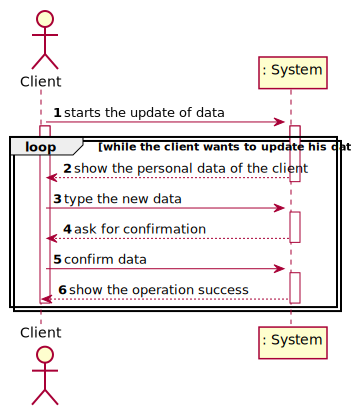

# US 02 - Update my personal data

## 1. Requirements Engineering

### 1.1. User Story Description

* As a client, I want to update my personal data.

### 1.2. Customer Specifications and Clarifications 

**From the specifications document:**
>In case of a new client, the receptionist registers the client in the application. To register a client, the
receptionist needs the client’s citizen card number, National Healthcare Service (NHS) number,
birth date, sex, Tax Identification number (TIF), phone number, e-mail and name.

**From the client clarifications:**

>**Question:** Should the Client type in the attribute he/she wants to update or should he choose from a list?
> 
>[**Answer:**](https://moodle.isep.ipp.pt/mod/forum/discuss.php?d=8838#p11582)  In this sprint each team should develop a graphical user interface for US2. The application should show the current user data and the client can update any attribute.

>**Question:** When we update the client's information, should we send an email informing that the client's data has been changed? If so, what should this email contain?
>
>[**Answer:**](https://moodle.isep.ipp.pt/mod/forum/discuss.php?d=9163)  Yes. The e-mail message should only inform the client that his personal data has been updated.

>**Question:** Should/Can we show the current data held in the client's account? If so, we think that showing certain information(Password, for exemple) could violate some security purposes. How should we approach that situation?
>
>[**Answer:**](https://moodle.isep.ipp.pt/mod/forum/discuss.php?d=9163)  Today I made the following clarification: "The client can only update his: name, address, phone number and sex attributes. The other attributes can not be updated. There are some restrictions that forced me to make this decision."

>**Question:** Up until now, we haven’t had any need to assign an address to a client. Seeing that there is now an Address column, that for us is somewhat left unused, would you advise us to add it as an attribute to the Client entity?
>
>[**Answer:**](https://moodle.isep.ipp.pt/mod/forum/discuss.php?d=9163)  Yes. The address should have no more than 90 characters. Please consider the address of the Employee to have the same format that I am suggesting now for the client's address. In the beginning of the project I said that the address of the Employee should have no more than 30 characters but with this size we can not write a normal UK address.

> **Question:** To register a Client which is the format of each attribute?
>
> [**Answer:**](https://moodle.isep.ipp.pt/mod/forum/discuss.php?d=7563#p10179)
> * Citizen Card: 16 digit number
> * NHS: 10 digit number
> * TIN: 10 digit number
> * Birth day - in which format: DD/MM/YY
> * Sex - should only be Male/Female or include more options.
> * Phone number: 11-digit number.
> * The sex is optional. All other fields are required.

### 1.3. Acceptance Criteria

* **AC1:** The gender should only be Male/Female or include more options.
* **AC2:** The phone number must be a 11 digit number.
* **AC3:** The Address mustn't have more than 90 characters
* **AC4:** The Name mustn't have more than 35 characters
* **AC5:** The Client can only update the name, the address, the phone number and the gender
* **AC6:** The system should send an email informing the client that his data was updated

### 1.4. Found out Dependencies

* This user story has a dependency with user story 3  since it is only possible to change the data of a client from a client registered.

### 1.5 Input and Output Data

**Input Data:**

* Typed data:
    * The field of the attribute that the client wants to change 
    

**Output Data:**

* (In)Success of the operation

### 1.6. System Sequence Diagram (SSD)

### 1.7 Other Relevant Remarks

* This user history will be used whenever a customer wishes to change their personal information. 

## 2. OO Analysis

### 2.1. Relevant Domain Model Excerpt  

## 3. Design - User Story Realization 

### 3.1. Rationale

**The rationale grounds on the SSD interactions and the identified input/output data.**

| Interaction ID | Question: Which class is responsible for... | Answer  | Justification (with patterns)  |
|:-------------  |:--------------------- |:------------|:---------------------------- |
| Step 1  		 |	...interacting with the actor?				 | UpdateDataUI           | **Pure Fabrication**: There is no justification for assigning this responsibility to any existing class in the Domain Model.                             |
|       		 |	...coordinating the US?						 | UpdateDataController   | **Controller**                             |
| Step 2  		 |	...knowing the Client						 | ClientStore            | IE: knows all clients                             |
|        		 |	...knowing the ClientStore					 | Company                | IE: The company knows the ClientStore to which it is delegating some tasks                             |
|        		 |	...transferring business data in DTO?						          | ClientMapper            | DTO: In order for the UI not to have direct acess to business objects, it is best to choose to use a DTO                             |
| Step 3  		 |							 |                   |                              |
| Step 4 | | | | 
|Step 5       	|	...validate all data?						 | Client                  | IE: owns its data                              |
|       		 |	...saving the new data?						 | Client                  | IE: owns its data                             |
| Step 6       |	...informing operation success?			     | UpdateDataUI            | IE: It is responsible for user interactions                             |

### Systematization ##

According to the taken rationale, the conceptual classes promoted to software classes are: 

 * Client
 * Company

Other software classes (i.e. Pure Fabrication) identified: 

 * UpdateDataUI  
 * UpdateDataController
 * ClientMapper
 * ClientStore
 * ClientDto

## 3.2. Sequence Diagram (SD)

## 3.3. Class Diagram (CD)

# 4. Tests

**Test 1:** Check that it is not possible to create an instance of the Example class with null values. 

	@Test(expected = IllegalArgumentException.class)
		public void ensureNullIsNotAllowed() {
		Exemplo instance = new Exemplo(null, null);
	}

**Test 2:** Check that it is not possible to change the gender of a client if it isn't a Male or a Female

     @Test(expected = IllegalArgumentException.class)
    public void setSex2() {
        Client cl = new Client("José Pedrosa","2234567891234567","2234567891","14/12/1995","male","3231231231","12345678900","pedrosa@gmail.com","Rua da República");
        cl.setSex("rdtfgyuhij");
    }

**Test 3:** Check that it is not possible to change the address of a client if it has more than 90 characters.

    @Test(expected = IllegalArgumentException.class)
    public void setAddress2() {
        Client cl = new Client("José Pedrosa","2234567891234567","2234567891","14/12/1995","3231231231","12345678900","pedrosa@gmail.com","Rua da República");
        cl.setAddress("Rua dos Montes fegrthyjhtgrfgthyjuyhgtrfdccegtryjukiouyjhtgrfedxsdcefgtyjukiujnybgvfcdefrgtyjukiojyhtbgrvfecdfrtgyjukiokujyh");

    }

**Test 4:** Check that it is not possible to change the phone number of a client if it is a number with more than 11 digits.

    @Test(expected = IllegalArgumentException.class)
    public void setPhoneNumber4() {
        Client cl = new Client("José Pedrosa","2234567891234567","2234567891","14/12/1995","3231231231","12345678900","pedrosa@gmail.com","Rua da República");
        cl.setPhoneNumber("123456789098765432123456789");
    }

**Test 4:** Check that it is not possible to change the phone number of a client if it is a number with less than 11 digits.

      @Test(expected = IllegalArgumentException.class)
    public void setPhoneNumber5() {
        Client cl = new Client("José Pedrosa","2234567891234567","2234567891","14/12/1995","3231231231","12345678900","pedrosa@gmail.com","Rua da República");
        cl.setPhoneNumber("123456");
    }

**Test 5:** Check that it is not possible to change the name of a client if it has more than 35 characters

        @Test(expected = IllegalArgumentException.class)
    public void setName2() {
        Client cl = new Client("José Pedrosa","2234567891234567","2234567891","14/12/1995","3231231231","12345678900","pedrosa@gmail.com","Rua da República");
        cl.setName("fegtrhyjkujytgrfedwefgyjukiuyhgtrfergtyuijyhg");
    }

# 5. Construction (Implementation)

## UpdateDataController

    /**
     * It updates the name of the Client
     * @param name the name of the Client
     */
    public void updateName(Client client, String name){
        store.updateName(client, name);
    }

    /**
     * It updates the sex of the Client
     * @param sex the sex of the Client
     */
    public  void updateSex(Client client, String sex){
        store.updateSex(client, sex);
    }

    /**
     * It updates the Phone Number of the Client
     * @param phoneNumber the Phone Number of the Client
     */
    public void updatePhoneNumber (Client client, String phoneNumber){store.updatePhoneNumber(client, phoneNumber);}

    /**
     * It updates the Address of the Client
     * @param client The Client
     * @param address The address of the Client you want to update
     */
    public void updateAddress (Client client, String address){store.updateAddress(client, address);}

 
## ClientStore

        /**
     *  It updates the name of the Client
     * @param client The Client
     * @param name the name of the Client
     */
    public void updateName(Client client, String name){
        /*if (clientExists(client))*/ client.setName(name);
    }

    /**
     * It updates the sex of the Client
     * @param client the Client
     * @param sex the sex of the Client
     */
    public void updateSex(Client client, String sex){
        /*if (clientExists(client))*/ client.setSex(sex);
    }

    /**
     * It updates the Phone Number of the Client
     * @param client the Client
     * @param phoneNumber the Phone Number of the Client
     */
    public void updatePhoneNumber(Client client, String phoneNumber) {
        /*if (clientExists(client))*/ client.setPhoneNumber(phoneNumber);
    }

    /**
     * It updates the Address of the Client
     * @param client The Client
     * @param address THe Address of the Client you want to update
     */
    public void updateAddress(Client client, String address) {
        /*if (clientExists(client))*/ client.setAddress(address);
    }

## Client
  
     /**
     * Sets the name of a client
     * @param name the name of a client
     */
    public void setName(String name) {
        nameValidation(name);
        this.name = name;
    }

    /**
     * Sets the gender of a client
     * @param sex the gender of a client
     */
    public void setSex(String sex) {
        sexValidation(sex);
        this.sex = sex;
    }

    /**
     * Sets the adress of a client
     * @param address the adress of a client
     */
    public void setAddress(String address) {
        addressValidation(address);
        this.address = address;
    }

# 6. Integration and Demo 

 To test this user storie, we need to create clients to update his data.

# 7. Observations

*In this section, it is suggested to present a critical perspective on the developed work, pointing, for example, to other alternatives and or future related work.*

