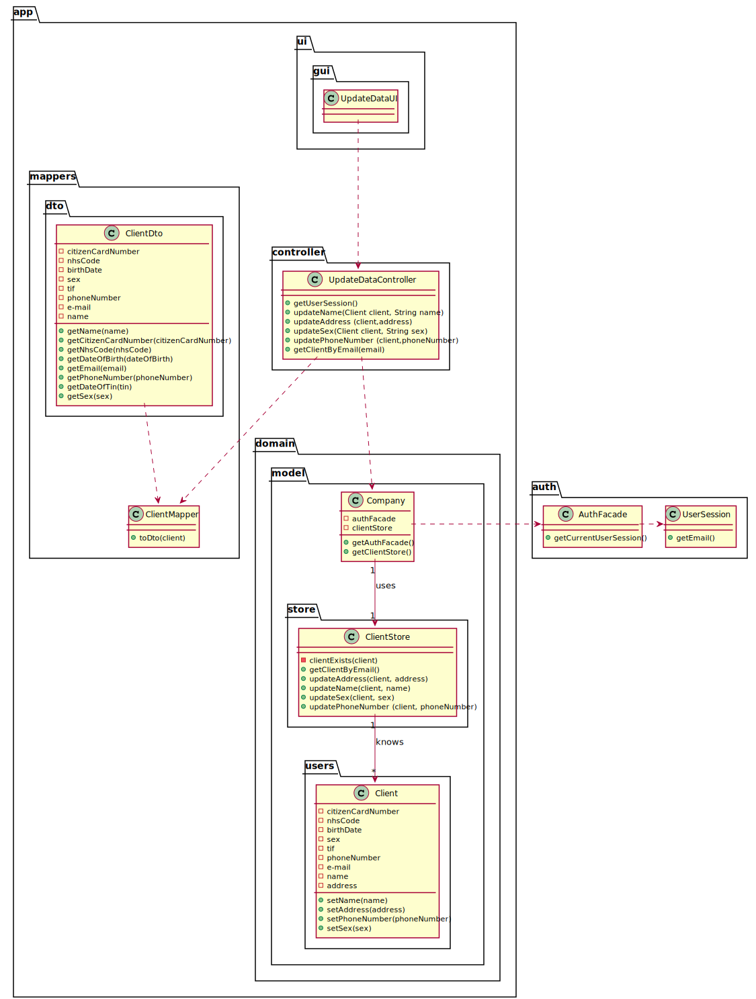

# US 02 - Update my personal data

## 1. Requirements Engineering

### 1.1. User Story Description

* As a client, I want to update my personal data.

### 1.2. Customer Specifications and Clarifications 

**From the specifications document:**
>In case of a new client, the receptionist registers the client in the application. To register a client, the
receptionist needs the client’s citizen card number, National Healthcare Service (NHS) number,
birth date, sex, Tax Identification number (TIF), phone number, e-mail and name.

**From the client clarifications:**

>**Question:** Should the Client type in the attribute he/she wants to update or should he choose from a list?
> 
>[**Answer:**](https://moodle.isep.ipp.pt/mod/forum/discuss.php?d=8838#p11582)  In this sprint each team should develop a graphical user interface for US2. The application should show the current user data and the client can update any attribute.

>**Question:** To update the attribute, should the Client type the previous data?
>
>[**Answer:**](https://moodle.isep.ipp.pt/mod/forum/discuss.php?d=8838#p11582)  In this sprint each team should develop a graphical user interface for US2. The application should show the current user data and the client can update any attribute.

>**Question:** What is the Data that the Client can update?
>
>[**Answer:**](https://moodle.isep.ipp.pt/mod/forum/discuss.php?d=8838#p11582)  In this sprint each team should develop a graphical user interface for US2. The application should show the current user data and the client can update any attribute.

> **Question:** To register a Client which is the format of each attribute?
>
> [**Answer:**](https://moodle.isep.ipp.pt/mod/forum/discuss.php?d=7563#p10179)
> * Citizen Card: 16 digit.
> * number NHS: 10 digit number.
> * TIN: 10 digit number.
> * Birth day - in which format: DD/MM/YYYY.
> * Sex - should only be Male/Female or include more options.
> * Phone number: 11 digit number.
> * The sex is opcional. All other fields are required.

### 1.3. Acceptance Criteria

* **AC1:** The Citizen Card number must have 16 digits.
* **AC2:** The National Healthcare Service number must have 10 digits.
* **AC3:** The Birth date should be in this format: DD/MM/YYYY.
* **AC4:** A client should not have more than 150 years of age.
* **AC5:** The gender should only be Male/Female or include more options.
* **AC6:** The phone number must be a 11 digit number.
* **AC7:** The tax identification number must have 10 digits.

### 1.4. Found out Dependencies

* This user story has a dependency with user story 3  since it is only possible to change the data of a client from a client registered.

### 1.5 Input and Output Data

**Input Data:**

* Typed data:
    * The field of the attribute that the client wants to change 
    

**Output Data:**

* (In)Success of the operation

### 1.6. System Sequence Diagram (SSD)

### 1.7 Other Relevant Remarks

* This user history will be used whenever a customer wishes to change their personal information. 

## 2. OO Analysis

### 2.1. Relevant Domain Model Excerpt  

## 3. Design - User Story Realization 

### 3.1. Rationale

**The rationale grounds on the SSD interactions and the identified input/output data.**

| Interaction ID | Question: Which class is responsible for... | Answer  | Justification (with patterns)  |
|:-------------  |:--------------------- |:------------|:---------------------------- |
| Step 1  		 |	...interacting with the actor?				 | UpdateDataUI           | **Pure Fabrication**: There is no justification for assigning this responsibility to any existing class in the Domain Model.                             |
|       		 |	...coordinating the US?						 | UpdateDataController   | **Controller**                             |
| Step 2  		 |	...knowing the Client						 | ClientStore            | IE: knows all clients                             |
|        		 |	...knowing the ClientStore					 | Company                | IE: The company knows the ClientStore to which it is delegating some tasks                             |
|        		 |	...transferring business data in DTO?						          | ClientMapper            | DTO: In order for the UI not to have direct acess to business objects, it is best to choose to use a DTO                             |
| Step 3  		 |							 |                   |                              |
| Step 4 | | | | 
|Step 5       	|	...validate all data?						 | Client                  | IE: owns its data                              |
|       		 |	...saving the new data?						 | Client                  | IE: owns its data                             |
| Step 6       |	...informing operation success?			     | UpdateDataUI            | IE: It is responsible for user interactions                             |

### Systematization ##

According to the taken rationale, the conceptual classes promoted to software classes are: 

 * Client
 * Company

Other software classes (i.e. Pure Fabrication) identified: 

 * UpdateDataUI  
 * UpdateDataController
 * ClientMapper
 * ClientStore
 * ClientDto

## 3.2. Sequence Diagram (SD)

## 3.3. Class Diagram (CD)

# 4. Tests 
*In this section, it is suggested to systematize how the tests were designed to allow a correct measurement of requirements fulfilling.* 

**_DO NOT COPY ALL DEVELOPED TESTS HERE_**

**Test 1:** Check that it is not possible to create an instance of the Example class with null values. 

	@Test(expected = IllegalArgumentException.class)
		public void ensureNullIsNotAllowed() {
		Exemplo instance = new Exemplo(null, null);
	}

*It is also recommended to organize this content by subsections.* 

# 5. Construction (Implementation)

*In this section, it is suggested to provide, if necessary, some evidence that the construction/implementation is in accordance with the previously carried out design. Furthermore, it is recommeded to mention/describe the existence of other relevant (e.g. configuration) files and highlight relevant commits.*

*It is also recommended to organize this content by subsections.* 

# 6. Integration and Demo 

*In this section, it is suggested to describe the efforts made to integrate this functionality with the other features of the system.*

# 7. Observations

*In this section, it is suggested to present a critical perspective on the developed work, pointing, for example, to other alternatives and or future related work.*

