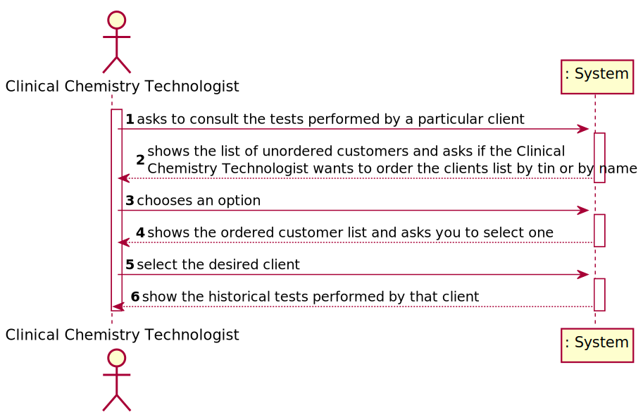
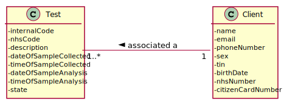
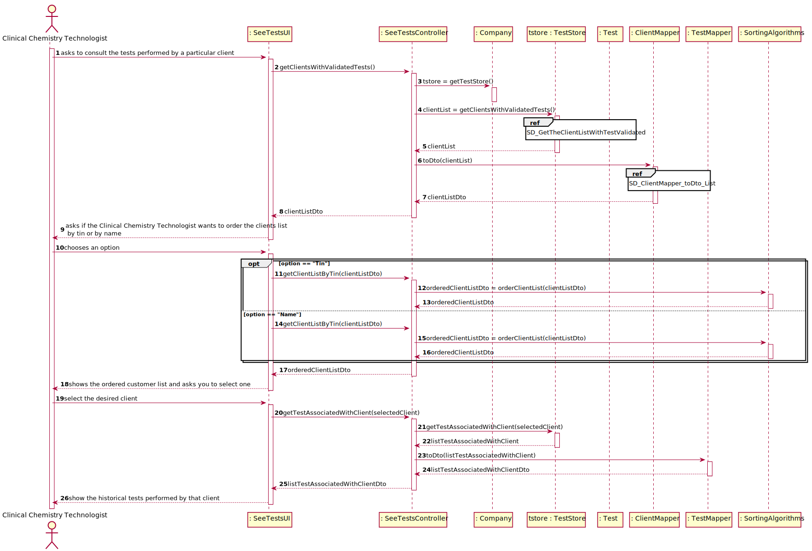
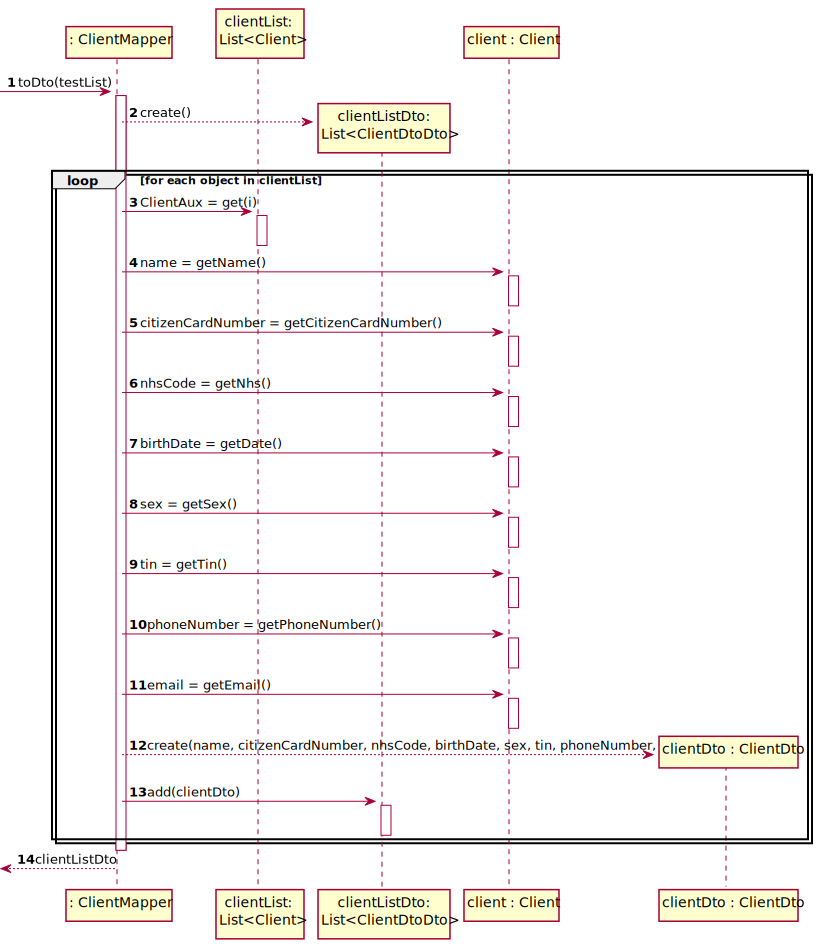
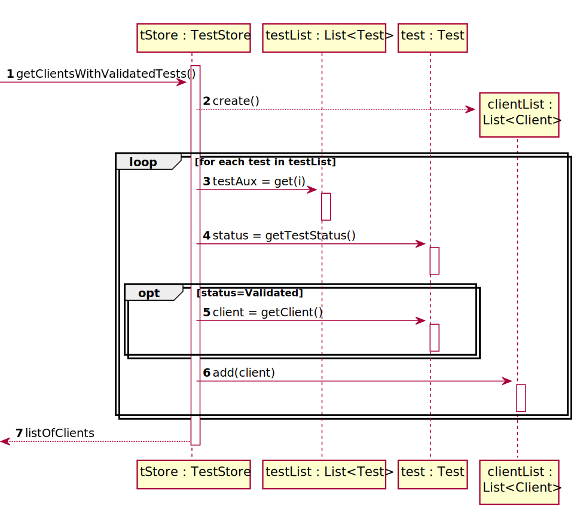
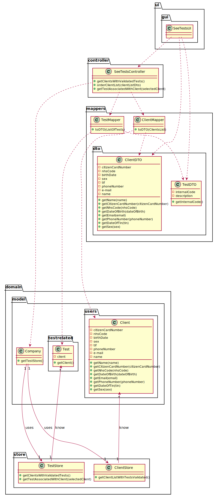

# US 13 - Consult the tests performed by a client

## 1. Requirements Engineering

### 1.1. User Story Description

* As a clinical chemistry technologist, I intend to consult the historical tests
  performed by a particular client and to be able to check tests details/results.

### 1.2. Customer Specifications and Clarifications 

**From the specifications document:**
>In case of a new client, the receptionist registers the client in the application. To register a client, the
receptionist needs the client’s citizen card number, National Healthcare Service (NHS) number,
birth date, sex, Tax Identification number (TIF), phone number, e-mail and name.

**From the client clarifications:**
> **Question:**  Should we show every client already registered when we show the clients' list to the clinical chemistry technologist or should we only show the clients' with a test or more already assigned?
>
> [**Answer:**](https://moodle.isep.ipp.pt/mod/forum/discuss.php?d=8938#p11754) The system should show only clients that have tests already validated by the lab coordinator.

> **Question:**  From the user story description "As a clinical chemistry technologist, I intend to consult the historical tests performed by a particular client and to be able to check tests details/results". What do you mean by "check tests details/results" ?
>
> [**Answer:**](https://moodle.isep.ipp.pt/mod/forum/discuss.php?d=9055) The clinical chemistry technologist should be able to check the historical tests performed by a particular client and see the results obtained in each test. For a given client (that was selected by the clinical chemistry technologist) the application should show all tests performed by the client and, for each parameter, the application should show the parameter value and the parameter reference values. The clinical chemistry technologist should not have access to the report made by the specialist doctor.

> **Question:**  In US13 acceptance criteria, "The application must allow ordering the clients by TIN and by name...". What do you mean by that? Is there a priority in ordering between name and TIN?
>
> [**Answer:**](https://moodle.isep.ipp.pt/mod/forum/discuss.php?d=9246#p12176) The user can chose to sort the clients by name OR by TIN.

> **Question:**  In the User Story 13, the Clinical Chemistry Technologist to "choose the target client" needs to type the name (or TIN number)? Or should be a list present with all the client's available and, after that, be possible to select one?
>
> [**Answer:**](https://moodle.isep.ipp.pt/mod/forum/discuss.php?d=9181#p12113)  From the requirements introduced in the beginning of Sprint D: "The application must allow ordering the clients by TIN and by name to help the clinical chemistry technologist choose the target client". A sorted list should be presented to the clinical chemistry technologist.

> **Question:** In US13, the Clinical Chemistry Technologist, can select more than one client at once to view its historical test results?
>
> [**Answer:**](https://moodle.isep.ipp.pt/mod/forum/discuss.php?d=9178#p12112) No.

> **Question:** Moreover, will all the tests associated with the client be displayed or the clinical chemistry technologist will have also to select the tests he wants to see?
>
> [**Answer:**](https://moodle.isep.ipp.pt/mod/forum/discuss.php?d=9178#p12112) After selecting one client, the application should show all the historical test results, of that client, to the Clinical Chemistry Technologist.

> **Question:**  Should the user be the one selecting if the Clients are ordered by Name or TIN, or should it be defined through the configuration file? If it is the user, how should he be able to select it?
>
> [**Answer:**](https://moodle.isep.ipp.pt/mod/forum/discuss.php?d=9120#p12103) When using the application, the clinical chemistry technologist should be able to sort the clients by name or TIN. The algorithm that will be used to sort the data should be defined through a configuration file.

> **Question:** From the user story description "As a clinical chemistry technologist, I intend to consult the historical tests performed by a particular client and to be able to check tests details/results". What do you mean by "check tests details/results" ?
>
> [**Answer:**](https://moodle.isep.ipp.pt/mod/forum/discuss.php?d=9055#p11905) The clinical chemistry technologist should be able to check the historical tests performed by a particular client and see the results obtained in each test. For a given client (that was selected by the clinical chemistry technologist) the application should show all tests performed by the client and, for each parameter, the application should show the parameter value and the parameter reference values. The clinical chemistry technologist should not have access to the report made by the specialist doctor.

> **Question:** The client's tests, that we have to show on this US, need to have been validated by the lab coordinator or is it enough if they just have results and we can show them before being validated by the lab coordinator?
>
> [**Answer:**](https://moodle.isep.ipp.pt/mod/forum/discuss.php?d=8945#p11883)  The tests to be presented in US13 are tests that have already been validated by the lab coordinator.

> **Question:** Should we show every client already registered when we show the clients' list to the clinical chemistry technologist or should we only show the clients' with a test or more already assigned?
>
> [**Answer:**](https://moodle.isep.ipp.pt/mod/forum/discuss.php?d=8938#p11754) The system should show only clients that have tests already validated by the lab coordinator.

### 1.3. Acceptance Criteria

* **AC1:** The application must allow ordering the clients by TIN and by name to help the clinical chemistry technologist choose the target client.
* **AC2:** The ordering algorithm to be used by the application must be defined through a configuration file. 
* **AC3:** At least two sorting algorithms should be available.
* **AC4:** It is only possible to select one client at a time.
* **AC5:** Only validated tests associated with a client should be shown.
* **AC6:** The algorithm used for ordering must be selected by the user.
* **AC7:** The medical report associated with a particular test should not be shown to the user.

### 1.4. Found out Dependencies

* This user story has a dependency with use story 15 since only customers with test already validated by the laboratory coordinator will be shown in user story 13.

### 1.5 Input and Output Data

**Input Data:**

* Selected data:
    * A Client
    * The sorting algorithm
  
**Output Data:**
* A list of clients sorted by the selected algorithm
* A list with the tests performed by a particular client

### 1.6. System Sequence Diagram (SSD)

### 1.7 Other Relevant Remarks

* Algorithms will be defined by a configuration file.
* This user story will be used whenever the clinical chemistry technologist needs to consult the tests related to a client.

## 2. OO Analysis

### 2.1. Relevant Domain Model Excerpt  

### 2.2. Other Remarks

## 3. Design - User Story Realization 

### 3.1. Rationale

**The rationale grounds on the SSD interactions and the identified input/output data.**

| Interaction ID | Question: Which class is responsible for... | Answer  | Justification (with patterns)  |
|:-------------  |:--------------------- |:------------|:---------------------------- |
| Step 1  		 | ... interacting with the actor? | SeeTestsUI|  **Pure Fabrication**: There is no justification for assigning this responsibility to any existing class in the Domain Model.|
|                | ... coordinating the US?                                        | SeeTestsController         | **Controller**                                                                                                                                                                                         |
|        		 | ... knowing all the clients with tests validated in the system? | TestStore |**IE:**: Know all the tests in the system. |
|                | ...knowing the client associated with a test?                   | Test      | **IE:** Owns our on data. |
|                | ... knowing the TestStore?                                      | Company                       | **IE**: The company knows the ClientStore to which it is delegating some tasks.                                                                                                                          |
|                | ... transferring business data in DTO?                           | ClientDto                       | **DTO**: In order for the UI not to have direct access to business objects, it is best to choose to use a DTO.                                                                                         |
| Step 2  		 | ... asking the user the algorithm that he intends to use to order the clients? | SeeTestsUi | **IE**: Is responsible for user interaction.|
| Step 3  		 |				 |    |                            |
| Step 4         |...show the list of client ordered?							 |SeeTestsUI             | **IE**: Is responsible for user interaction.                              |
| Step 5  		 |... know the client associated with a test? | Test | **IE:** The test owns your on data.                              |
| Step 6  		 |... show the test associated with a client? | SeeTestsUI | **IE:** Is responsible for user interaction.                             |              

### Systematization ##

According to the taken rationale, the conceptual classes promoted to software classes are: 

 * Client
 * Test
 * Company

Other software classes (i.e. Pure Fabrication) identified: 
 * SeeTestsUI  
 * SeeTestsController
 * ClientStore
 * ClientMapper
 * TestMapper 
 * TestStore
 * ClientDto

## 3.2. Sequence Diagram (SD)

### 3.2.1 Partial Sequence Diagram 
* Partial sequence diagram related to the passing of a client, domain object, to an object data transfer type

* Partial sequence diagram related to the process of picking up customers associated with a particular test validated by the laboratory coordinator

## 3.3. Class Diagram (CD)

# 4. Tests

**Test 1:** Check if the algorithm is ordering the clients by name

	 ClientDTO cl1 = new ClientDTO("Carlos","123456789012","02/05/2020","female","1234567890","12345678901","lola@gmail.com","Rua das cavalas");
        ClientDTO cl2 = new ClientDTO("Ana","123456789012","02/05/2020","female","1234567890","12345678901","lola@gmail.com","Rua das cavalas");
        ClientDTO cl3 = new ClientDTO("Daniel","123456789012","02/05/2020","female","1234567890","12345678901","lola@gmail.com","Rua das cavalas");
        ClientDTO cl4 = new ClientDTO("Joana","123456789012","02/05/2020","female","1234567890","12345678901","lola@gmail.com","Rua das cavalas");
        ClientDTO cl5 = new ClientDTO("Ricardo","123456789012","02/05/2020","female","1234567890","12345678901","lola@gmail.com","Rua das cavalas");

        List<ClientDTO> listResult = new ArrayList<>();
        listResult.add(cl1);
        listResult.add(cl2);
        listResult.add(cl3);
        listResult.add(cl4);
        listResult.add(cl5);

        List<ClientDTO> listExpected = new ArrayList<>();
        listExpected.add(cl2);
        listExpected.add(cl1);
        listExpected.add(cl3);
        listExpected.add(cl4);
        listExpected.add(cl5);

        SortAlphabetically sortAlphabetically = new SortAlphabetically();
        listResult = sortAlphabetically.orderClientList(listResult);

        Assert.assertEquals(listExpected,listResult);
     }

**Test 2:** Check if the algorithm is ordering the clients by Tin

        @Test
    public void orderClientList() {
        ClientDTO cl1 = new ClientDTO("Carlos","123456789012","02/05/2020","female","8421345003","12345678901","lola@gmail.com","Rua das cavalas");
        ClientDTO cl2 = new ClientDTO("Carlos","123456789012","02/05/2020","female","4382710056","12345678901","lola@gmail.com","Rua das cavalas");
        ClientDTO cl3 = new ClientDTO("Carlos","123456789012","02/05/2020","female","1999999999","12345678901","lola@gmail.com","Rua das cavalas");
        ClientDTO cl4 = new ClientDTO("Carlos","123456789012","02/05/2020","female","1300000000","12345678901","lola@gmail.com","Rua das cavalas");
        ClientDTO cl5 = new ClientDTO("Carlos","123456789012","02/05/2020","female","2045689605","12345678901","lola@gmail.com","Rua das cavalas");

        List<ClientDTO> listExpected = new ArrayList<>();
        listExpected.add(cl4);
        listExpected.add(cl3);
        listExpected.add(cl5);
        listExpected.add(cl2);
        listExpected.add(cl1);

        List<ClientDTO> listResult = new ArrayList<>();
        listResult.add(cl1);
        listResult.add(cl2);
        listResult.add(cl3);
        listResult.add(cl4);
        listResult.add(cl5);

        SortByTin sort = new SortByTin();
        listResult = sort.orderClientList(listResult);

        Assert.assertEquals(listExpected,listResult);
    }

# 5. Construction (Implementation)

## SeeTestsController
   
       /**
     * Sort the list of clients by Tin
     * @return the ordered list
     * @throws ClassNotFoundException if it is not possible to instantiate the desired class
     * @throws IllegalAccessException if the object we intend to create it's not  correctly
     * @throws InstantiationException if we can't instantiate an object
     */
    public List<ClientDTO> getClientListByTin() throws ClassNotFoundException, IllegalAccessException, InstantiationException {
        List<ClientDTO> list = getClientList();

        Properties props = App.getInstance().getProps();
        String algorithm = props.getProperty("Controller.SortByTin.Class");
        Class<?> oClass = Class.forName(algorithm);
        SortingAlgorithms sort = (SortingAlgorithms) oClass.newInstance();

        return sort.orderClientList(list);
    }

    /**
     * Sort the client list alphabetically
     * @return the ordered list
     * @throws ClassNotFoundException if it is not possible to instantiate the desired class
     * @throws IllegalAccessException if the object we intend to create it's not  correctly
     * @throws InstantiationException if we can't instantiate an object
     */
    public List<ClientDTO> getClientsListByAlphabeticalOrder() throws ClassNotFoundException, IllegalAccessException, InstantiationException {
        List<ClientDTO> list = getClientList();

        Properties props = App.getInstance().getProps();
        String algorithm = props.getProperty("Controller.SortAlphabetically.Class");

        Class<?> oClass = Class.forName(algorithm);
        SortingAlgorithms sort = (SortingAlgorithms) oClass.newInstance();

        return sort.orderClientList(list);
    }

    /**
     * It gets a list of tests of a Client
     * @param selectedClient the Client we want to see his tests
     * @return a Dto list of tests of a Client
     */
    public List<TestDTO> getAssociatedWithClient(ClientDTO selectedClient){
        return tmapper.toDto(tstore.getTestListAssociatedWithClient(selectedClient));
    }

## TestStore

      /**
     * Gets the list of Clients that have at least one Test Validated
     * @return the list of Clients that have at least one Test Validated
     */
    public List<Client> getClientWithTestsValidated(){
        List<Client> list = new ArrayList<>();
        for (Test t: testList) {
            if (t.getStateOfTest()== validated && !list.contains(t.getCl())){
                list.add(t.getCl());
            }
        }
        if (list.size()==0){
            throw new IllegalArgumentException("There aren't Clients with tests validated");
        }

        return list;
    }

    /**
     * Gets the list of all test associated with a specific client
     * @param selectedClient The specific client we want to gets it's tests
     * @return the list of all test associated with a specific client
     */
    public List<Test> getTestListAssociatedWithClient(ClientDTO selectedClient){
        List<Test> test = new ArrayList<>();
        for (Test t : testList) {
            if (t.getCl().getTin().equals(selectedClient.getTin()) && t.getStateOfTest()== validated) {
                test.add(t);
            }
        }
        return test;
    }
     
## Company

     /**
     * Get the instance of TestTypeStore.
     * @return the instance of TestTypeStore.
     */
    public TestTypeStore getTestTypeStore(){
        return testTypeStore;
    }

# 6. Integration and Demo 

To implement and test this user storie we needed to have the functionality to create clients , test and associate them to the clients.

# 7. Observations

*In this section, it is suggested to present a critical perspective on the developed work, pointing, for example, to other alternatives and or future related work.*

