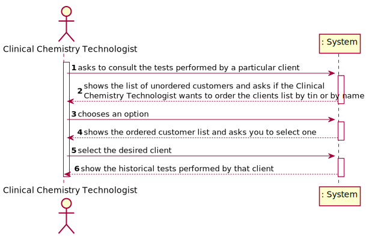
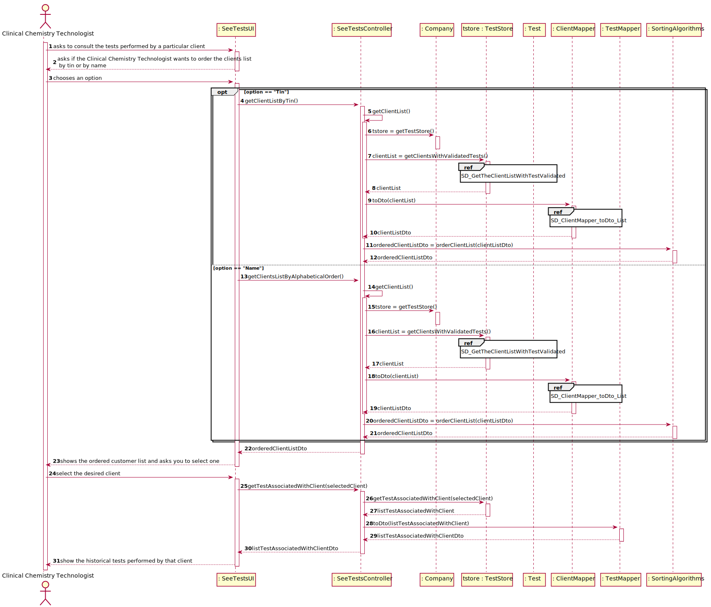
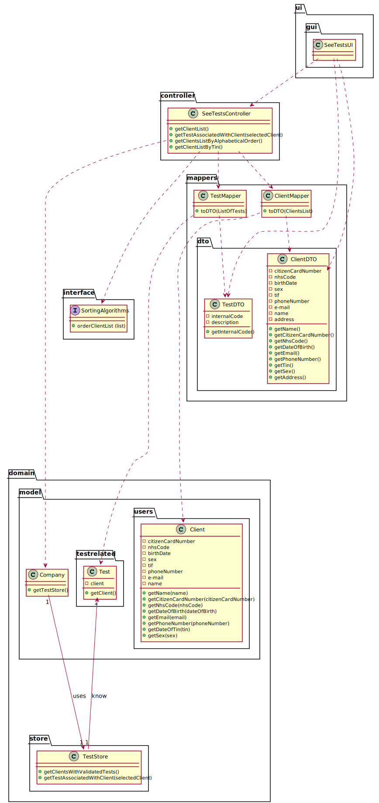

# US 13 - Consult the tests performed by a client

## 1. Requirements Engineering

### 1.1. User Story Description

* As a clinical chemistry technologist, I intend to consult the historical tests
  performed by a particular client and to be able to check tests details/results.

### 1.2. Customer Specifications and Clarifications 
**From the specifications document:**
>In case of a new client, the receptionist registers the client in the application. To register a client, the
receptionist needs the client’s citizen card number, National Healthcare Service (NHS) number,
birth date, sex, Tax Identification number (TIF), phone number, e-mail and name.

**From the client clarifications:**
> **Question:**  Should we show every client already registered when we show the clients' list to the clinical chemistry technologist or should we only show the clients' with a test or more already assigned?
>
> [**Answer:**](https://moodle.isep.ipp.pt/mod/forum/discuss.php?d=8938#p11754) The system should show only clients that have tests already validated by the lab coordinator.

### 1.3. Acceptance Criteria

* **AC1:** The application must allow ordering the clients by TIN and by name to help the clinical chemistry technologist choose the target client.
* **AC2:** The ordering algorithm to be used by the application must be defined through a configuration file. 
* **AC3:** At least two sorting algorithms should be available.

### 1.4. Found out Dependencies

* This user story has a dependency with use story 15 since only customers with test already validated by the laboratory coordinator will be shown in user story 13.

### 1.5 Input and Output Data

**Input Data:**

* Selected data:
    * A Client
    * The sorting algorithm
  
**Output Data:**
* A list of clients sorted by the selected algorithm
* A list with the tests performed by a particular client

### 1.6. System Sequence Diagram (SSD)

### 1.7 Other Relevant Remarks

* Algorithms will be defined by a configuration file.
* This user story will be used whenever the clinical chemistry technologist needs to consult the tests related to a client.

## 2. OO Analysis

### 2.1. Relevant Domain Model Excerpt  

### 2.2. Other Remarks

## 3. Design - User Story Realization 

### 3.1. Rationale

**The rationale grounds on the SSD interactions and the identified input/output data.**

| Interaction ID | Question: Which class is responsible for... | Answer  | Justification (with patterns)  |
|:-------------  |:--------------------- |:------------|:---------------------------- |
| Step 1  		 | ... interacting with the actor? | SeeTestsUI|  **Pure Fabrication**: There is no justification for assigning this responsibility to any existing class in the Domain Model.|
|                | ... coordinating the US?                                        | SeeTestsController         | **Controller**                                                                                                                                                                                         |
|        		 | ... knowing all the clients with tests validated in the system? | TestStore |**IE:**: Know all the tests in the system. |
|                | ...knowing the client associated with a test?                   | Test      | **IE:** Owns our on data. |
|                | ... knowing the TestStore?                                      | Company                       | **IE**: The company knows the ClientStore to which it is delegating some tasks.                                                                                                                          |
|                | ... transferring business data in DTO?                           | ClientDto                       | **DTO**: In order for the UI not to have direct access to business objects, it is best to choose to use a DTO.                                                                                         |
| Step 2  		 | ... asking the user the algorithm that he intends to use to order the clients? | SeeTestsUi | **IE**: Is responsible for user interaction.|
| Step 3  		 |				 |    |                            |
| Step 4         |...show the list of client ordered?							 |SeeTestsUI             | **IE**: Is responsible for user interaction.                              |
| Step 5  		 |... know the client associated with a test? | Test | **IE:** The test owns your on data.                              |
| Step 6  		 |... show the test associated with a client? | SeeTestsUI | **IE:** Is responsible for user interaction.                             |              

### Systematization ##

According to the taken rationale, the conceptual classes promoted to software classes are: 

 * Client
 * Test

Other software classes (i.e. Pure Fabrication) identified: 
 * SeeTestsUI  
 * SeeTestsController
 * ClientStore
 * ClientMapper
 * TestMapper 
 * TestStore

## 3.2. Sequence Diagram (SD)

### 3.2.1 Partial Sequence Diagram 
* Partial sequence diagram related to the passing of a client, domain object, to an object data transfer type

* Partial sequence diagram related to the process of picking up customers associated with a particular test validated by the laboratory coordinator

## 3.3. Class Diagram (CD)

# 4. Tests 
*In this section, it is suggested to systematize how the tests were designed to allow a correct measurement of requirements fulfilling.* 

**_DO NOT COPY ALL DEVELOPED TESTS HERE_**

**Test 1:** Check that it is not possible to create an instance of the Example class with null values. 

	@Test(expected = IllegalArgumentException.class)
		public void ensureNullIsNotAllowed() {
		Exemplo instance = new Exemplo(null, null);
	}

*It is also recommended to organize this content by subsections.* 

# 5. Construction (Implementation)

*In this section, it is suggested to provide, if necessary, some evidence that the construction/implementation is in accordance with the previously carried out design. Furthermore, it is recommeded to mention/describe the existence of other relevant (e.g. configuration) files and highlight relevant commits.*

*It is also recommended to organize this content by subsections.* 

# 6. Integration and Demo 

*In this section, it is suggested to describe the efforts made to integrate this functionality with the other features of the system.*

# 7. Observations

*In this section, it is suggested to present a critical perspective on the developed work, pointing, for example, to other alternatives and or future related work.*

