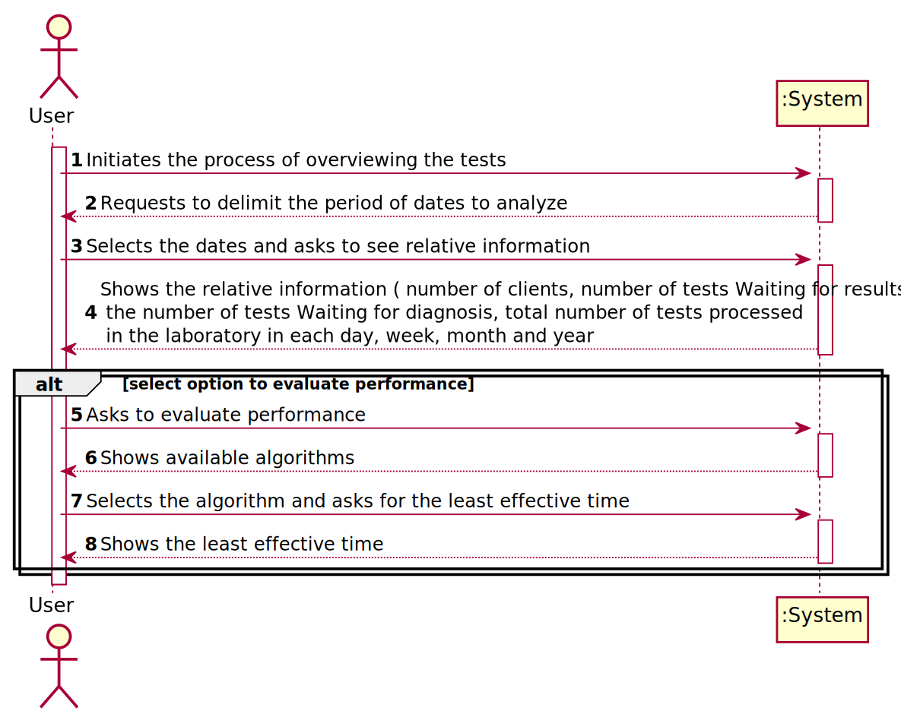
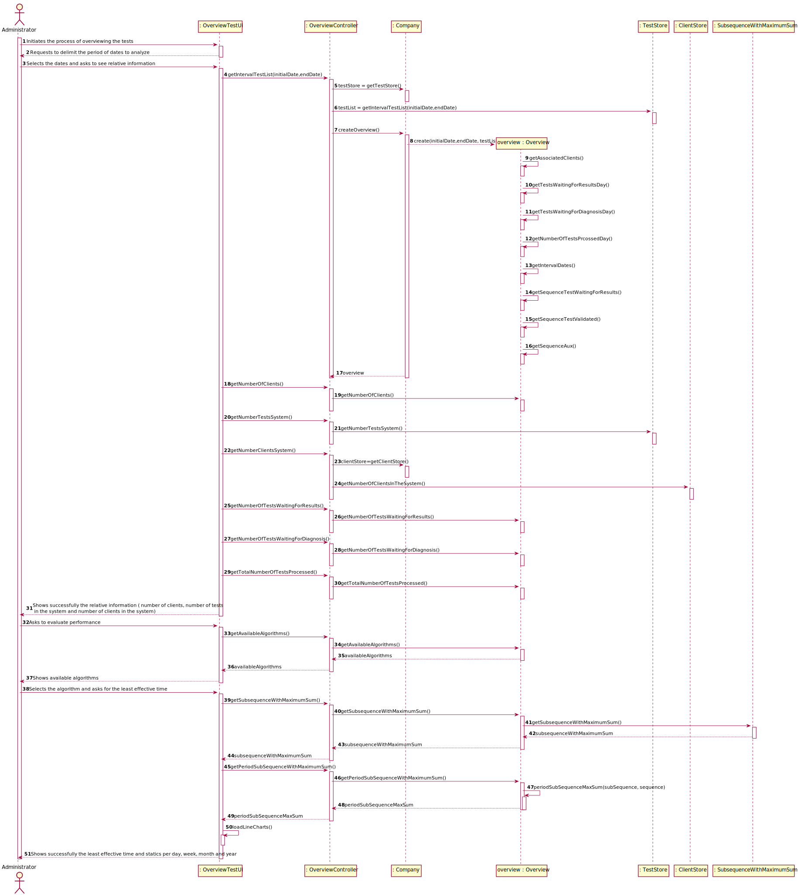
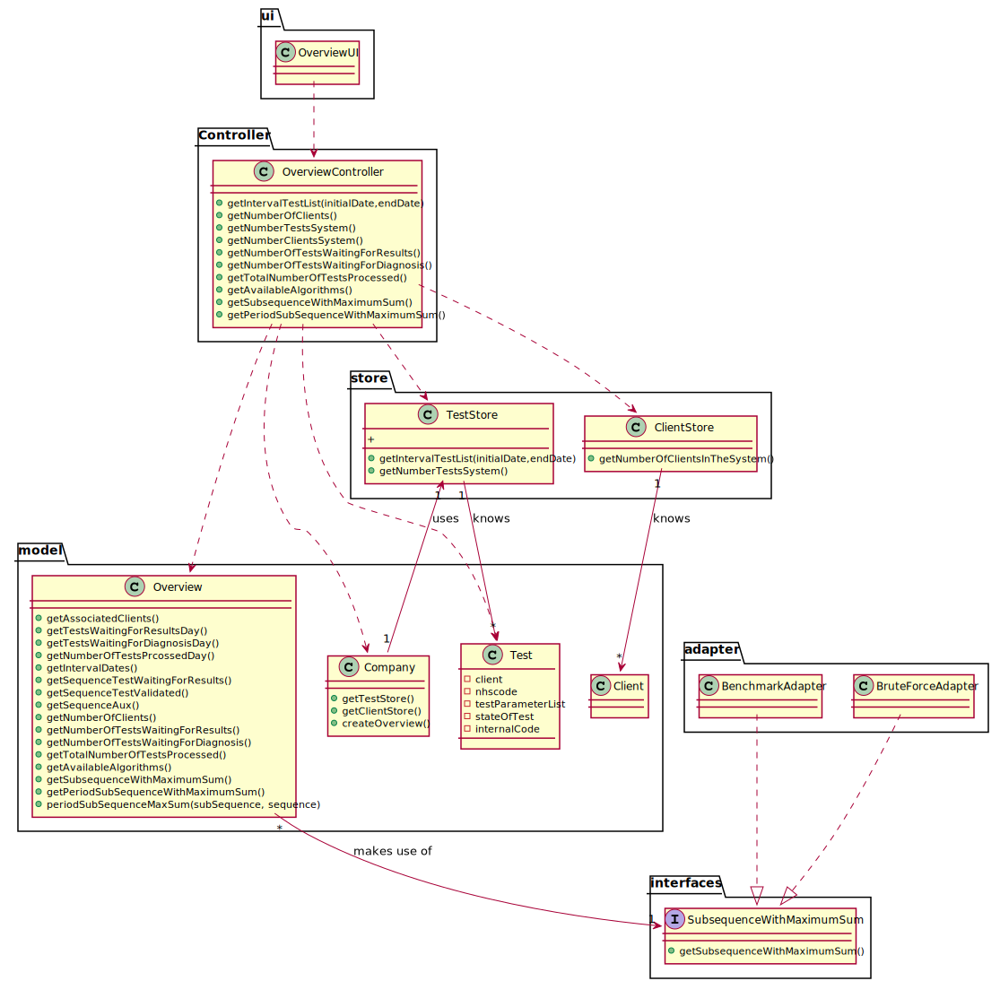

# US 16 -  I want to have an overview of all the tests performed by Many Labs and analyse the overall performance of the company

## 1. Requirements Engineering

### 1.1. User Story Description

*As a laboratory coordinator, I want to have an overview of all the tests performed by Many Labs and analyse the overall performance of the company*

### 1.2. Customer Specifications and Clarifications 

**From the specifications document:**

>Moreover, Many Labs is a company that needs to be continuously evaluating and improving its
internal processes to achieve excellence and to beat the competition. Therefore, the company wants
to decrease the number of tests waiting for its result. To evaluate this, it proceeds as following: for
any interval of time, for example one week (6 working days with 12 working hours per day), the
difference between the number of new tests and the number of results available to the client during
each half an hour period is computed. In that case, a list with 144 integers is obtained, where a
positive integer means that in such half an hour more tests were processed than results were
obtained, and a negative integer means the opposite. Now, the problem consists in determining what
the contiguous subsequence of the initial sequence is, whose sum of their entries is maximum. This
will show the time interval, in such week, when the company was less effective in responding. So,
the application should implement a brute-force algorithm (an algorithm which examines each
subsequence) to determine the contiguous subsequence with maximum sum, for any interval of time
registered. 

>The implemented algorithm should be analysed in terms of its worst-case time complexity, 
and it should be compared to a provided benchmark algorithm. The algorithm to be
used by the application must be defined through a configuration file.

>The complexity analysis must be accompanied by the observation of the execution time of the
algorithms for inputs of variable size in order to observe the asymptotic behaviour. The time
complexity analysis of the algorithms should be properly documented in the application user
manual (in the annexes) that must be delivered with the application.

**From the client clarifications:**

> **Question:** Should the interval of time considered for the evaluation be asked to the Laboratory Coordinator?
> 
> [**Awnser:**](https://moodle.isep.ipp.pt/mod/forum/discuss.php?d=8831) Yes.

> **Question:** How should we ask him the interval of time to be considered? Should we ask him to type a number of days? A number of weeks? Should we give general options like: last week, last month..., for him to select from?
>  
> In case the Laboratory Coordinator chooses, for example, one week, should we consider the last 7 days, or should we consider, for example, the data from monday to sunday?
>
> [**Awnser:**](https://moodle.isep.ipp.pt/mod/forum/discuss.php?d=8831) The laboratory coordinator should introduce two dates that define an interval, the beginning date and the end date. This interval will be used to find the contiguous subsequence with maximum sum.

> **Question:** What is the meaning of "overview" here? Should the laboratory coordinator see the number of tests waiting for samples, the number of tests waiting for results, the number of tests waiting for diagnoses... Or should he see the information available for each one of the tests in the application?
>
> [**Awnser:**](https://moodle.isep.ipp.pt/mod/forum/discuss.php?d=8831) The laboratory coordinator should be able to check the number of clients, the number of tests waiting for results, the number of tests waiting for diagnosis and the total number of tests processed in the laboratory in each day, week, month and year. Moreover, the laboratory coordinator should be able to check the contiguous subsequence with maximum sum.

> **Question:** You said in this [**Q&A**](https://moodle.isep.ipp.pt/mod/forum/discuss.php?d=8831), that the laboratory coordinator should define an interval, the beginning date and the end date.
>  Can we assume that every day in the interval defined by the coordinator is a working day with 12 working hours each?
>
> [**Awnser:**](https://moodle.isep.ipp.pt/mod/forum/discuss.php?d=8906) Yes.

> **Question:** If Saturday or Sunday are in the interval should we skip them or count them also as working days?
>
> [**Awnser:**](https://moodle.isep.ipp.pt/mod/forum/discuss.php?d=8906) Sunday is not a working day. All the other days of the week are working days.

> **Question:** "For example one week (6 working days with 12 working hours)"  In this case, is there any specifc hour to start filling the 144 integers list?
>
> [**Awnser:**](https://moodle.isep.ipp.pt/mod/forum/discuss.php?d=8906) A working day is from 8h00 to 20h00.

> **Question:** After the Laboratory Coordinator types the requested data and views the analysis of the company performance, should he be able to re-type different data and view the results for a different interval of time and/or algorithm? To make the re-type of the data easier, should there be a "clear" button, that is responsible for clearing the text fields for data entry?
>
> [**Awnser:**](https://moodle.isep.ipp.pt/mod/forum/discuss.php?d=8901) The laboratory coordinator should be able to explore different parameter values (settings) and check the results. Each team should prepare a simple and intuitive interface that requires a minimum number of interactions with the user.

> **Question:** On the project description is written that "The algorithm to be used by the application must be defined through a configuration file", but on the requirements is written that "the laboratory coordinator should have the ability to dynamically select the algorithm to be applied from the ones available on the system". Should we discard the configuration file and add an option on th program to select one of the available algorithms?
>
> [**Awnser:**](https://moodle.isep.ipp.pt/mod/forum/discuss.php?d=8931) Developing an application, like the one we are developing during the Integrative Project, is a dynamic process and the best teams are those who are prepared to react to change quickly. Moreover, the latest client requests/requirements are those that should be considered. Typically, a client updates the requirements throughout the project development.
Please consider the requirements introduced at the beginning of Sprint D. The laboratory coordinator should have the ability to dynamically select the algorithm to be applied from the ones available on the system (either the benchmark algorithm provided in moodle or the brute-force algorithm to be developed by each team).

> **Question:** The elements used in the algorithm refer to a half-hour interval?
>
> [**Awnser:**](https://moodle.isep.ipp.pt/mod/forum/discuss.php?d=8964) Yes.

> **Question:** How do we obtain the number to be used in the algorithm do we subtract tests that got a result in that interval and the tests registered?
>
> [**Awnser:**](https://moodle.isep.ipp.pt/mod/forum/discuss.php?d=8964) Yes.

> **Question:** Regarding US16, when the laboratory coordinator "analyses the overall performance of the company", is the analysis purely looking at the results? Or should he write any type of report based on the results for the interval he is seeing?
>
> [**Awnser:**](https://moodle.isep.ipp.pt/mod/forum/discuss.php?d=8963) You should only identify the time interval where there was a delay in the response (the maximum subsequence).

> **Question:** When you say tests waiting results are you referring to tests with samples collected but not analyzed yet? If so, and considering the csv file does not have an explicit date for when the sample is collected, which date should we use?
>
> [**Awnser:**](https://moodle.isep.ipp.pt/mod/forum/discuss.php?d=9169) You should use the test registration date (Test_Reg_DateHour).

> **Question:** What is the total number of tests processed in the laboratory? Is it the number of tests that were given results in that time span or is it the number of tests that were validated in that time span?
>
> [**Awnser:**](https://moodle.isep.ipp.pt/mod/forum/discuss.php?d=9198) The total number of tests processed in the laboratory is the total number of tests that were validated by the laboratory coordinator.
In a previous answer I asked: "The laboratory coordinator should be able to check the number of clients, the number of tests waiting for results, the number of tests waiting for diagnosis and the total number of tests processed in the laboratory in each day, week, month and year. "
I asked these statistics for a given interval that should be selected by the user. Moreover, the application should also show to the laboratory coordinator the total number of clients and the total number of validated tests that exist in the system.

> **Question:** What are the statistics that require a graph, could you specify, please.
>
> [**Awnser:**](https://moodle.isep.ipp.pt/mod/forum/discuss.php?d=9204) In a previous post I asked: "The laboratory coordinator should be able to check the number of clients, the number of tests waiting for results, the number of tests waiting for diagnosis and the total number of tests processed (tests validated) in the laboratory in each day, week, month and year. The system should show these statistics for a given interval that should be selected/defined by the user".
The application should present these statistics using four graphs/charts, one for each time resolution (day, week, month and year). Moreover, the application should also show to the laboratory coordinator the total number of clients and the total number of validated tests that exist in the system. There is no need to show these information using a graph/chart.

### 1.3. Acceptance Criteria

*Insert here the client acceptance criteria.*

* **AC1:** While evaluating the performance the laboratory
  coordinator should have the ability to dynamically select the algorithm to be
  applied from the ones available on the system (the benchmark algorithm provided
  in moodle and the brute-force algorithm to be developed). Support for easily
  adding other similar algorithms is required.
  
* **AC2:** The laboratory coordinator should introduce two dates, the interval to find the contiguous subsequence with maximum sum.

* **AC3:** The laboratory coordinator should be able to check the number of clients, the number of tests waiting for results, the number of tests waiting for diagnosis and the total number of tests processed in the laboratory in each day, week, month and year. Moreover, the laboratory coordinator should be able to check the contiguous subsequence with maximum sum.

* **AC4:** Sunday is not a working day. All the other days of the week are working days.

* **AC5:** A working day is from 8h00 to 20h00.

### 1.4. Found out Dependencies

### 1.5 Input and Output Data

**Input Data:**

* Typed data:

    * Period to analyze - start date and end date
    
* Selected data:
  
    * Algorithm

**Output Data:**

* Number of clients in the scope
* Number of clients in the system
* Number of tests waiting for results per day, week, month and year
* Number of tests waiting for diagnosis per day, week, month and year
* Total Number of tests processed in the laboratory in each day, week, month and year
* Least effective interval (Sub sequence with maximum sum)
* (In)Success of the operation

### 1.6. System Sequence Diagram (SSD)

## 2. OO Analysis

### 2.1. Relevant Domain Model Excerpt

### 2.2. Other Remarks

## 3. Design - User Story Realization 

### 3.1. Rationale

**The rationale grounds on the SSD interactions and the identified input/output data.**

| Interaction ID | Question: Which class is responsible for...                     | Answer                        | Justification (with patterns)                                                                                                                                                                          |
|:-------------  |:--------------------------------------------------------------- |:-----------------------------:|:------------------------------------------------------------------------------------------------------------------------------------------------------------------------------------------------------ |
| Step 1  		 | ... interacting with the actor?                                 | OverviewTestUI                | **Pure Fabrication**: There is no justification for assigning this responsibility to any existing class in the Domain Model.                                                                           |
|                | ... coordinating the US?                                        | OverviewController            | **Controller**                                                                                                                                                                                         |
| Step 2  		 |                                                                 |                               |                                                                                                                                                                                                        |
| Step 3         | ... saving the typed data?                                      | Overview                      | **IE**: Owns its data.                                                                                                                                                                                 |
|                | ... instantiating a new Overview?                               | Company                       | **Creator (R1)**                                                                                                                                                                                       |
|                | ... knowing the tests that meet some date in that range?        | TestStore                     | **IE**: Knows all the tests.                                                                                                                                                                           |
|                | ... knowing the TestStore?                                      | Company                       | **IE**: The company knows the TestStore to which it is delegating some tasks.                                                                                                                          |
|                | ... knowing the total number of clients in the system?          | ClientStore                   | **IE**: Knows all the clients.                                                                                                                                                                         |
|                | ... knowing the ClientStore?                                    | Company                       | **IE**: The company knows the ClientStore to which it is delegating some tasks.                                                                                                                        |
|                | ... knowing the total number of tests in the system?            | TestStore                     | **IE**: Knows all the tests.                                                                                                                                                                           |
| Step 4  		 | ... show the information to the user?                           | OverviewTestUI                | **IE**: Is responsible for user interactions.                                                                                                                                                          |
| Step 5         | ... knowing the available algorithms?                           | Overview                      | **IE**: knows through which algorithms it can get the information it needs                                                                                                                             |
| Step 6  		 |                                                                 |                               |                                                                                                                                                                                                        |
| Step 7         | ... get the subsequence with maximum sum?                       | Overview                      | **IE**: Has the necessary information                                                                                                                                                                  |
|                | ... knowing the tests waiting for result by day, week, month and year?| Overview                      | **IE**: Owns its data.                                                                                                                                                                           |
|                | ... knowing the tests waiting for diagnosis by day, week, month and year?| Overview                      | **IE**: Owns its data.                                                                                                                                                                        |
|                | ... knowing the tests performed by day, week, month and year?   | Overview                      | **IE**: Owns its data.                                                                                                                                                                                 |
| Step 8  		 | ... informing operation success?                                | OverviewTestUI                | **IE**: Is responsible for user interactions.                                                                                                                                                          |

### Systematization ##

According to the taken rationale, the conceptual classes promoted to software classes are: 

 * Overview
 * Company
 * TestStore
 * ClientStore

Other software classes (i.e. Pure Fabrication) identified: 

 * OverviewTestUI
 * OverviewController

## 3.2. Sequence Diagram (SD)

*In this section, it is suggested to present an UML dynamic view stating the sequence of domain related software objects' interactions that allows to fulfill the requirement.* 

## 3.3. Class Diagram (CD)

*In this section, it is suggested to present an UML static view representing the main domain related software classes that are involved in fulfilling the requirement as well as and their relations, attributes and methods.*

# 4. Tests 
*In this section, it is suggested to systematize how the tests were designed to allow a correct measurement of requirements fulfilling.* 

        @Test
        public void getAvailableAlgorithms() throws ParseException {
           /* Company company = new Company("efwgtrt");
            List<TestParameter> listaDeParametros = new ArrayList<>();
            ParameterCategory pc = new ParameterCategory("12A4D","Covid-19");
            List<ParameterCategory> listPC = new ArrayList();
            listPC.add(pc);
            Parameter p = new Parameter("HB000","test","method", pc);
            Parameter p2 = new Parameter("PLT00","test","method", pc);
            TestParameterDTO temDto2 = new TestParameterDTO("frefrfe","PLT00");
            List<TestParameterDTO> listaDeParametrosDTO = new ArrayList<>();
            listaDeParametrosDTO.add(temDto2);
            TestParameter tpm1 = new TestParameter(p);
            TestParameter tpm2 = new TestParameter(p2);
            // listaDeParametros.add(tpm1);
            listaDeParametros.add(tpm2);
            Client la = new Client("freferf","1234567890123456","1234567890","12/09/2001","female","1234567890","12345678901","erferfregergerergreg@gmail.com","Rua das cavalas");
            TestType tt = new TestType("12345","test","collecting",listPC,"ExternalModule3API");
            NhsCode nhs = new NhsCode("123456789012");
            List<TestType> ttlist = new ArrayList<>();
            ttlist.add(tt);
            ClinicalAnalysisLaboratory lab = new ClinicalAnalysisLaboratory("Chemical","1234","12312312312","1231231231","12345",ttlist);
            app.domain.model.testrelated.Test test = new app.domain.model.testrelated.Test(la,nhs,tt,listaDeParametros,lab,"123123123123");
            List<app.domain.model.testrelated.Test> testList = new ArrayList<>();
            testList.add(test);
    
            Date initialDate = new Date("15/05/2021");
            Date endDate = new Date("30/05/2021");
    
            Overview overview = new Overview(initialDate,endDate,testList);
    
            List<String> availableAlgorithms = new ArrayList(Arrays.asList("Benchmark", "BruteForce"));
    
            Assert.assertEquals(availableAlgorithms,overview.getAvailableAlgorithms());
    
    
            */
        }
    
        @Test
        public void getIntervalDays() throws ParseException {
            /*Company company = new Company("Many Labs");
            ParameterCategory pc1 = new ParameterCategory("HM000","Hemogram");
            Parameter p1 = new Parameter("HB000","HB","Hemoglobin",pc1);
            List<ParameterCategory> list=new ArrayList();
            list.add(pc1);
            Client client = new Client("Rita","1231231231231231","1231231231","26/11/2002","1231231231","12345678900","rita@gmail.com","Avenida da República");
            NhsCode nhs = new NhsCode("123456789012");
            TestType tt = new TestType("BL000","blood","syringe",list,"ExternalModule2API");
            RefValue rv = new RefValue("mg",10,20);
            TestParameterResult tpr = new TestParameterResult(rv,"15","mg");
            TestParameter tp = new TestParameter(p1,tpr);
            List<TestParameter> tpList = new ArrayList<>();
            tpList.add(tp);
            List<TestType> ttlist = new ArrayList<>();
            ttlist.add(tt);
            ClinicalAnalysisLaboratory lab = new ClinicalAnalysisLaboratory("Chemical","1234","12312312312","1231231231","12345",ttlist);
            app.domain.model.testrelated.Test test = new app.domain.model.testrelated.Test(client,nhs,tt,tpList,lab,"128123123123", new Date("18/05/2021  10:07:00"), new Date("19/05/2021  10:07:00"),new Date("20/05/2021  10:07:00"),new Date("16/05/2021  10:07:00") );
            app.domain.model.testrelated.Test test2 = new app.domain.model.testrelated.Test(client,nhs,tt,tpList,lab,"128123123123", new Date("18/05/2021  10:07:00"), new Date("19/05/2021  10:07:00"),new Date("20/05/2021  10:07:00"),new Date("16/05/2021  10:07:00") );
            app.domain.model.testrelated.Test test3 = new app.domain.model.testrelated.Test(client,nhs,tt,tpList,lab,"128123123123", new Date("18/05/2021  10:07:00"), new Date("19/05/2021  10:07:00"),new Date("20/05/2021  10:07:00"),new Date("16/05/2021  10:07:00") );
    
    
           Date initialDate = new Date("14/05/2021  10:07:00");
           Date endDate = new Date ("25/05/2021  10:07:00");
    
    
    
    
           List<app.domain.model.testrelated.Test> testList = new ArrayList<>();
           testList.add(test);
           testList.add(test2);
           testList.add(test3);
    
           Overview overview = new Overview (initialDate,endDate,testList);
           overview.getIntervalDays();
    
           List<Date> dateList = new ArrayList<>();
    
            dateList = overview.getDates();
    
            Assert.assertEquals(dateList,overview.getDates());
    
             */
    
        }
    
        @Test
        public void getAssociatedClients() throws ParseException {
            /*
            Company company = new Company("Many Labs");
            ParameterCategory pc1 = new ParameterCategory("HM000","Hemogram");
            Parameter p1 = new Parameter("HB000","HB","Hemoglobin",pc1);
            List<ParameterCategory> list=new ArrayList();
            list.add(pc1);
            Client client = new Client("Rita","1231231231231231","1231231231","26/11/2002","1231231231","12345678900","rita@gmail.com","Avenida da República");
            NhsCode nhs = new NhsCode("123456789012");
            TestType tt = new TestType("BL000","blood","syringe",list,"ExternalModule2API");
            RefValue rv = new RefValue("mg",10,20);
            TestParameterResult tpr = new TestParameterResult(rv,"15","mg");
            TestParameter tp = new TestParameter(p1,tpr);
            List<TestParameter> tpList = new ArrayList<>();
            tpList.add(tp);
            List<TestType> ttlist = new ArrayList<>();
            ttlist.add(tt);
            ClinicalAnalysisLaboratory lab = new ClinicalAnalysisLaboratory("Chemical","1234","12312312312","1231231231","12345",ttlist);
            app.domain.model.testrelated.Test test = new app.domain.model.testrelated.Test(client,nhs,tt,tpList,lab,"128123123123", new Date("18/05/2021  10:07:00"), new Date("19/05/2021  10:07:00"),new Date("20/05/2021  10:07:00"),new Date("16/05/2021  10:07:00") );
            app.domain.model.testrelated.Test test2 = new app.domain.model.testrelated.Test(client,nhs,tt,tpList,lab,"128123123123", new Date("18/05/2021  10:07:00"), new Date("19/05/2021  10:07:00"),new Date("20/05/2021  10:07:00"),new Date("16/05/2021  10:07:00") );
            app.domain.model.testrelated.Test test3 = new app.domain.model.testrelated.Test(client,nhs,tt,tpList,lab,"128123123123", new Date("18/05/2021  10:07:00"), new Date("19/05/2021  10:07:00"),new Date("20/05/2021  10:07:00"),new Date("16/05/2021  10:07:00") );
    
    
            Date initialDate = new Date("14/05/2021  10:07:00");
            Date endDate = new Date ("25/05/2021  10:07:00");
    
    
            List<app.domain.model.testrelated.Test> testList = new ArrayList<>();
            testList.add(test);
            testList.add(test2);
            testList.add(test3);
    
            Overview overview = new Overview (initialDate,endDate,testList);
    
    
            List<Client> clList = new ArrayList<>();
            clList.add(client);
            int sizeexpected = clList.size();
            int sizeresult = overview.getNumberOfClients();
    
            Assert.assertEquals(sizeexpected,sizeresult);
    
             */
        }

*It is also recommended to organize this content by subsections.* 

# 5. Construction (Implementation)

*In this section, it is suggested to provide, if necessary, some evidence that the construction/implementation is in accordance with the previously carried out design. Furthermore, it is recommeded to mention/describe the existence of other relevant (e.g. configuration) files and highlight relevant commits.*

* Class OverviewController

    package app.controller;
    
    import app.domain.model.Company;
    import app.domain.model.testrelated.Overview;
    import app.domain.model.testrelated.Test;
    import app.domain.store.ClientStore;
    import app.domain.store.TestStore;
    import java.text.ParseException;
    import java.util.Date;
    import java.util.List;
    
    public class OverviewController {
    
        /**
         * Represents an instance of app.
         */
        private App app;
    
        /**
         * Represents a instance of company.
         */
        private Company company;
    
        /**
         * Represents an instance of the test store.
         */
        private TestStore testStore;
    
        /**
         * Represents an instance of the client store.
         */
        private ClientStore clientStore;
        /**
         * Represents an instance of Overview
         */
        private Overview overview;
    
        /**
         * Constructs an instance of {@code OverviewController}.
         */
        public OverviewController(){
            this.app=App.getInstance();
            this.company=app.getCompany();
        }
    
        /**
         * Constructs an instance of {@code OverviewController} receiving a company.
         * @param company The company.
         */
        public OverviewController(Company company) {
            this.app=App.getInstance();
            this.company =company;
        }
    
        /**
         * Process data from the date range
         * @param initialDate the initial date of the interval
         * @param endDate the end date of the interval
         * @throws ParseException if the conversion of dates does not go well
         */
        public void getIntervalTestList(Date initialDate, Date endDate) throws ParseException {
            this.testStore=company.getTestStore();
            List<Test> testList = testStore.getIntervalTestList(initialDate, endDate);
            this.overview=company.createOverview(initialDate,endDate,testList);
        }
    
        /**
         * Get the number of clients in the system
         * @return the number of clients in the system
         */
        public int getNumberOfClients(){
            return overview.getNumberOfClients();
        }
    
        /**
         * Gets the number of tests in the system
         * @return the number of tests in the system
         */
        public int getNumberTestsSystem(){
            return testStore.getTestList().size();
        }
    
        /**
         * Gets the number of the clients in the system
         * @return the number of the clients in the system
         */
        public int getNumberClientsSystem(){
            this.clientStore=company.getClientStore();
            return clientStore.getClientList().size();
        }
    
        /**
         * Gets the date of the clients
         * @return the date of the clients
         */
        public List<Date> getDates(){
            return overview.getDates();
        }
    
        /**
         * Get the number of tests waiting for results in the system
         * @return the number of tests waiting for results in the system
         */
        public List<Integer>  getNumberOfTestsWaitingForResults(){
            return overview.getTestWaitingForResults();
        }
    
        public List<Date> getIntervalDates(){
            return overview.getIntervalDates();
        }
        /**
         * Get the number of tests waiting for diagnosis in the system
         * @return the number of tests waiting for diagnosis in the system
         */
        public List<Integer>  getNumberOfTestsWaitingForDiagnosis(){
            return overview.getTestsWaitingForDiagnosis();
        }
    
        /**
         * Get the number of tests processed in the system
         * @return the number of tests processed in the system
         */
        public List<Integer> getTotalNumberOfTestsProcessed(){
            return overview.getTestProcessed();
        }
    
        /**
         * The list of available algorithms in the system
         * @return the list of algorithms
         */
        public List<String> getAvailableAlgorithms(){
            return overview.getAvailableAlgorithms();
        }
    
        /**
         * Get the maximum subsequence of a interval
         * @param algorithm algorithm to be used for calculation of the maximum subsequence
         * @return the subsequence maximum
         * @throws ClassNotFoundException if it is not possible to instantiate the desired class
         * @throws IllegalAccessException if the object we intend to create it's not  correctly
         * @throws InstantiationException if we can't instantiate an object
         */
        public int[] getSubsequenceWithMaximumSum(String algorithm) throws ClassNotFoundException, IllegalAccessException, InstantiationException {
            return overview.getSubsequenceWithMaximumSum(algorithm);
        }
    
        /**
         * Sets an algorithm
         * @param algorithm A algorithm
         * @throws ClassNotFoundException
         * @throws IllegalAccessException
         * @throws InstantiationException
         */
        public void sendAlgorithm(String algorithm) throws ClassNotFoundException, IllegalAccessException, InstantiationException {
            overview.setAlgorithm(algorithm);
        }
    
        /**
         * Gets the Period Sub Sequence
         * @return the Period Sub Sequence
         */
        public String[] getPeriodSubSequenceMaxSum(){
            return overview.getPeriodSubSequenceMaxSum();
        }
    
        /**
         * Get the sequence
         * @return the sequence
         */
        public int[] getSequence(){
            return overview.getSequence();
        }
    
    }

# 6. Integration and Demo 

*In this section, it is suggested to describe the efforts made to integrate this functionality with the other features of the system.*

# 7. Observations

*In this section, it is suggested to present a critical perspective on the developed work, pointing, for example, to other alternatives and or future related work.*

