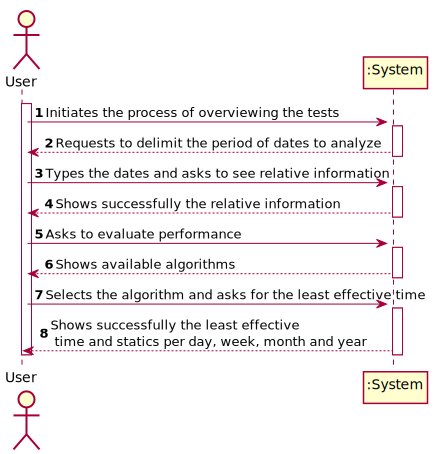
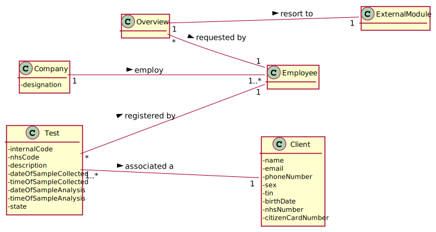

# US 16 -  I want to have an overview of all the tests performed by Many Labs and analyse the overall performance of the company

## 1. Requirements Engineering

*In this section, it is suggested to capture the requirement description and specifications as provided by the client as well as any further clarification on it. It is also suggested to capture the requirements acceptance criteria and existing dependencies to other requirements. At last, identfy the involved input and output data and depicted an Actor-System interaction in order to fulfill the requirement.*

### 1.1. User Story Description

*As a laboratory coordinator, I want to have an overview of all the tests performed by Many Labs and analyse the overall performance of the company*

### 1.2. Customer Specifications and Clarifications 

*Insert here any related specification and/or clarification provided by the client together with **your interpretation**. When possible, provide a link to such specifications/clarifications.*

**From the specifications document:**

>Moreover, Many Labs is a company that needs to be continuously evaluating and improving its
internal processes to achieve excellence and to beat the competition. Therefore, the company wants
to decrease the number of tests waiting for its result. To evaluate this, it proceeds as following: for
any interval of time, for example one week (6 working days with 12 working hours per day), the
difference between the number of new tests and the number of results available to the client during
each half an hour period is computed. In that case, a list with 144 integers is obtained, where a
positive integer means that in such half an hour more tests were processed than results were
obtained, and a negative integer means the opposite. Now, the problem consists in determining what
the contiguous subsequence of the initial sequence is, whose sum of their entries is maximum. This
will show the time interval, in such week, when the company was less effective in responding. So,
the application should implement a brute-force algorithm (an algorithm which examines each
subsequence) to determine the contiguous subsequence with maximum sum, for any interval of time
registered. 

>The implemented algorithm should be analysed in terms of its worst-case time complexity, 
and it should be compared to a provided benchmark algorithm. The algorithm to be
used by the application must be defined through a configuration file.

>The complexity analysis must be accompanied by the observation of the execution time of the
algorithms for inputs of variable size in order to observe the asymptotic behaviour. The time
complexity analysis of the algorithms should be properly documented in the application user
manual (in the annexes) that must be delivered with the application.

**From the client clarifications:**

> **Question:** Should the interval of time considered for the evaluation be asked to the Laboratory Coordinator?
> 
> [**Awnser:**](https://moodle.isep.ipp.pt/mod/forum/discuss.php?d=8831) Yes.

> **Question:** How should we ask him the interval of time to be considered? Should we ask him to type a number of days? A number of weeks? Should we give general options like: last week, last month..., for him to select from?
>  
> In case the Laboratory Coordinator chooses, for example, one week, should we consider the last 7 days, or should we consider, for example, the data from monday to sunday?
>
> [**Awnser:**](https://moodle.isep.ipp.pt/mod/forum/discuss.php?d=8831) The laboratory coordinator should introduce two dates that define an interval, the beginning date and the end date. This interval will be used to find the contiguous subsequence with maximum sum.

> **Question:** What is the meaning of "overview" here? Should the laboratory coordinator see the number of tests waiting for samples, the number of tests waiting for results, the number of tests waiting for diagnoses... Or should he see the information available for each one of the tests in the application?
>
> [**Awnser:**](https://moodle.isep.ipp.pt/mod/forum/discuss.php?d=8831) The laboratory coordinator should be able to check the number of clients, the number of tests waiting for results, the number of tests waiting for diagnosis and the total number of tests processed in the laboratory in each day, week, month and year. Moreover, the laboratory coordinator should be able to check the contiguous subsequence with maximum sum.

> **Question:** You said in this [**Q&A**](https://moodle.isep.ipp.pt/mod/forum/discuss.php?d=8831), that the laboratory coordinator should define an interval, the beginning date and the end date.
>  Can we assume that every day in the interval defined by the coordinator is a working day with 12 working hours each?
>
> [**Awnser:**](https://moodle.isep.ipp.pt/mod/forum/discuss.php?d=8906) Yes.

> **Question:** If Saturday or Sunday are in the interval should we skip them or count them also as working days?
>
> [**Awnser:**](https://moodle.isep.ipp.pt/mod/forum/discuss.php?d=8906) Sunday is not a working day. All the other days of the week are working days.

> **Question:** "For example one week (6 working days with 12 working hours)"  In this case, is there any specifc hour to start filling the 144 integers list?
>
> [**Awnser:**](https://moodle.isep.ipp.pt/mod/forum/discuss.php?d=8906) A working day is from 8h00 to 20h00.

> **Question:** After the Laboratory Coordinator types the requested data and views the analysis of the company performance, should he be able to re-type different data and view the results for a different interval of time and/or algorithm? To make the re-type of the data easier, should there be a "clear" button, that is responsible for clearing the text fields for data entry?
>
> [**Awnser:**](https://moodle.isep.ipp.pt/mod/forum/discuss.php?d=8901) The laboratory coordinator should be able to explore different parameter values (settings) and check the results. Each team should prepare a simple and intuitive interface that requires a minimum number of interactions with the user.

> **Question:** On the project description is written that "The algorithm to be used by the application must be defined through a configuration file", but on the requirements is written that "the laboratory coordinator should have the ability to dynamically select the algorithm to be applied from the ones available on the system". Should we discard the configuration file and add an option on th program to select one of the available algorithms?
>
> [**Awnser:**](https://moodle.isep.ipp.pt/mod/forum/discuss.php?d=8931) Developing an application, like the one we are developing during the Integrative Project, is a dynamic process and the best teams are those who are prepared to react to change quickly. Moreover, the latest client requests/requirements are those that should be considered. Typically, a client updates the requirements throughout the project development.
Please consider the requirements introduced at the beginning of Sprint D. The laboratory coordinator should have the ability to dynamically select the algorithm to be applied from the ones available on the system (either the benchmark algorithm provided in moodle or the brute-force algorithm to be developed by each team).

> **Question:** The elements used in the algorithm refer to a half-hour interval?
>
> [**Awnser:**](https://moodle.isep.ipp.pt/mod/forum/discuss.php?d=8964) Yes.

> **Question:** How do we obtain the number to be used in the algorithm do we subtract tests that got a result in that interval and the tests registered?
>
> [**Awnser:**](https://moodle.isep.ipp.pt/mod/forum/discuss.php?d=8964) Yes.

> **Question:** Regarding US16, when the laboratory coordinator "analyses the overall performance of the company", is the analysis purely looking at the results? Or should he write any type of report based on the results for the interval he is seeing?
>
> [**Awnser:**](https://moodle.isep.ipp.pt/mod/forum/discuss.php?d=8963) You should only identify the time interval where there was a delay in the response (the maximum subsequence).

> **Question:** Regarding your answer: "The laboratory coordinator should be able to check the number of clients, the number of tests waiting for results, the number of tests waiting for diagnosis and the total number of tests processed in the laboratory in each day, week, month and year. Moreover, the laboratory coordinator should be able to check the contiguous subsequence with maximum sum."
>
> **Question:** Displaying information in each day, week, month and year is it only specific for total number of tests processed in the Laboratory or it is also necessary for number of clients, number of tests waiting for results and waiting for diagnosis? This information should be an all time analysis or should be filtered by the two dates defined by the coordinator? Or the two dates defined by the coordinator is only necessary to check the contiguous subsequence with maximum sum?
> 
> [**Awnser:**](https://moodle.isep.ipp.pt/mod/forum/discuss.php?d=9134)
> 
> **Question:**  How the information should appear to the coordinator? Should he select what he wants to analyse or all the information should appear at once? (for example: option 1: show information about clients, 2 information about number of tests waiting for results, etc.)
>
> [**Awnser:**](https://moodle.isep.ipp.pt/mod/forum/discuss.php?d=9134)

> **Question:** In what way is the application supposed to show data such as the number of clients, tests waiting for results and tests waiting for diagnosis? Is it supposed to only show the current number for the moment the information is being consulted (ex: Number of Clients at the moment: X), or is it supposed to graphically show the information over a selected time period (day, week, month, year), such as the total number of tests processed in the laboratory?
>
> [**Awnser:**](https://moodle.isep.ipp.pt/mod/forum/discuss.php?d=9133)

> **Question:** When you say tests waiting results are you referring to tests with samples collected but not analyzed yet? If so, and considering the csv file does not have an explicit date for when the sample is collected, which date should we use?
>
> [**Awnser:**](https://moodle.isep.ipp.pt/mod/forum/discuss.php?d=9169) You should use the test registration date (Test_Reg_DateHour).

> **Question:** What is the total number of tests processed in the laboratory? Is it the number of tests that were given results in that time span or is it the number of tests that were validated in that time span?
>
> [**Awnser:**](https://moodle.isep.ipp.pt/mod/forum/discuss.php?d=9198) The total number of tests processed in the laboratory is the total number of tests that were validated by the laboratory coordinator.
In a previous answer I asked: "The laboratory coordinator should be able to check the number of clients, the number of tests waiting for results, the number of tests waiting for diagnosis and the total number of tests processed in the laboratory in each day, week, month and year. "
I asked these statistics for a given interval that should be selected by the user. Moreover, the application should also show to the laboratory coordinator the total number of clients and the total number of validated tests that exist in the system.

> **Question:** What are the statistics that require a graph, could you specify, please.
>
> [**Awnser:**](https://moodle.isep.ipp.pt/mod/forum/discuss.php?d=9204) In a previous post I asked: "The laboratory coordinator should be able to check the number of clients, the number of tests waiting for results, the number of tests waiting for diagnosis and the total number of tests processed (tests validated) in the laboratory in each day, week, month and year. The system should show these statistics for a given interval that should be selected/defined by the user".
The application should present these statistics using four graphs/charts, one for each time resolution (day, week, month and year).

### 1.3. Acceptance Criteria

*Insert here the client acceptance criteria.*

* **AC1:** While evaluating the performance the laboratory
  coordinator should have the ability to dynamically select the algorithm to be
  applied from the ones available on the system (the benchmark algorithm provided
  in moodle and the brute-force algorithm to be developed). Support for easily
  adding other similar algorithms is required.
### 1.4. Found out Dependencies

*Identify here any found out dependency to other US and/or requirements.*

### 1.5 Input and Output Data

*Identity here the data to be inputted by the system actor as well as the output data that the system have/needs to present in order to properly support the actor actions. Regarding the inputted data, it is suggested to distinguish between typed data and selected data (e.g. from a list)*

**Input Data:**

* Typed data:

    * Period to analyze - start date and end date
    
* Selected data:
    * Algorithm

**Output Data:**

* Number of clients in the scope
* Number of clients in the system
* Number of tests waiting for results per day, week, month and year
* Number of tests waiting for diagnosis per day, week, month and year
* Total Number of tests processed in the laboratory in each day, week, month and year
* Least effective interval (Sub sequence with maximum sum)
* (In)Success of the operation

### 1.6. System Sequence Diagram (SSD)

*Insert here a SSD depicting the envisioned Actor-System interactions and throughout which data is inputted and outputted to fulfill the requirement. All interactions must be numbered.*

### 1.7 Other Relevant Remarks

*Use this section to capture other relevant information that is related with this US such as (i) special requirements ; (ii) data and/or technology variations; (iii) how often this US is held.* 

To facilitate overall analysis, the application should also display statistics and graphs.

## 2. OO Analysis

### 2.1. Relevant Domain Model Excerpt 
*In this section, it is suggested to present an excerpt of the domain model that is seen as relevant to fulfill this requirement.* 

### 2.2. Other Remarks

*Use this section to capture some aditional notes/remarks that must be taken into consideration into the design activity. In some case, it might be usefull to add other analysis artifacts (e.g. activity or state diagrams).* 

## 3. Design - User Story Realization 

### 3.1. Rationale

**The rationale grounds on the SSD interactions and the identified input/output data.**

| Interaction ID | Question: Which class is responsible for...                     | Answer                        | Justification (with patterns)                                                                                                                                                                          |
|:-------------  |:--------------------------------------------------------------- |:-----------------------------:|:------------------------------------------------------------------------------------------------------------------------------------------------------------------------------------------------------ |
| Step 1  		 | ... interacting with the actor?                                 | WriteMedicalReportUI          | **Pure Fabrication**: There is no justification for assigning this responsibility to any existing class in the Domain Model.                                                                           |
|                | ... coordinating the US?                                        | WriteMedicalReportController  | **Controller**                                                                                                                                                                                         |
| Step 2  		 | ... knowing the tests that are waiting for the medical report?  | TestStore                     | **IE**: Knows all the tests.                                                                                                                                                                           |
|                | ... knowing the TestStore?                                      | Company                       | **IE**: The company knows the TestStore to which it is delegating some tasks.                                                                                                                          |
|                | ... transferring business data in DTO?                          | TestMapper                    | **DTO**: In order for the UI not to have direct access to business objects, it is best to choose to use a DTO.                                                                                         |
| Step 3  		 |                                                                 |                               |                                                                                                                                                                                                        |
| Step 4  		 | ... knowing the parameters analyzed and the respective data?    | Test                          | **IE**: The test knows its own results.                                                                                                                                                                |
|                | ... transferring business data in DTO?                          | TestParameterMapper           | **DTO**: In order for the UI not to have direct access to business objects, it is best to choose to use a DTO.                                                                                         |
| Step 5         | ... saving the typed data?                                      | MedicalReport                 | **IE**: Owns its data.                                                                                                                                                                                 |
| Step 6  		 |                                                                 |                               |                                                                                                                                                                                                        |
| Step 7         | ... validating all data (global validation)?                    | Test                          | **IE**: Know if already have a medical report.                                                                                                                                                         |
|                | ... instantiating a new Medical Report?                         | Test                          | **Creator (R1)**                                                                                                                                                                                       |
|        		 | ... validating all data (local validation)?                     | MedicalReport                 | **IE**: Owns its data.                                                                                                                                                                                 |
|        		 | ... saving the creation time?                                   | MedicalReport                 | **IE**: The medical report knows when it was created.                                                                                                                                                  |
| Step 8  		 | ... informing operation success?                                | WriteMedicalReportUI          | **IE**: Is responsible for user interactions.                                                                                                                                                          |

### Systematization ##

According to the taken rationale, the conceptual classes promoted to software classes are: 

 * 

Other software classes (i.e. Pure Fabrication) identified: 

 * OverviewUI  
 * OverviewController

## 3.2. Sequence Diagram (SD)

*In this section, it is suggested to present an UML dynamic view stating the sequence of domain related software objects' interactions that allows to fulfill the requirement.* 

## 3.3. Class Diagram (CD)

*In this section, it is suggested to present an UML static view representing the main domain related software classes that are involved in fulfilling the requirement as well as and their relations, attributes and methods.*

# 4. Tests 
*In this section, it is suggested to systematize how the tests were designed to allow a correct measurement of requirements fulfilling.* 

**_DO NOT COPY ALL DEVELOPED TESTS HERE_**

**Test 1:** 

*It is also recommended to organize this content by subsections.* 

# 5. Construction (Implementation)

*In this section, it is suggested to provide, if necessary, some evidence that the construction/implementation is in accordance with the previously carried out design. Furthermore, it is recommeded to mention/describe the existence of other relevant (e.g. configuration) files and highlight relevant commits.*

*It is also recommended to organize this content by subsections.* 

# 6. Integration and Demo 

*In this section, it is suggested to describe the efforts made to integrate this functionality with the other features of the system.*

# 7. Observations

*In this section, it is suggested to present a critical perspective on the developed work, pointing, for example, to other alternatives and or future related work.*

