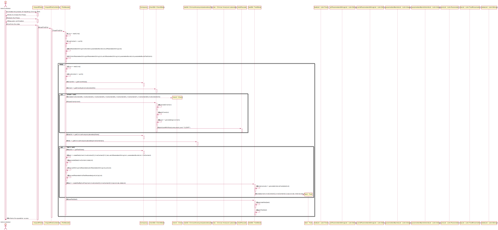
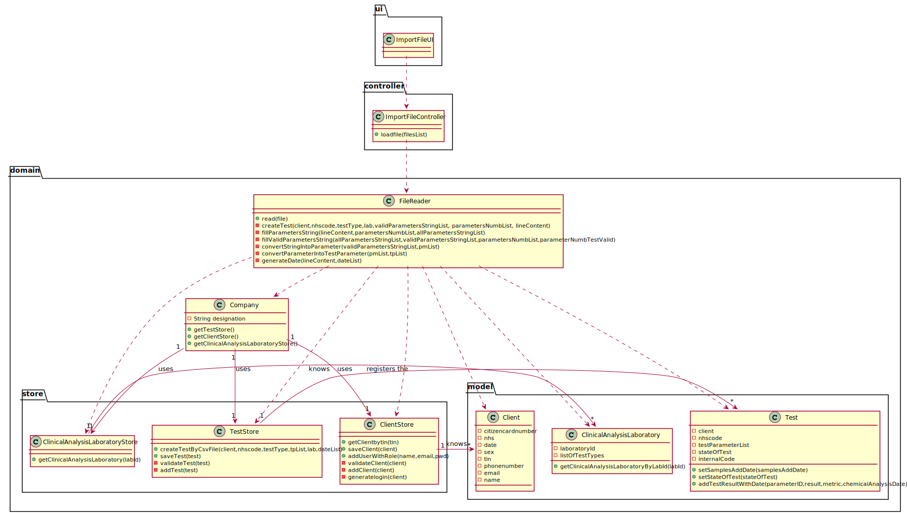

# US 17 - I want to import clinical tests from a CSV file.

## 1. Requirements Engineering

*In this section, it is suggested to capture the requirement description and specifications as provided by the client as well as any further clarification on it. It is also suggested to capture the requirements acceptance criteria and existing dependencies to other requirements. At last, identfy the involved input and output data and depicted an Actor-System interaction in order to fulfill the requirement.*

### 1.1. User Story Description

*As a laboratory coordinator, I want to import clinical tests from a CSV file.*

### 1.2. Customer Specifications and Clarifications 

*Insert here any related specification and/or clarification provided by the client together with **your interpretation**. When possible, provide a link to such specifications/clarifications.*

**From the specifications document:**

>In case of a new client, the receptionist registers the client in the application. To register a client, the receptionist needs the client’s citizen card number, National Healthcare Service (NHS) number, birth date, sex, Tax Identification number (TIF), phone number, e-mail and name.

> Once there, a receptionist asks the client’s citizen card number, the lab order (which contains the type of test and parameters to be measured), and registers in the application the test to be performed to that client.

**From the client clarifications:**

> **Question:** In what folder should the CSV file be when we want to use the application through the console?
> 
> [**Awnser:**](https://moodle.isep.ipp.pt/mod/forum/discuss.php?d=8857) In this sprint each team should develop a graphical user interface. The file to import can be located in any folder. The user should specify the path of the file.

> **Question:**  In the CSV, there is a parameter category that has 11 characters (Cholesterol). How do you suggest we should proceed?
>
> [**Awnser:**](https://moodle.isep.ipp.pt/mod/forum/discuss.php?d=8925#p11747)  Please modify your application to accept category names with a maximum of 15 characters.

> **Question:**  :In the CSV files provided for this sprint we can find a parameter with code HDL00 which belongs to the Cholesterol category and to the blood test type, but by searching the external modules for the blood test type the team could not find a match for the said parameter. What can we as a team do to resolve such issue?
>
> [**Awnser:**](https://moodle.isep.ipp.pt/mod/forum/discuss.php?d=8877#p11684)  If the API does not have reference values for this parameter, than you should not present the reference values to the application user.

> **Question:**  Will the CSV files always have the same format as the ones available on moodle?
>
> [**Awnser:**](https://moodle.isep.ipp.pt/mod/forum/discuss.php?d=8883#p11685)  Yes. But we can have more categories and parameters for each type of test.

> **Question:**   If a labID on the CSV file isn't found on the system, should we consider it "invalid data"?
>
> [**Awnser:**](https://moodle.isep.ipp.pt/mod/forum/discuss.php?d=8935#p11750)  Yes. To import tests of any laboratory (with a given Lab_ID), it is required that a laboratory having the given Lab_ID exists in the system. 
> 
>Therefore, if you want to import data from a given laboratory, you should use the application to create that laboratory in the system. Then you should import the data.
>
>When creating a laboratory in the system, you should use the given Lab_ID (available in the CSV file) and define the other attributes using valid data. In this project, we are NOT going to import data from laboratories (or other entities) to reduce the amount of hours required to develop and deliver a working application to the client.
>
>What I say in this message is valid for the laboratories and for other entities that appear in the CSV files.

> **Question:** Should we write some kind of report or should we just leave the report field empty and simply add the date?
> 
> [**Awnser:**](https://moodle.isep.ipp.pt/mod/forum/discuss.php?d=9204#p12186) Leave empty and simply add the date.
### 1.3. Acceptance Criteria

*Insert here the client acceptance criteria.*

* **AC1:** If the file contains invalid data, that data should not be load into the system. An exception should be thrown.
* **AC2:** To import tests of any laboratory, it is required that a laboratory having the given Lab_ID exists in the system.
* **AC3:** If the API does not have reference values for the given parameter, than the reference values should not be presented to the application user.

### 1.4. Found out Dependencies

To import tests of any laboratory, it is required that a laboratory having the given Lab_ID exists in the system.

### 1.5 Input and Output Data

**Input Data:**

* Typed data:
    
* Selected data:
    * File(s)
    
**Output Data:**

* (In)Success of the operation

### 1.6. System Sequence Diagram (SSD)

### 1.7 Other Relevant Remarks

To facilitate overall analysis, the application should also display statistics and graphs.

## 2. OO Analysis

### 2.1. Relevant Domain Model Excerpt 
*In this section, it is suggested to present an excerpt of the domain model that is seen as relevant to fulfill this requirement.* 

### 2.2. Other Remarks

## 3. Design - User Story Realization 

### 3.1. Rationale

**The rationale grounds on the SSD interactions and the identified input/output data.**

| Interaction ID | Question: Which class is responsible for...                     | Answer                        | Justification (with patterns)                                                                                                                                                                          |
|:-------------  |:--------------------------------------------------------------- |:-----------------------------:|:------------------------------------------------------------------------------------------------------------------------------------------------------------------------------------------------------ |
| Step 1  		 | ... interacting with the actor?                                 | ImportFileUI                  | **Pure Fabrication**: There is no justification for assigning this responsibility to any existing class in the Domain Model.                                                                           |
|                | ... coordinating the US?                                        | ImportFileController          | **Controller**                                                                                                                                                                                         |
| Step 2  		 | ...                                                             |                               |                                                                                                                                                                                                        |
| Step 3  		 |                                                                 |                               |                                                                                                                                                                                                        |
| Step 4  		 |                                                                 |                               |                                                                                                                                                                                                        |
| Step 5         |                                                                 |                               |                                                                                                                                                                                                        |
| Step 6  		 |                                                                 |                               |                                                                                                                                                                                                        |

### Systematization ##

According to the taken rationale, the conceptual classes promoted to software classes are: 

 * 

Other software classes (i.e. Pure Fabrication) identified: 

 * ImportFileUI
 * ImportFileController

## 3.2. Sequence Diagram (SD)

## 3.3. Class Diagram (CD)

# 4. Tests

**Test 1:** If the file contains invalid data, that data should not be load into the system. An exception should be thrown - AC1.

    @Test(expected = IllegalArgumentException.class)
    public void clientValidation(){
    Client cl= new Client("José David Teixeira Pessoa Pessoa Pessoa","1234567891234567","1234567891","12/12/1995","1231231231","12345678900","pessoa@gmail.com","Avenida da República");
    }

**Test 2:** To import tests of any laboratory, it is required that a laboratory having the given Lab_ID exists in the system - AC2.

    @Test
    public void laboratoryValidation(){
        Company company = new Company("Many Labs");
        ClinicalAnalysisLaboratory lab = new ClinicalAnalysisLaboratory("Clinical laboratory", "Rua 20", "12312312312", "1234567890", "1234s",company.getTestTypeStore().getTestTypeList());
        String s1 ="working";
        String s2 ="Not working";
        if(lab!=null){
            s2="working";
        }
        Assert.assertEquals(s1,s2);
    }

# 5. Construction (Implementation)

## Class ImportFileController
      /**
      * Initialize the instance variable
      */
      public ImportFileController(){
      this.fileread= new CSVFileReader();
      }
      
          /**
           * Calls the FileReader method to read from the file
           * @param files the list of file we need to read
           * @throws IOException if we have problems to open or close the file
           */
          public void loadFile(List<File> files) throws IOException {
              for (File f : files){
                  fileread.read(f);
              }
      
          }

## Class CSVFileReader

        /**
        * Reads a file receiving a file as a parameter
        * @param file
        * @throws IOException
        */
        public void read(File file) throws IOException {
        FileReader fr = new FileReader(file);
        BufferedReader br = new BufferedReader(fr);
        String line = "";
        String delimiter = ";";
        int i=1;
        int date=0;
        String[] tempArr;
        line = br.readLine();
        tempArr = line.split(delimiter);
        List<String> allParametersStringList=new ArrayList<>();
        List<String> validParametersStringList=new ArrayList<>();
        List<Integer> parametersNumbList=new ArrayList<>();
        List<Integer> parameterNumbTestValid= new ArrayList<>();
        date=fillParametersString(tempArr,parametersNumbList,allParametersStringList);
        fillValidParametersString(allParametersStringList,validParametersStringList,parametersNumbList,parameterNumbTestValid);
        
                    while((line = br.readLine()) != null) {
                        tempArr = line.split(delimiter);
                        i++;
                        cl= clStore.getClientbytin(tempArr[5]);
                            try {
                                if(cl==null) {
                                cl = new Client(tempArr[8], tempArr[3], tempArr[4], tempArr[6], tempArr[5], tempArr[7], tempArr[9],tempArr[10]);
                                }else{
                                    System.out.printf("Error in line %d : That client alredy exists in the system\n", i);
                                }
                                clientList.add(cl);
                                clStore.saveClient(cl, clAuthFacade);
                                NhsCode nhsCode = new NhsCode(tempArr[1]);
                                lab = calStore.getClinicalAnalysisLaboratoryByLabId(tempArr[2]);
                                if(lab!=null) {
                                    createTest(cl, nhsCode, ttStore.getTestTypeByDescription(tempArr[11]), lab, validParametersStringList, parametersNumbList, tempArr, date);
                                }else{
                                    System.out.printf("Error in line %d : This laboratory doesn´t exist\n", i);
                                }
                                } catch (IllegalArgumentException | IllegalAccessException | ClassNotFoundException | InstantiationException | ParseException | BarcodeException e) {
                                System.err.printf("Error in line %d : %s%n", i, e.getMessage());
                            }
                    }
                    br.close();
            }

# 6. Integration and Demo 

To get this User Story in the system, instead of getting information from the UI, we had to go get it from a file

# 7. Observations

None

