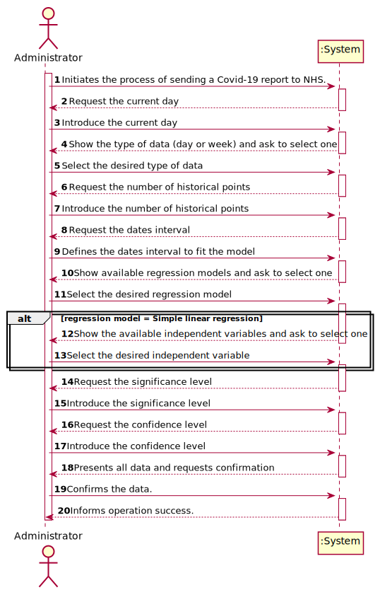
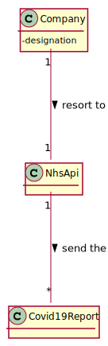
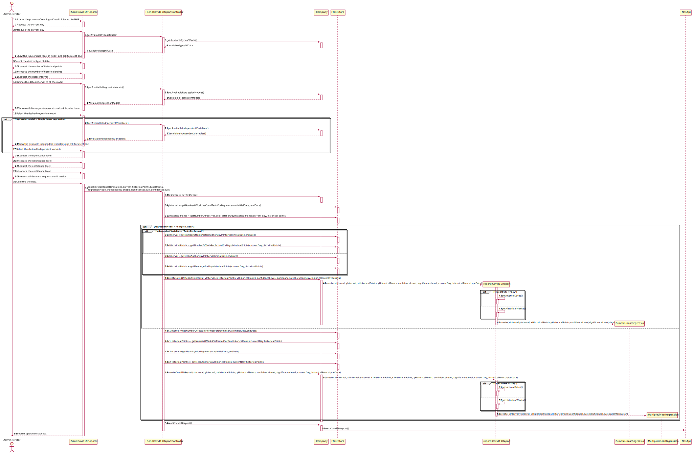
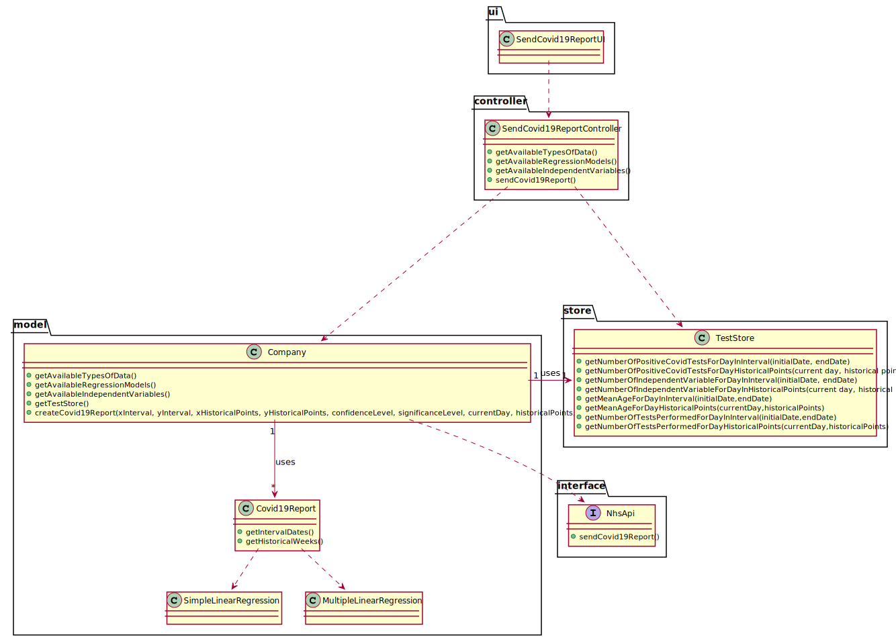

# US 18 - Send Covid-19 Report to NHS

## 1. Requirements Engineering

### 1.1. User Story Description

As an Administrator I want to send the Covid-19 report to the NHS at any time. I
want to define the interval of dates to fit the regression model, the number of historical
points (number of days or number of weeks) that must be sent to the NHS, the regression
model to use and select the independent variables to use.

### 1.2. Customer Specifications and Clarifications 

**From the specifications document:**

>Considering that Many Labs has the exclusivity to perform Covid-19 tests, and that the contract
with the NHS in England requires Many Labs to summarize and report Covid-19 data, the company
needs to: identify the number of Covid-19 tests performed, identify all positive results to Covid-19
tests, report the total number of Covid-19 cases per day, per week and per month of the year, and
send the forecasts for these same time horizons (the number of Covid-19 cases for the following
day, next week and next month).

>To make the predictions, the NHS contract defines that a linear regression algorithm should be used.
The NHS required that both simple linear and multiple linear regression algorithms should be
evaluated to select the best model.

>The algorithm to be used by the application must be defined through a configuration
file.

>The accuracy of the prediction models should be analysed and
documented in the application user manual (in the annexes) that must be delivered with the
application.

**From the client clarifications:**

> **Question:**  You said " ..the number of historical points (number of days or number of weeks) that must be sent to the NHS .." what exactly is this ? Is this a interval of dates ?
>
> [_**Answer:**_](https://moodle.isep.ipp.pt/mod/forum/discuss.php?d=9109#p11873)   Yes, you must allow the client to choose days of weeks.

> **Question:**  If the admin selects the multilinear regression he/she can select more than one independent variable. Should he select from a checklist the ones that he/she want? If so, what are the supposed independent variables we need to include in the checklist?
>
> [_**Answer:**_](https://moodle.isep.ipp.pt/mod/forum/discuss.php?d=9104#p11874)    to apply mlr you need two independent variables- daily number tests and mean age person tested daily. Also you need the same records per week.

> **Question:**  Is the Administrator who must choose between days or weeks? If so, how should he make this choice?
>
> [_**Answer:**_](https://moodle.isep.ipp.pt/mod/forum/discuss.php?d=8937#p11751)   Yes. The Administrator should select between days and weeks using the user interface.

> **Question:** From the project description it is known "send the forecasts for these same time horizons (the number of Covid-19 cases for the following day, next week and next month)." In the example report we have in moodle, there is a line that says "// Prediction values". Does this mean that after this line we should put our predictions or it refers to the following table?
>
> [_**Answer:**_](https://moodle.isep.ipp.pt/mod/forum/discuss.php?d=8910#p11745)    Yes, the prediction values are the ones available in the table that we include in the example.

> **Question:** Regarding US18 and US19, it is only one report containing all the tests performed by Many Labs to be sent each time, correct? Or is it one report per laboratory, for example?
>
> [_**Answer:**_](https://moodle.isep.ipp.pt/mod/forum/discuss.php?d=8892#p11693)   The report should contain all the tests made by Many Labs.

> **Question:**   Should the report contain the data of all the tests with results (with or without report, with or without validation) or contain only the validated tests? (Or other option?)
>
> [_**Answer:**_](https://moodle.isep.ipp.pt/mod/forum/discuss.php?d=8892#p11693)   The NHS Covid report should include statistics computed only from validated tests.

> **Question:**  Which significance level should we use for the hypothesis tests?
>
> [_**Answer:**_](https://moodle.isep.ipp.pt/mod/forum/discuss.php?d=8890#p11690)   The application should allow the user to choose the significance level.

> **Question:**  From Sprint D requirements we get "I want to define... the number of historical points (number of days or number of weeks) that must be sent to the NHS".
Is the Administrator who must choose between days or weeks? If so, how should he make this choice?
>
> [_**Answer:**_](https://moodle.isep.ipp.pt/mod/forum/discuss.php?d=8937)   Yes. The Administrator should select between days and weeks using the user interface.

> **Question:**  If the admin selects the multilinear regression he/she can select more than one independent variable. Should he select from a checklist the ones that he/she want? If so, what are the supposed independent variables we need to include in the checklist?
>
> [_**Answer:**_](https://moodle.isep.ipp.pt/mod/forum/discuss.php?d=9104)   to apply mlr you need two independent variables- daily number tests and mean age person tested daily. Also you need the same records per week.

> **Question:**  Should the number of historical points have the same range as the date interval defined by the administrator?
>
> [_**Answer:**_](https://moodle.isep.ipp.pt/mod/forum/discuss.php?d=8942)   No. The points within the interval are used to fit the linear regression model. The number of historical points are the points for which we want to send the estimates/expect values to NHS. The points within the interval and historical points can overlap. Please carefully review the report example file available in moodle.

> **Question:**  From the report example we got that the administrator defines the dates interval to fit the model. Which date should the application use to provide the report? Is it the registration date or results registration date?
>
> [_**Answer:**_](https://moodle.isep.ipp.pt/mod/forum/discuss.php?d=8944)   The registration date should be considered. But only tests that have already been validated should be considered.

> **Question:**  From the covid report example you gave us we can see that is missing two dates(16/05/2021 and 23/05/2021) in the predictions table. Is there any specific reason?
>
> [_**Answer:**_](https://moodle.isep.ipp.pt/mod/forum/discuss.php?d=9059)   These days of the week are two Sundays and the laboratory does not work on Sundays.

> **Question:**  Could you clarify how the historical points work? Acording to the NhsReportExample, it was chosen 15 points and the dates to fit the regression model but it seems that it was not chosen the day to start the prediction table.
>
> [_**Answer:**_](https://moodle.isep.ipp.pt/mod/forum/discuss.php?d=9142)    In the header of the exampleNHSReport.txt file it says "If the administrator selects: The current day to be 31/05/2021...". Please relate this information with the table available in the exampleNHSReport.txt file.
> In US19, the current day is the day when the report is sent automatically to the NHS.
The teams should not include sundays in their analysis or estimates.
When the time resolution is a week, please consider only complete weeks.

> **Question:**  I read from a previous post that " to apply mlr you need two independent variables- daily number tests and mean age person tested daily. Also you need the same records per week. " so when de administrator selects a MLR the system should adopt by default that the independent variables are daily number tests and mean age person , or he should write or select the independent variables that he wants ?
>
> [_**Answer:**_](https://moodle.isep.ipp.pt/mod/forum/discuss.php?d=9121)   When the Administrator selects MLR, the number tests and mean age independent variables should be used without being selected.

> **Question:**  I know that the administrator chose 15 historical points and it is shown in the table down below in the file, but my question is, what's the criteria for showing 3 days before 17/05 and 6 days after 22/05?
>
> [_**Answer:**_](https://moodle.isep.ipp.pt/mod/forum/discuss.php?d=9232)   The interval data is used to fit the regression model. The historical points are defined to get the number of ESTIMATED positive cases. Please study MATCP and linear regression.

> **Question:**  Should I find the line/equation (and everything else derived from it) using the data concerning the interval of days chosen, or from the historical days chosen?
>
> [_**Answer:**_](https://moodle.isep.ipp.pt/mod/forum/discuss.php?d=9232)   The interval data is used to fit the regression model.

> **Question:**   Should the reports sent to the NHS be saved in the app, or are they just sent?
>
> [_**Answer:**_](https://moodle.isep.ipp.pt/mod/forum/discuss.php?d=9271)   There is no need to save the report in the app.

> **Question:**  In US 18, should we ask the user to select which parameter he/she wants be analyzed for the hypothesis tests (a or b)?
>
> [_**Answer:**_](https://moodle.isep.ipp.pt/mod/forum/discuss.php?d=9234)   Yes.

> **Question:**  If on a certain day or week there aren't any Covid 19 tests realized and therefore no clients, should we consider the mean age to be 0?
>
> [_**Answer:**_](https://moodle.isep.ipp.pt/mod/forum/discuss.php?d=9297)   Yes, you should consider the mean age to be zero. Sundays should not be considered in your analysis.

### 1.3. Acceptance Criteria

* **AC1:** The user should choose the significance level for hip t and confidence level for IC.
* **AC2:** The system should allow the Administrator to select between a simple linear and multilinear regression model to fit the data.
* **AC3:** The Administrator should be able to choose the independent variable to use with the simple linear regression model (either the number of tests realized or the mean age).
* **AC4:** The Administrator should select between days and weeks using the user interface.
* **AC5:** The system should send the report using the NHS API (available in moodle).
* **AC6:** The report should contain all the tests made by Many Labs.

### 1.4. Found out Dependencies

* 

### 1.5 Input and Output Data

**Input Data:**
   
* Typed data:
	* Current day
	* Number of historical points  
	* Dates interval
	* Significance level
	* Confidence level
	
* Selected data:
	* Regression model
	* Independent variable

**Output Data:**

* (In)Success of the operation

### 1.6. System Sequence Diagram (SSD)

**Alternative 1**

**Other alternatives might exist.**

### 1.7 Other Relevant Remarks

* The test goes to the Diagnosis Made status after the conclusion of the medical report.

## 2. OO Analysis

### 2.1. Relevant Domain Model Excerpt 

### 2.2. Other Remarks

* For the integration between user stories 4, 5, 12, and 15 to be carried out correctly, the test must change its status as it goes through each step of the user stories.

## 3. Design - User Story Realization 

### 3.1. Rationale

**SSD - Alternative 1 is adopted.**

| Interaction ID | Question: Which class is responsible for...                     | Answer                        | Justification (with patterns)                                                                                                                                                                          |
|:-------------  |:--------------------------------------------------------------- |:-----------------------------:|:------------------------------------------------------------------------------------------------------------------------------------------------------------------------------------------------------ |
| Step 1  		 | ... interacting with the actor?                                 | SendCovid19ReportUI           | **Pure Fabrication**: There is no justification for assigning this responsibility to any existing class in the Domain Model.                                                                           |
|                | ... coordinating the US?                                        | SendCovid19ReportController   | **Controller**                                                                                                                                                                                         |
| Step 2  		 | ... knowing available types of Data?                            | Company                       | **IE**: Knows the available types of data (day or week).                                                                                                                                               |
| Step 3  		 | ... knowing available regression models?                        | Company                       | **IE**: Knows the available regression models.                                                                                                                                               |
| Step 4  		 | ... knowing available regression models?                        | Company                       | **IE**: Knows the available regression models.                                                                                                                                               |
|                | ... knowing available independent variables?                    | Company                       | **IE**: Knows the available independent variables.                                                                                                                                                          |
| Step 5         | ... saving the typed data?                                      |                               | **IE**: Owns its data.                                                                                                                                                                                 |
|                | ... knowing the TestStore?                                      | Company                       | **IE**: The company knows the TestStore to which it is delegating some tasks.                                                                                                                          |
|                | ... knowing the number of covid Tests in any interval?          | TestStore                     | **IE**: Knows all the tests.                                                                                                                                                                           |
| Step 6  		 |                                                                 |                               |                                                                                                                                                                                                        |
| Step 7         | ... instantiating a Covid-19 Report?                            | Company                       | **Creator (R1)**                                                                                                                                                                                       |
|        		 | ... generating historical points dates?                         | Covid19Report                 | **IE**: Owns its data.                                                                                                                                                                                 |
| Step 8  		 | ... sending to NHS covid-19 report?                             | NhsApi                        | **IE**: The medical report knows when it was created.                                                                                                                                                  |
| Step 9  		 | ... informing operation success?                                | SendCovid19ReportUI           | **IE**: Is responsible for user interactions.                                                                                                                                                          |

### Systematization ##

According to the taken rationale, the conceptual classes promoted to software classes are: 

 * Company
 * NhsApi
 * Covid19Report

Other software classes (i.e. Pure Fabrication) identified: 

 * SendCovid19ReportUI
 * SendCovid19ReportController
 * TestStore
 * SimpleLinearRegression

## 3.2. Sequence Diagram (SD)

**Alternative 1**

## 3.3. Class Diagram (CD)

**From alternative 1**

# 4. Tests

**Test 1:** Check that it is not possible to create an instance of the medical report class with null values.

    @Test(expected = IllegalArgumentException.class)
    public void ensureNullIsNotAllowed(){
        MedicalReport md = new MedicalReport(null);
    }

**Test 2:** Check that it is not possible to create an instance of the Medical Report class with a diagnosis invalid - AC1.

    @Test(expected = IllegalArgumentException.class)
    public void ensureDiagnosisMeetsAC1_1(){
       MedicalReport md = new MedicalReport("Test Test Test Test Test Test Test Test Test Test Test Test Test Test Test Test Test Test Test Test Test Test Test Test Test Test Test Test Test Test Test Test Test Test Test Test Test Test Test Test Test Test Test Test Test Test Test Test Test Test Test Test Test Test Test Test Test Test Test Test Test Test Test Test Test Test Test Test Test Test Test Test Test Test Test Test Test Test Test Test Test Test Test Test Test Test Test Test Test Test Test Test Test Test Test Test Test Test Test Test Test Test Test Test Test Test Test Test Test Test Test Test Test Test Test Test Test Test Test Test Test Test Test Test Test Test Test Test Test Test Test Test Test Test Test Test Test Test Test Test Test Test Test Test Test Test Test Test Test Test Test Test Test Test Test Test Test Test Test Test Test Test Test Test Test Test Test Test Test Test Test Test Test Test Test Test Test Test Test Test Test Test Test Test Test Test Test Test Test Test Test Test Test Test Test Test Test Test Test Test Test Test Test Test Test Test Test Test Test Test Test Test Test Test Test Test Test Test Test Test Test Test Test Test Test Test Test Test Test Test Test Test Test Test Test Test Test Test Test Test Test Test Test Test Test Test Test Test Test Test Test Test Test Test Test Test Test Test Test Test Test Test Test Test Test Test Test Test Test Test Test Test Test Test Test Test Test Test Test Test Test Test Test Test Test Test Test Test Test Test Test Test Test Test Test Test Test Test Test Test Test Test Test Test Test Test Test Test Test Test Test Test Test Test Test Test Test Test Test Test Test Test Test Test Test Test Test Test Test Test Test Test Test Test Test Test Test Test Test Test Test Test Test Test Test Test Test Test Test Test Test Test Test Test Test Test Test Test Test Test Test Test Test Test Test Test Test Test Test Test Test Test Test Test Test Test Test Test Test Test Test Test Test Test Test Test Test Test Test Test Test Test Test Test Test Test Test Test Test Test Test Test");
    }

**Test 3:** Check that it is not possible to add more than one Medical Report to the test - AC2.

    @Test
    public void addInvalidMedicalReport(){
        Company company = new Company("Many Labs");
        ParameterCategory pc1 = new ParameterCategory("HM000","Hemogram");
        Parameter p1 = new Parameter("HB000","HB","Hemoglobin",pc1);
        List<ParameterCategory> list=new ArrayList();
        list.add(pc1);
        Client client = new Client("Rita","1231231231231231","1231231231","26/11/2002","Female","1231231231","12312312312","rita@gmail.com");
        NhsCode nhs = new NhsCode("123456789012");
        TestType tt = new TestType("BL000","blood","syringe",list,"ExternalModule2API");
        RefValue rv = new RefValue("mg",10,20);
        TestParameterResult tpr = new TestParameterResult(rv,"15","mg");
        TestParameter tp = new TestParameter(p1,tpr);
        List<TestParameter> tpList = new ArrayList<>();
        tpList.add(tp);
        List<TestType> ttlist = new ArrayList<>();
        ttlist.add(tt);
        ClinicalAnalysisLaboratory lab = new ClinicalAnalysisLaboratory("Chemical","1234","12312312312","1231231231","12345",ttlist);
        app.domain.model.testrelated.Test test = new app.domain.model.testrelated.Test(client,nhs,tt,tpList,lab,"123123123123");
        test.addMedicalReport("The patient is healthy");
        boolean result = test.addMedicalReport("The patient is healthy");
        Assert.assertFalse(result);
    }

# 5. Construction (Implementation)

##Class WriteMedicalReportController

     /**
     * Get a list of objects of type TestDTO.
     * @return list with the tests with the analyzed samples.
     */
    public List<TestDTO> getTestHasSamplesAnalyzedList(){
        this.testStore=company.getTestStore();
        checkPossibilityOfWriteAReport(testStore.getTestHasSamplesAnalyzedList());
        List<Test> testHasSamplesAnalyzedList = testStore.getTestHasSamplesAnalyzedList();
        return testMapper.toDto(testHasSamplesAnalyzedList);
    }

    /**
     * Check if there is any test waiting for the medical report.
     */
    public void checkPossibilityOfWriteAReport(List<Test> testHasSamplesAnalyzedList){
        if (testHasSamplesAnalyzedList.isEmpty())
            throw new IllegalArgumentException("There are no tests with the samples analyzed.");
    }
     
     /**
     * Get the list with the information of the analyzed parameters of the test that we are getting the diagnosis.
     * @param selectedTest Test that we intend to write the medical report.
     * @return the list with the information of the analyzed parameters of the test.
     */
    public List<TestParameterDTO> getTestParameterList(TestDTO selectedTest){
        test = testStore.getTestByInternalCode(selectedTest.getInternalCode());
        List<TestParameter> testParametersList =test.getTestParameterList();
        return testPMapper.toDTO(testParametersList);
    }

    /**
     * Add the medical report to the test.
     * @param diagnosis The diagnosis made by the specialist doctor.
     * @return true if the medical report was added. Otherwise, false.
     */
    public boolean addMedicalReport(String diagnosis){
        return test.addMedicalReport(diagnosis);
    }

##Class Test

     /**
     * Adds the medical report to the test.
     * @param diagnosis The diagnosis made by the specialist doctor.
     * @return true if the medical report was added. Otherwise, false.
     */
    public boolean addMedicalReport(String diagnosis) {
        if (validateMedicalReport()) {
            this.md = new MedicalReport(diagnosis);
            this.stateOfTest = StateOfTest.DiagnosisMade;
            return true;
        }
        return false;
    }

##Class MedicalReport

    /**
     * Build an instance of {@code MedicalReport} by receiving the diagnosis.
     * @param diagnosis The report of the test.
     */
    public MedicalReport(String diagnosis){
        checkReportRules(diagnosis);
        this.diagnosis=diagnosis;
        this.createdAt=Calendar.getInstance().getTime();
    }

    /**
     * Checks whether the diagnosis contains all business rules.
     * @param diagnosis diagnosis made by specialist doctor.
     */
    private void checkReportRules (String diagnosis) {
        if (StringUtils.isBlank(diagnosis))
            throw new IllegalArgumentException("Report cannot be blank.");
        String[] aux = diagnosis.split(" ");
        if ( aux.length > 400 )
            throw new IllegalArgumentException("The report should have no more than 400 words.");
    }

# 6. Integration and Demo 

* For some demonstration purposes, the following objects were added in the bootstrap method: parameter category, parameter, test type and a client.

# 7. Observations

* In the future, the user story will be developed with a graphical interface for a better experience for the user.

