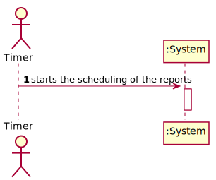
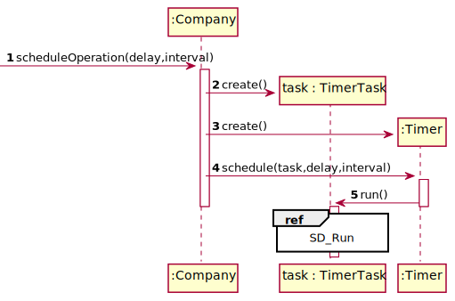

# US 19 - To send NHS daily reports

## 1. Requirements Engineering

### 1.1. User Story Description

The Many Labs company wants to send to the NHS daily reports of Covid-19
data, including the number of observed values and estimated values. Reports should be
generated automatically with historical data and must be sent every day at 6:00 am.

### 1.2. Customer Specifications and Clarifications 

**From the specifications document:**

>Considering that Many Labs has the exclusivity to perform Covid-19 tests, and that the contract
with the NHS in England requires Many Labs to summarize and report Covid-19 data, the company
needs to: identify the number of Covid-19 tests performed, identify all positive results to Covid-19
tests, report the total number of Covid-19 cases per day, per week and per month of the year, and
send the forecasts for these same time horizons (the number of Covid-19 cases for the following
day, next week and next month). The company is also required to generate daily (automatic) reports
with all the information demanded by the NHS and should send them to the NHS using their API.
To make the predictions, the NHS contract defines that a linear regression algorithm should be used.
The NHS required that both simple linear and multiple linear regression algorithms should be
evaluated to select the best model. The accuracy of the prediction models should be analysed and
documented in the application user manual (in the annexes) that must be delivered with the
application. The algorithm to be used by the application must be defined through a configuration
file.

**From the client clarifications:**

> **Question:**  As the report is generated automatically, should the system generate a notification that the report was sent?
>  
> [**Answer:**](https://moodle.isep.ipp.pt/mod/forum/discuss.php?d=8894#p11691) The application should write the event into a log file.

> **Question:** Regarding US18 and US19, it is only one report containing all the tests performed by Many Labs to be sent each time, correct? Or is it one report per laboratory, for example? Or other option?
>
> [**Answer:**](https://moodle.isep.ipp.pt/mod/forum/discuss.php?d=8892#p11693) The report should contain all the tests made by Many Labs.

> **Question:** In US19, in Sprint D Requirements, it says "The report should include day and week (observed and estimated) values..." and also "Reports...must be sent every day at 6:00 am".
As the Report is to be automatically sent very early in the morning, do you wish the report to have the data concerning the day before and the last week starting at the day before?
>
> [**Answer:**](https://moodle.isep.ipp.pt/mod/forum/discuss.php?d=8892#p11693) The format of the report should follow the report example that is available in moodle.

> **Question:**  Should the report contain the data of all the tests with results (with or without report, with or without validation) or contain only the validated tests? (Or other option?)
> 
> [**Answer:**](https://moodle.isep.ipp.pt/mod/forum/discuss.php?d=8892#p11693)  The NHS Covid report should include statistics computed only from validated tests.

> **Question:** General doubt: Are we going to be able to use more math libraries in order to facilitate the calculus (for example, for confidence intervals) or is the rest of the calculus to be developed by each team?
> 
> [**Answer:**](https://moodle.isep.ipp.pt/mod/forum/discuss.php?d=8892#p11693) Each team should implement the classes and methods needed.

### 1.3. Acceptance Criteria

* **AC1:** The report should include day and week (observed and
  estimated) values, the regression model used to estimate each value, R(SLR), R2
  and R2 adjusted for SLR and MLR, hypothesis tests for regression coefficients
  significance model with Anova. 
  
* **AC2:** Simple linear and multilinear regression models
  can be used to compute the estimates and corresponding confidence intervals.
  
* **AC3:** When the system is configured to use the simple linear regression model, the
  performance of each model should be used to select the best model (the one that
  uses the number of tests realized or the one that uses the mean age as independent
  variable). 
  
* **AC4:** The best model will be used to make the estimated/expected values that
  will be send to NHS. 
  
* **AC5:** The interval of dates to fit the regression model and the
  number of historical points (number of days and number of weeks) must be
  defined through a configuration file. 
  
* **AC6:** The system should send the report using the
  NHS API (available in moodle).
  
* **AC7** The NHS Covid report should include statistics computed only from validated tests.

### 1.4. Found out Dependencies

* There is a dependency with user story 12 since it is only possible to perform statistic tests from the moment there are results associated with the test.

* There is a dependency with "US 15 - I want to validate the work done by the clinical chemistry technologist and specialist doctor." since the report will only be about the tests validated

### 1.5 Input and Output Data

**Input Data:**

* Typed data:
	None
	
* Selected data:
     None

**Output Data:**

* A Covid report
* (In)Success of the operation

### 1.6. System Sequence Diagram (SSD)

### 1.7 Other Relevant Remarks

* The created task stays in a "not published" state in order to distinguish from "published" tasks.

## 2. OO Analysis

### 2.1. Relevant Domain Model Excerpt 

## 3. Design - User Story Realization 

### 3.1. Rationale

| Interaction ID | Question: Which class is responsible for... | Answer  | Justification (with patterns)  |
|:-------------  |:--------------------- |:------------|:---------------------------- |
| Step 1  		     |	... who has the responsability of scheduling the operation? | Company   |  IE: The company knows the task to be created           |
| 			  		 |	... coordinating the US? | TimerTask |                             |
| 			  		 |	... instantiating a new Task? | Company   | IE: THe comapny knows the task to be operated   |
| 			  		 | ...  instantiating a new Report to be sent?  | Company  | IE: The company knows all the reports made.  |

### Systematization ##

According to the taken rationale, the conceptual classes promoted to software classes are: 

 * Company
 * Covid19Report

Other software classes (i.e. Pure Fabrication) identified:

 * NhsAdapter
 * TimerTask
 * SendAutomaticallyCovid19Report

## 3.2. Sequence Diagram (SD)

### 3.2.1 Partial Sequence Diagram
* Partial sequence diagram related to what happen when the timer executes the task
  
  

## 3.3. Class Diagram (CD)

# 4. Tests 

**Test 1:** Check that it is not possible to create an instance of the Task class with null values. 

	@Test(expected = IllegalArgumentException.class)
		public void ensureNullIsNotAllowed() {
		Task instance = new Task(null, null, null, null, null, null, null);
	}
	

**Test 2:** Check that it is not possible to create an instance of the Task class with a reference containing less than five chars - AC2. 

	@Test(expected = IllegalArgumentException.class)
		public void ensureReferenceMeetsAC2() {
		Category cat = new Category(10, "Category 10");
		
		Task instance = new Task("Ab1", "Task Description", "Informal Data", "Technical Data", 3, 3780, cat);
	}

*It is also recommended to organize this content by subsections.* 

# 5. Construction (Implementation)

## Class CreateTaskController 

		public boolean createTask(String ref, String designation, String informalDesc, 
			String technicalDesc, Integer duration, Double cost, Integer catId)() {
		
			Category cat = this.platform.getCategoryById(catId);
			
			Organization org;
			// ... (omitted)
			
			this.task = org.createTask(ref, designation, informalDesc, technicalDesc, duration, cost, cat);
			
			return (this.task != null);
		}

## Class Organization

		public Task createTask(String ref, String designation, String informalDesc, 
			String technicalDesc, Integer duration, Double cost, Category cat)() {
		
	
			Task task = new Task(ref, designation, informalDesc, technicalDesc, duration, cost, cat);
			if (this.validateTask(task))
				return task;
			return null;
		}

# 6. Integration and Demo 

* A new option on the Employee menu options was added.

* Some demo purposes some tasks are bootstrapped while system starts.

# 7. Observations

Platform and Organization classes are getting too many responsibilities due to IE pattern and, therefore, they are becoming huge and harder to maintain. 

Is there any way to avoid this to happen?

